# System Architecture

The Dashcam project follows a layered architecture designed for safety, performance, and maintainability. This document explains the architectural decisions, component relationships, and design patterns used throughout the system.

## 🏗️ High-Level Architecture

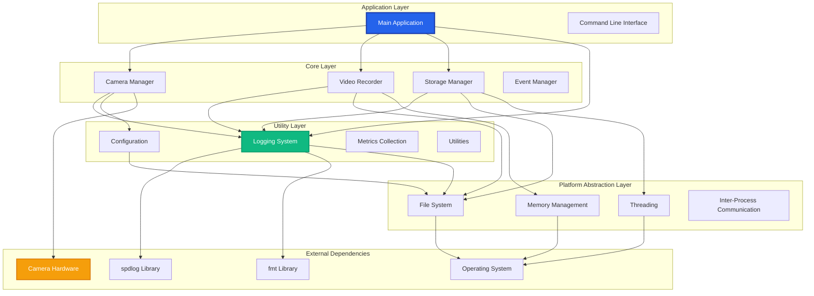

## 🎯 Design Principles

### Tiger Style Architecture

The architecture strictly follows Tiger Style principles:

#### 1. Safety First
- **Static Memory Allocation**: All memory allocated at startup
- **Bounded Operations**: Every loop has a maximum iteration count
- **Explicit Error Handling**: No exceptions in critical paths
- **Comprehensive Assertions**: Pre/postconditions for every function

#### 2. Performance Focus
- **Cache-Friendly Design**: Data structures optimized for CPU cache
- **Minimal Dynamic Allocation**: Heap usage avoided in hot paths
- **Batched Operations**: Network, disk, and CPU work batched for efficiency
- **Lock-Free Where Possible**: Atomic operations preferred over mutexes

#### 3. Developer Experience
- **Clear Interfaces**: Each component has a well-defined API
- **Comprehensive Testing**: Every component fully tested
- **Rich Diagnostics**: Extensive logging and debugging support
- **Documentation-Driven**: Code documented before implementation

## 🧩 Component Architecture

### Core Components

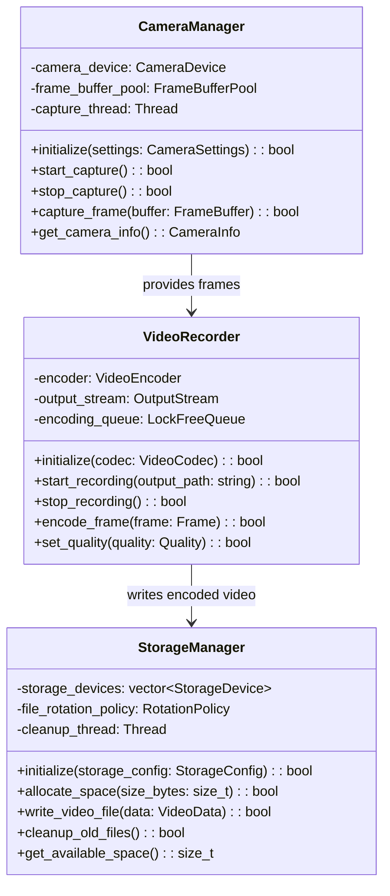

### Utility Components

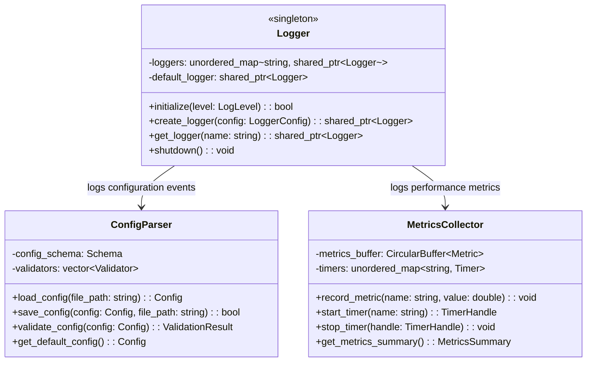

## 🔄 Data Flow Architecture

### Frame Processing Pipeline

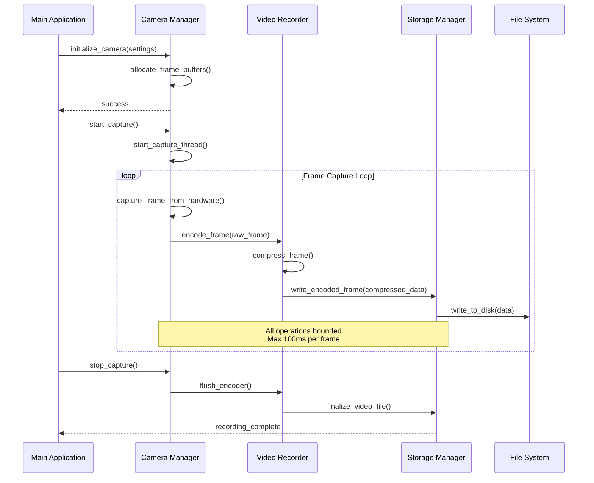

### Error Handling Flow

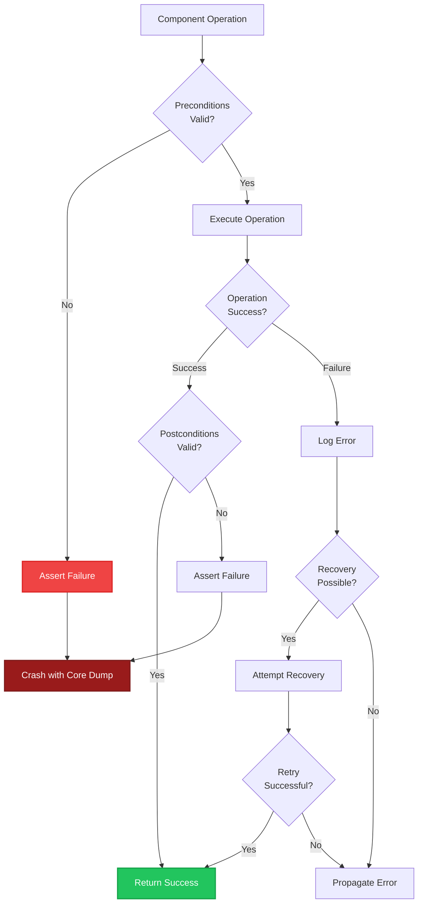

## 🧵 Threading Architecture

### Thread Model

The application uses a carefully designed threading model to maximize performance while maintaining safety:

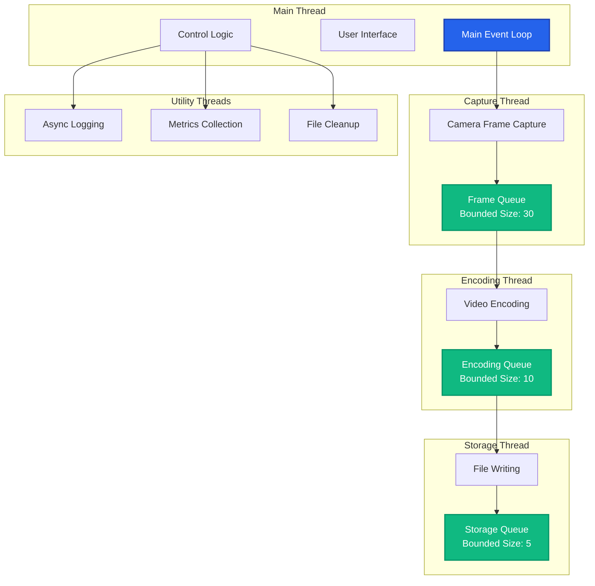

### Synchronization Strategy

#### Design Decision: Lock-Free Queues vs. Mutexes

**Decision**: Use lock-free circular buffers for high-frequency data (frames) and mutexes for low-frequency control operations.

**Rationale**:
- Frame processing is the critical path requiring predictable latency
- Control operations (start/stop recording) happen infrequently
- Lock-free structures eliminate priority inversion and deadlock risks
- Simpler to reason about than complex lock hierarchies

**Trade-offs**:
- Lock-free code is harder to implement correctly
- Memory ordering requirements are complex
- Limited scalability to many producers/consumers

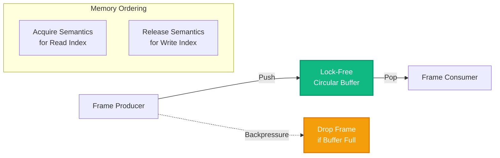

## 💾 Memory Architecture

### Memory Layout Strategy

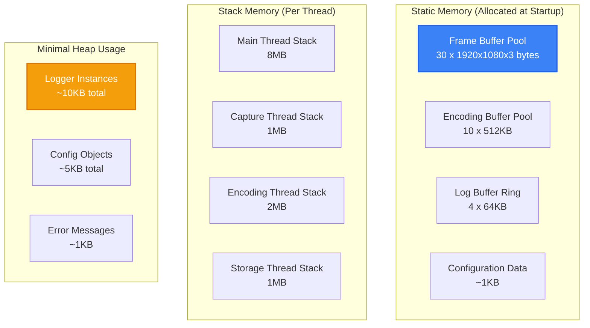

### Buffer Management

#### Design Decision: Pre-allocated Buffer Pools

**Decision**: Allocate all frame and encoding buffers at startup in pools.

**Rationale**:
- Eliminates allocation/deallocation overhead in critical paths
- Prevents memory fragmentation during long-running operation
- Enables deterministic memory usage for embedded deployment
- Simplifies memory leak detection and debugging

**Implementation Pattern**:
```cpp
class FrameBufferPool {
    static constexpr size_t BUFFER_COUNT = 30;
    static constexpr size_t BUFFER_SIZE = 1920 * 1080 * 3; // RGB
    
    std::array<std::array<uint8_t, BUFFER_SIZE>, BUFFER_COUNT> buffers_;
    std::atomic<uint32_t> next_available_{0};
    
public:
    FrameBuffer* acquire_buffer() {
        // Lock-free buffer acquisition
        uint32_t index = next_available_.fetch_add(1) % BUFFER_COUNT;
        return &buffers_[index];
    }
    
    void release_buffer(FrameBuffer* buffer) {
        // Buffer automatically available for reuse
        // No explicit release needed with circular allocation
    }
};
```

## 🔧 Configuration Architecture

### Configuration Hierarchy

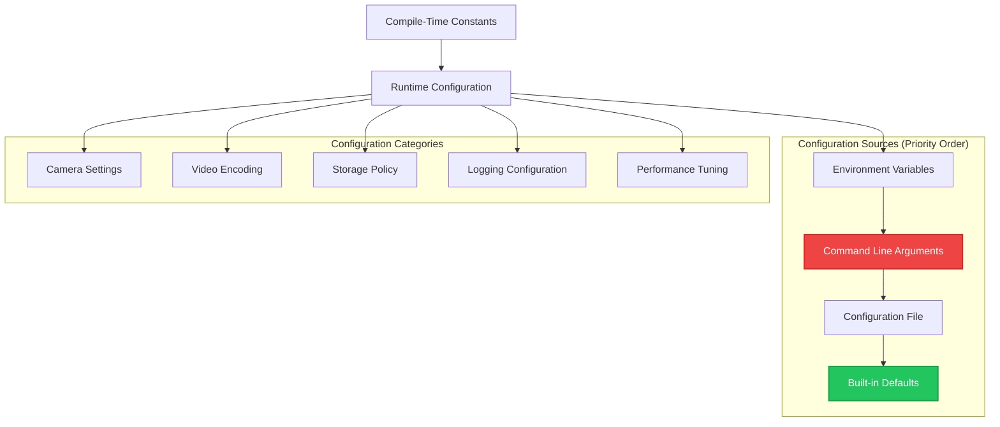

## 🚦 State Management

### Application State Machine

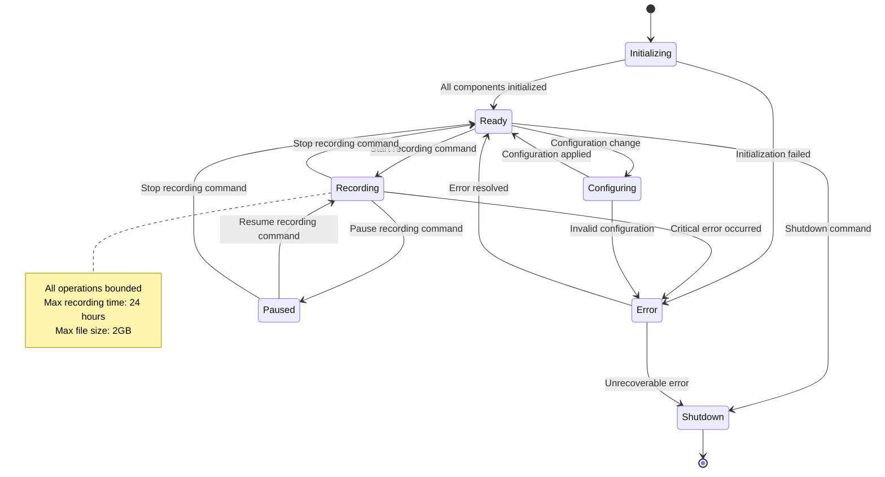

## 🔍 Monitoring and Observability

### Metrics Collection Architecture

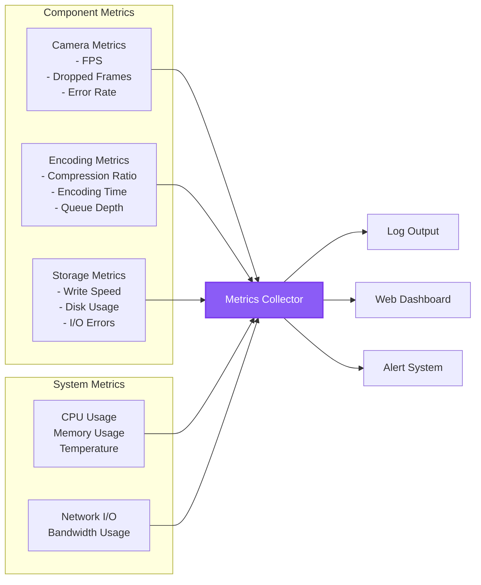

## 🧪 Testing Architecture

### Testing Pyramid

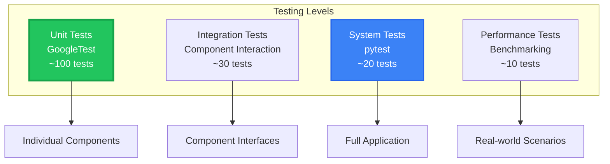

### Test Strategy by Component

| Component | Unit Tests | Integration Tests | System Tests |
|-----------|------------|-------------------|--------------|
| **Logger** | ✅ All log levels<br/>✅ File output<br/>✅ Thread safety | ✅ Multiple loggers<br/>✅ Configuration reload | ✅ Log rotation<br/>✅ Performance under load |
| **Camera Manager** | ✅ Mock camera<br/>✅ Buffer management<br/>✅ Error handling | ✅ Real camera<br/>✅ Format conversion | ✅ Long-term stability<br/>✅ Hardware failure recovery |
| **Video Recorder** | ✅ Codec selection<br/>✅ Quality settings<br/>✅ Frame queuing | ✅ End-to-end encoding<br/>✅ File format validation | ✅ Continuous recording<br/>✅ Storage limits |

## 📋 Architecture Decision Records

### ADR-001: Choose C++17 over C++20

**Status**: Accepted

**Context**: Need to choose C++ standard version for maximum compatibility while having modern features.

**Decision**: Use C++17 as the target standard.

**Consequences**:
- ✅ Wide compiler support (GCC 7+, Clang 5+, MSVC 2017+)
- ✅ Stable feature set with good tooling support
- ✅ Includes essential modern features (auto, lambdas, smart pointers)
- ❌ Missing some newer features like concepts, ranges, coroutines

### ADR-002: Static Memory Allocation Strategy

**Status**: Accepted

**Context**: Embedded deployment requires predictable memory usage.

**Decision**: Allocate all major data structures at startup, avoid dynamic allocation in steady state.

**Consequences**:
- ✅ Predictable memory usage and performance
- ✅ No memory fragmentation issues
- ✅ Easier to debug memory problems
- ❌ Higher startup memory usage
- ❌ Less flexibility for varying workloads

### ADR-003: Comprehensive Logging Strategy

**Status**: Accepted

**Context**: Need excellent debugging and monitoring capabilities.

**Decision**: Implement multi-level, multi-output logging system with performance optimization.

**Consequences**:
- ✅ Excellent debugging and troubleshooting capabilities
- ✅ Production monitoring and alerting
- ✅ Performance tuning through metrics
- ❌ Additional complexity and binary size
- ❌ Need to manage log file rotation and cleanup

---

*This architecture documentation is maintained alongside the codebase. When making architectural changes, update this document and create new ADRs as needed.*
