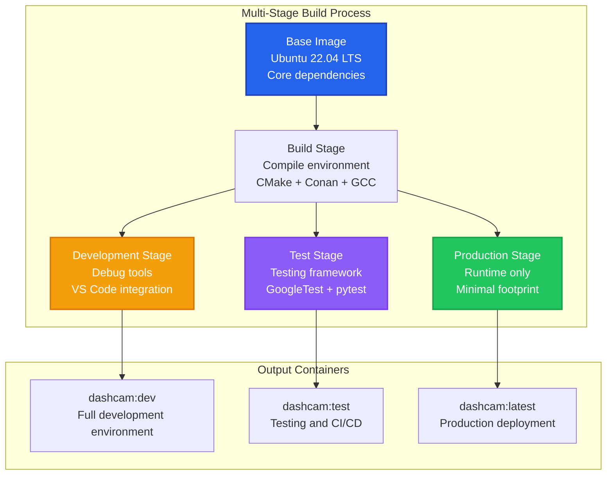
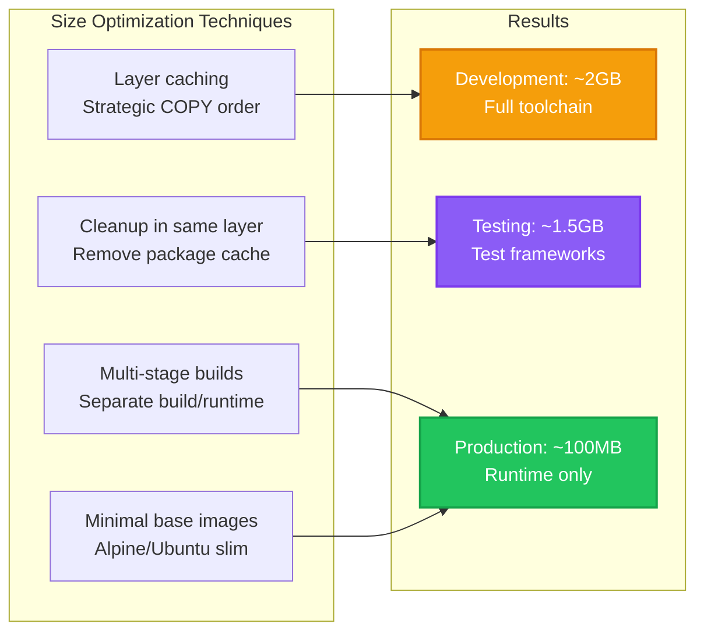

# Docker Deployment Guide

This guide covers containerized deployment of the Dashcam application using Docker and Docker Compose. Our Docker setup supports both development workflows and production deployments with multi-platform builds and optimized container images.

## 🎯 Docker Strategy Overview

### Container Architecture



### Design Principles

| Principle | Implementation | Benefit |
|-----------|----------------|---------|
| **Multi-stage builds** | Separate dev/test/prod stages | Optimized image sizes |
| **Layer caching** | Strategic COPY ordering | Faster rebuilds |
| **Security** | Non-root user, minimal attack surface | Production safety |
| **Reproducibility** | Pinned base images and dependencies | Consistent deployments |
| **Platform support** | Multi-arch builds (amd64, arm64) | Pi and cloud deployment |

## 📁 Docker Configuration Files

### Main Dockerfile

```dockerfile
# docker/Dockerfile - Multi-stage Dashcam container
# Supports development, testing, and production environments

# Build arguments for customization
ARG UBUNTU_VERSION=22.04
ARG CMAKE_VERSION=3.27.0
ARG CONAN_VERSION=2.0.0

# =============================================================================
# Base stage: Common dependencies and environment
# =============================================================================
FROM ubuntu:${UBUNTU_VERSION} as base

# Install system dependencies
RUN apt-get update && apt-get install -y \
    # Build essentials
    build-essential \
    cmake \
    git \
    pkg-config \
    # Runtime libraries
    libc6-dev \
    libstdc++6 \
    # Python for build scripts and testing
    python3 \
    python3-pip \
    python3-venv \
    # System utilities
    curl \
    wget \
    unzip \
    ca-certificates \
    # Cleanup
    && rm -rf /var/lib/apt/lists/*

# Create non-root user for security
RUN groupadd -r dashcam && useradd -r -g dashcam -m -s /bin/bash dashcam
USER dashcam
WORKDIR /home/dashcam

# Install Conan in user space
RUN pip3 install --user conan==${CONAN_VERSION}
ENV PATH="/home/dashcam/.local/bin:${PATH}"

# Set up Conan profile
RUN conan profile detect --force

# =============================================================================
# Build stage: Full build environment
# =============================================================================
FROM base as build

# Switch back to root for installing build dependencies
USER root

# Install additional build tools
RUN apt-get update && apt-get install -y \
    # Debugging tools
    gdb \
    valgrind \
    # Static analysis
    clang-tidy \
    clang-format \
    # Performance tools
    perf-tools-unstable \
    # Additional libraries for comprehensive testing
    libasan6 \
    && rm -rf /var/lib/apt/lists/*

# Switch back to dashcam user
USER dashcam
WORKDIR /home/dashcam

# Copy project files
COPY --chown=dashcam:dashcam . /home/dashcam/dashcam/

# Set working directory to project
WORKDIR /home/dashcam/dashcam

# Install dependencies via Conan
RUN mkdir -p build && cd build && \
    conan install .. --build=missing

# Configure project
RUN cd build && \
    cmake .. \
        -DCMAKE_BUILD_TYPE=Release \
        -DCMAKE_EXPORT_COMPILE_COMMANDS=ON \
        -DENABLE_STATIC_ANALYSIS=ON

# Build project
RUN cd build && \
    cmake --build . --parallel $(nproc)

# Run tests to verify build
RUN cd build && \
    ctest --output-on-failure

# =============================================================================
# Development stage: Full development environment
# =============================================================================
FROM build as development

USER root

# Install development tools
RUN apt-get update && apt-get install -y \
    # VS Code dependencies
    libnss3 \
    libatk-bridge2.0-0 \
    libdrm2 \
    libxkbcommon0 \
    libxcomposite1 \
    libxdamage1 \
    libxrandr2 \
    libgbm1 \
    libxss1 \
    libasound2 \
    # Additional development utilities
    htop \
    tree \
    vim \
    nano \
    tmux \
    && rm -rf /var/lib/apt/lists/*

USER dashcam

# Install development Python packages
RUN pip3 install --user \
    pytest \
    psutil \
    markdown \
    pygments

# Set up development environment
ENV DASHCAM_ENV=development
ENV CMAKE_BUILD_TYPE=Debug

# Expose ports for debugging and development servers
EXPOSE 8080 8000 9999

# Development entrypoint
CMD ["/bin/bash"]

# =============================================================================
# Testing stage: Optimized for CI/CD and automated testing
# =============================================================================
FROM build as testing

USER root

# Install testing dependencies
RUN apt-get update && apt-get install -y \
    # Coverage tools
    lcov \
    gcovr \
    # Additional testing utilities
    python3-pytest \
    python3-psutil \
    && rm -rf /var/lib/apt/lists/*

USER dashcam

# Set up testing environment
ENV DASHCAM_ENV=testing
ENV CMAKE_BUILD_TYPE=Debug

# Build with coverage enabled
RUN cd build && \
    cmake .. \
        -DCMAKE_BUILD_TYPE=Debug \
        -DENABLE_COVERAGE=ON \
        -DENABLE_TESTING=ON

RUN cd build && \
    cmake --build . --parallel $(nproc)

# Copy test scripts
COPY --chown=dashcam:dashcam scripts/test.sh /home/dashcam/
COPY --chown=dashcam:dashcam tests/ /home/dashcam/dashcam/tests/

# Default command runs all tests
CMD ["./test.sh", "all", "--coverage"]

# =============================================================================
# Production stage: Minimal runtime environment
# =============================================================================
FROM ubuntu:${UBUNTU_VERSION} as production

# Install minimal runtime dependencies
RUN apt-get update && apt-get install -y \
    # Essential runtime libraries
    libstdc++6 \
    libc6 \
    # Minimal utilities
    ca-certificates \
    # Cleanup
    && rm -rf /var/lib/apt/lists/* \
    && apt-get clean

# Create non-root user
RUN groupadd -r dashcam && useradd -r -g dashcam -m -s /bin/bash dashcam

# Copy built application from build stage
COPY --from=build --chown=dashcam:dashcam /home/dashcam/dashcam/build/dashcam /usr/local/bin/dashcam

# Copy configuration files
COPY --from=build --chown=dashcam:dashcam /home/dashcam/dashcam/config/ /etc/dashcam/

# Set up runtime directories
RUN mkdir -p /var/log/dashcam /var/lib/dashcam && \
    chown -R dashcam:dashcam /var/log/dashcam /var/lib/dashcam

USER dashcam

# Set up environment
ENV DASHCAM_ENV=production
ENV DASHCAM_LOG_LEVEL=info
ENV DASHCAM_STORAGE_PATH=/var/lib/dashcam
ENV DASHCAM_LOG_PATH=/var/log/dashcam

# Health check
HEALTHCHECK --interval=30s --timeout=10s --start-period=5s --retries=3 \
    CMD dashcam --health-check || exit 1

# Default command
CMD ["dashcam"]

# Metadata
LABEL org.opencontainers.image.title="Dashcam Application"
LABEL org.opencontainers.image.description="Multi-platform dashcam recording application"
LABEL org.opencontainers.image.version="1.0.0"
LABEL org.opencontainers.image.source="https://github.com/yourorg/dashcam"
```

### Docker Compose Configuration

```yaml
# docker-compose.yml - Complete development and deployment stack
version: '3.8'

services:
  # ==========================================================================
  # Development Environment
  # ==========================================================================
  dashcam-dev:
    build:
      context: .
      dockerfile: docker/Dockerfile
      target: development
      args:
        UBUNTU_VERSION: 22.04
        CMAKE_VERSION: 3.27.0
        CONAN_VERSION: 2.0.0
    image: dashcam:dev
    container_name: dashcam-development
    volumes:
      # Mount source code for live editing
      - ./src:/home/dashcam/dashcam/src:rw
      - ./include:/home/dashcam/dashcam/include:rw
      - ./tests:/home/dashcam/dashcam/tests:rw
      - ./scripts:/home/dashcam/dashcam/scripts:rw
      # Mount build directory for persistence
      - dashcam-build:/home/dashcam/dashcam/build
      # Mount logs for debugging
      - dashcam-logs:/var/log/dashcam
      # Mount VS Code extensions
      - vscode-extensions:/home/dashcam/.vscode-server
    ports:
      - "8080:8080"  # Documentation server
      - "8000:8000"  # Development server
      - "9999:9999"  # Debug port
    environment:
      - DASHCAM_ENV=development
      - CMAKE_BUILD_TYPE=Debug
      - DASHCAM_LOG_LEVEL=debug
    stdin_open: true
    tty: true
    networks:
      - dashcam-network

  # ==========================================================================
  # Testing Environment
  # ==========================================================================
  dashcam-test:
    build:
      context: .
      dockerfile: docker/Dockerfile
      target: testing
    image: dashcam:test
    container_name: dashcam-testing
    volumes:
      - ./tests:/home/dashcam/dashcam/tests:ro
      - dashcam-test-results:/home/dashcam/dashcam/test-results
    environment:
      - DASHCAM_ENV=testing
      - CMAKE_BUILD_TYPE=Debug
      - ENABLE_COVERAGE=ON
    command: ["./test.sh", "all", "--coverage", "--output-dir", "test-results"]
    networks:
      - dashcam-network

  # ==========================================================================
  # Production Environment
  # ==========================================================================
  dashcam-prod:
    build:
      context: .
      dockerfile: docker/Dockerfile
      target: production
    image: dashcam:latest
    container_name: dashcam-production
    volumes:
      # Production data persistence
      - dashcam-storage:/var/lib/dashcam
      - dashcam-logs:/var/log/dashcam
      # Configuration override
      - ./config/production.conf:/etc/dashcam/dashcam.conf:ro
    environment:
      - DASHCAM_ENV=production
      - DASHCAM_LOG_LEVEL=info
      - DASHCAM_STORAGE_PATH=/var/lib/dashcam
      - DASHCAM_LOG_PATH=/var/log/dashcam
    restart: unless-stopped
    healthcheck:
      test: ["CMD", "dashcam", "--health-check"]
      interval: 30s
      timeout: 10s
      retries: 3
      start_period: 40s
    networks:
      - dashcam-network

  # ==========================================================================
  # Documentation Server
  # ==========================================================================
  dashcam-docs:
    build:
      context: .
      dockerfile: docker/Dockerfile.docs
    image: dashcam:docs
    container_name: dashcam-documentation
    ports:
      - "8080:8000"
    volumes:
      - ./docs:/app/docs:ro
    environment:
      - PORT=8000
    networks:
      - dashcam-network

  # ==========================================================================
  # Monitoring and Logging (Optional)
  # ==========================================================================
  log-aggregator:
    image: fluentd:v1.16-1
    container_name: dashcam-logs
    volumes:
      - ./docker/fluentd.conf:/fluentd/etc/fluent.conf:ro
      - dashcam-logs:/var/log/dashcam:ro
    ports:
      - "24224:24224"
    networks:
      - dashcam-network
    profiles:
      - monitoring

# =============================================================================
# Volumes for data persistence
# =============================================================================
volumes:
  dashcam-build:
    driver: local
  dashcam-storage:
    driver: local
  dashcam-logs:
    driver: local
  dashcam-test-results:
    driver: local
  vscode-extensions:
    driver: local

# =============================================================================
# Network configuration
# =============================================================================
networks:
  dashcam-network:
    driver: bridge
    ipam:
      config:
        - subnet: 172.20.0.0/16
```

### Documentation Dockerfile

```dockerfile
# docker/Dockerfile.docs - Standalone documentation server
FROM python:3.11-slim

WORKDIR /app

# Install documentation dependencies
RUN pip install --no-cache-dir \
    markdown \
    pygments \
    watchdog

# Copy documentation server
COPY docs/serve_docs.py /app/
COPY docs/ /app/docs/

# Expose documentation port
EXPOSE 8000

# Health check for documentation server
HEALTHCHECK --interval=30s --timeout=5s --start-period=10s --retries=3 \
    CMD curl -f http://localhost:8000/ || exit 1

# Run documentation server
CMD ["python", "serve_docs.py", "--host", "0.0.0.0", "--port", "8000"]
```

## 🚀 Docker Build Scripts

### docker-build.sh

```bash
#!/bin/bash
# scripts/docker-build.sh - Docker build automation

set -euo pipefail

# Configuration
readonly SCRIPT_DIR="$(cd "$(dirname "${BASH_SOURCE[0]}")" && pwd)"
readonly PROJECT_ROOT="$(dirname "$SCRIPT_DIR")"
readonly IMAGE_NAME="dashcam"
readonly REGISTRY=""  # Set to your registry URL

# Color codes
readonly RED='\033[0;31m'
readonly GREEN='\033[0;32m'
readonly YELLOW='\033[1;33m'
readonly BLUE='\033[0;34m'
readonly NC='\033[0m'

# Logging functions
log_info() { echo -e "${BLUE}[INFO]${NC} $1"; }
log_success() { echo -e "${GREEN}[SUCCESS]${NC} $1"; }
log_warning() { echo -e "${YELLOW}[WARNING]${NC} $1"; }
log_error() { echo -e "${RED}[ERROR]${NC} $1"; }

# Build configuration
BUILD_TARGET=""
PUSH_IMAGE=false
CUSTOM_TAG=""
PLATFORM="linux/amd64,linux/arm64"
NO_CACHE=false

# Build functions
build_development() {
    log_info "Building development container..."
    docker build \
        --target development \
        --tag ${IMAGE_NAME}:dev \
        --tag ${IMAGE_NAME}:latest-dev \
        $([ "$NO_CACHE" = true ] && echo "--no-cache") \
        --platform ${PLATFORM} \
        -f docker/Dockerfile \
        .
    
    log_success "Development container built: ${IMAGE_NAME}:dev"
}

build_testing() {
    log_info "Building testing container..."
    docker build \
        --target testing \
        --tag ${IMAGE_NAME}:test \
        $([ "$NO_CACHE" = true ] && echo "--no-cache") \
        --platform ${PLATFORM} \
        -f docker/Dockerfile \
        .
    
    log_success "Testing container built: ${IMAGE_NAME}:test"
}

build_production() {
    log_info "Building production container..."
    
    # Get version from git or default
    local version
    version=$(git describe --tags --always --dirty 2>/dev/null || echo "dev")
    
    docker build \
        --target production \
        --tag ${IMAGE_NAME}:latest \
        --tag ${IMAGE_NAME}:${version} \
        $([ -n "$CUSTOM_TAG" ] && echo "--tag ${IMAGE_NAME}:${CUSTOM_TAG}") \
        $([ "$NO_CACHE" = true ] && echo "--no-cache") \
        --platform ${PLATFORM} \
        -f docker/Dockerfile \
        .
    
    log_success "Production container built: ${IMAGE_NAME}:latest, ${IMAGE_NAME}:${version}"
}

build_docs() {
    log_info "Building documentation container..."
    docker build \
        --tag ${IMAGE_NAME}:docs \
        $([ "$NO_CACHE" = true ] && echo "--no-cache") \
        -f docker/Dockerfile.docs \
        .
    
    log_success "Documentation container built: ${IMAGE_NAME}:docs"
}

build_all() {
    log_info "Building all containers..."
    build_development
    build_testing
    build_production
    build_docs
    log_success "All containers built successfully"
}

# Push function
push_images() {
    if [ -z "$REGISTRY" ]; then
        log_warning "No registry configured. Skipping push."
        return
    fi
    
    log_info "Pushing images to registry: $REGISTRY"
    
    case "$BUILD_TARGET" in
        dev)
            docker push ${REGISTRY}/${IMAGE_NAME}:dev
            ;;
        test)
            docker push ${REGISTRY}/${IMAGE_NAME}:test
            ;;
        prod)
            docker push ${REGISTRY}/${IMAGE_NAME}:latest
            local version
            version=$(git describe --tags --always --dirty 2>/dev/null || echo "dev")
            docker push ${REGISTRY}/${IMAGE_NAME}:${version}
            ;;
        docs)
            docker push ${REGISTRY}/${IMAGE_NAME}:docs
            ;;
        all)
            docker push ${REGISTRY}/${IMAGE_NAME}:dev
            docker push ${REGISTRY}/${IMAGE_NAME}:test
            docker push ${REGISTRY}/${IMAGE_NAME}:latest
            docker push ${REGISTRY}/${IMAGE_NAME}:docs
            ;;
    esac
    
    log_success "Images pushed successfully"
}

# Utility functions
show_usage() {
    cat << EOF
Docker Build Script for Dashcam Project

USAGE:
    $0 <target> [options]

TARGETS:
    dev         Build development container
    test        Build testing container
    prod        Build production container
    docs        Build documentation container
    all         Build all containers

OPTIONS:
    --push              Push images to registry after building
    --tag TAG           Add custom tag to built images
    --platform PLATFORM Set target platform (default: linux/amd64,linux/arm64)
    --no-cache          Build without using cache
    --registry URL      Set container registry URL
    --help              Show this help message

EXAMPLES:
    $0 dev                          # Build development container
    $0 prod --push                  # Build and push production container
    $0 all --tag v1.0.0            # Build all containers with custom tag
    $0 prod --platform linux/arm64 # Build for Raspberry Pi only

EOF
}

validate_docker() {
    if ! command -v docker >/dev/null 2>&1; then
        log_error "Docker is not installed or not in PATH"
        exit 1
    fi
    
    if ! docker info >/dev/null 2>&1; then
        log_error "Docker daemon is not running"
        exit 1
    fi
}

# Main execution
main() {
    cd "$PROJECT_ROOT"
    
    validate_docker
    
    case "$BUILD_TARGET" in
        dev)
            build_development
            ;;
        test)
            build_testing
            ;;
        prod)
            build_production
            ;;
        docs)
            build_docs
            ;;
        all)
            build_all
            ;;
        *)
            log_error "Invalid target: $BUILD_TARGET"
            show_usage
            exit 1
            ;;
    esac
    
    if [ "$PUSH_IMAGE" = true ]; then
        push_images
    fi
    
    log_success "Docker build completed successfully!"
}

# Argument parsing
while [[ $# -gt 0 ]]; do
    case $1 in
        dev|test|prod|docs|all)
            BUILD_TARGET="$1"
            shift
            ;;
        --push)
            PUSH_IMAGE=true
            shift
            ;;
        --tag)
            CUSTOM_TAG="$2"
            shift 2
            ;;
        --platform)
            PLATFORM="$2"
            shift 2
            ;;
        --no-cache)
            NO_CACHE=true
            shift
            ;;
        --registry)
            REGISTRY="$2"
            shift 2
            ;;
        --help)
            show_usage
            exit 0
            ;;
        *)
            log_error "Unknown option: $1"
            show_usage
            exit 1
            ;;
    esac
done

# Validate required arguments
if [ -z "$BUILD_TARGET" ]; then
    log_error "Build target is required"
    show_usage
    exit 1
fi

# Run main function
main
```

## 🏗️ Development Workflows

### Local Development with Docker

```bash
# Start development environment
docker-compose up -d dashcam-dev

# Access development container
docker-compose exec dashcam-dev bash

# Inside container: build and test
cd /home/dashcam/dashcam
./scripts/build.sh debug
./scripts/test.sh all

# Start documentation server
docker-compose up -d dashcam-docs
# Access at http://localhost:8080
```

### Testing Workflow

```bash
# Run tests in container
docker-compose run --rm dashcam-test

# Run specific test suites
docker-compose run --rm dashcam-test ./test.sh unit
docker-compose run --rm dashcam-test ./test.sh system --verbose

# Generate coverage report
docker-compose run --rm dashcam-test ./test.sh all --coverage
```

### Production Deployment

```bash
# Build production image
./scripts/docker-build.sh prod

# Deploy with docker-compose
docker-compose -f docker-compose.yml -f docker-compose.prod.yml up -d

# Or deploy individual container
docker run -d \
    --name dashcam-app \
    --restart unless-stopped \
    -v dashcam-storage:/var/lib/dashcam \
    -v dashcam-logs:/var/log/dashcam \
    dashcam:latest
```

## 🔧 Container Optimization

### Image Size Optimization



### Performance Tuning

```dockerfile
# Optimize for build performance
ARG BUILDKIT_INLINE_CACHE=1

# Use BuildKit for improved caching
# syntax=docker/dockerfile:1.4

# Mount cache for package managers
RUN --mount=type=cache,target=/var/cache/apt \
    --mount=type=cache,target=/var/lib/apt \
    apt-get update && apt-get install -y build-essential

# Use cache mounts for Conan
RUN --mount=type=cache,target=/home/dashcam/.conan2 \
    conan install .. --build=missing
```

## 📊 Monitoring and Logging

### Container Health Monitoring

```yaml
# docker-compose.monitoring.yml
version: '3.8'

services:
  prometheus:
    image: prom/prometheus:latest
    ports:
      - "9090:9090"
    volumes:
      - ./monitoring/prometheus.yml:/etc/prometheus/prometheus.yml
    networks:
      - dashcam-network

  grafana:
    image: grafana/grafana:latest
    ports:
      - "3000:3000"
    environment:
      - GF_SECURITY_ADMIN_PASSWORD=admin
    volumes:
      - grafana-data:/var/lib/grafana
      - ./monitoring/dashboards:/etc/grafana/provisioning/dashboards
    networks:
      - dashcam-network

volumes:
  grafana-data:
```

### Log Management

```yaml
# Log aggregation with Fluentd
version: '3.8'

services:
  fluentd:
    image: fluentd:v1.16-debian-1
    volumes:
      - ./docker/fluentd.conf:/fluentd/etc/fluent.conf
      - dashcam-logs:/var/log/dashcam:ro
    ports:
      - "24224:24224"
      - "24224:24224/udp"
    logging:
      driver: "json-file"
      options:
        max-size: "100m"
        max-file: "5"
```

## 🔒 Security Best Practices

### Container Security

- **Non-root user**: All containers run as unprivileged user
- **Minimal attack surface**: Production images contain only runtime dependencies
- **Read-only filesystems**: Where possible, mount filesystems as read-only
- **Security scanning**: Regular vulnerability scans with tools like Trivy

```bash
# Security scanning
docker run --rm -v /var/run/docker.sock:/var/run/docker.sock \
    aquasec/trivy image dashcam:latest

# Benchmark against CIS standards
docker run --rm --net host --pid host --userns host --cap-add audit_control \
    -v /etc:/etc:ro -v /usr/bin/docker-containerd:/usr/bin/docker-containerd:ro \
    -v /usr/bin/docker-runc:/usr/bin/docker-runc:ro \
    -v /usr/lib/systemd:/usr/lib/systemd:ro \
    docker/docker-bench-security
```

---

*This Docker deployment guide covers comprehensive containerization strategies for the Dashcam project. Update this documentation when modifying Docker configurations or deployment procedures.*
