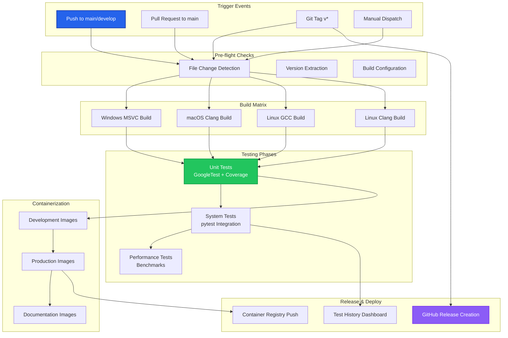
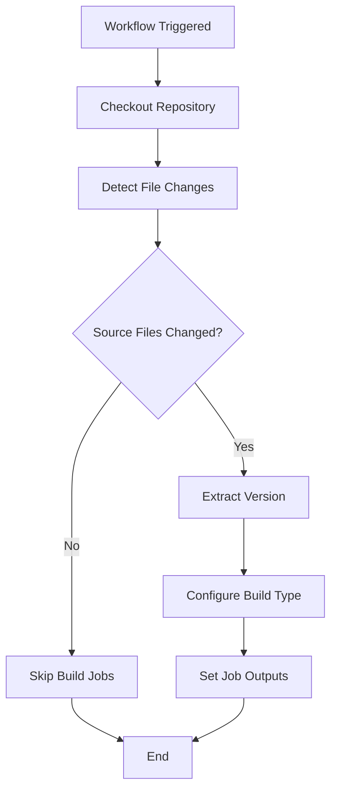
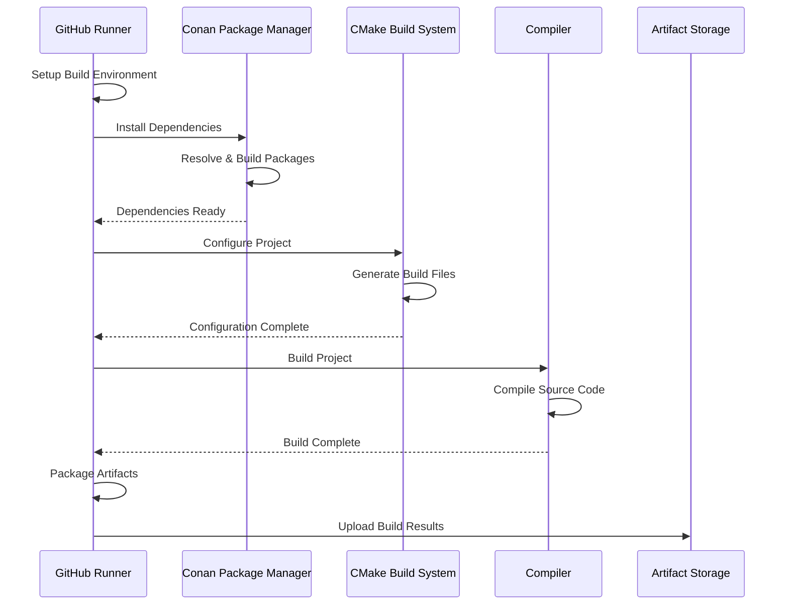
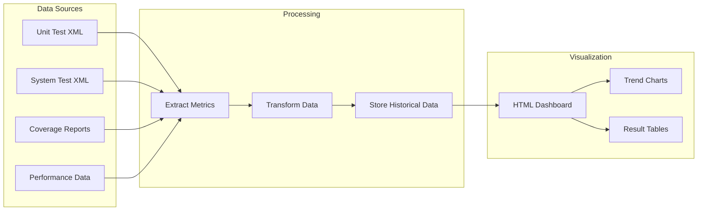
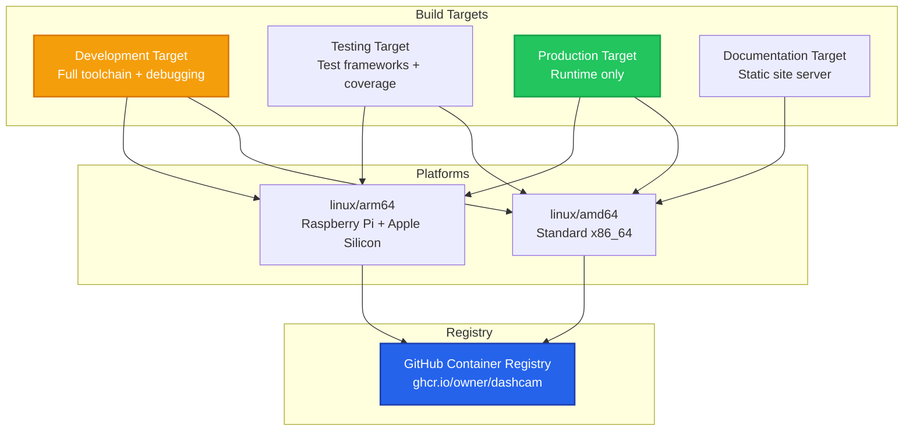
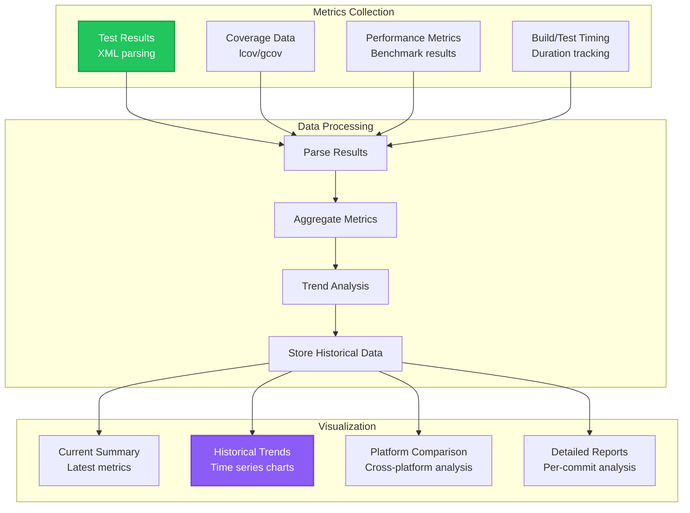
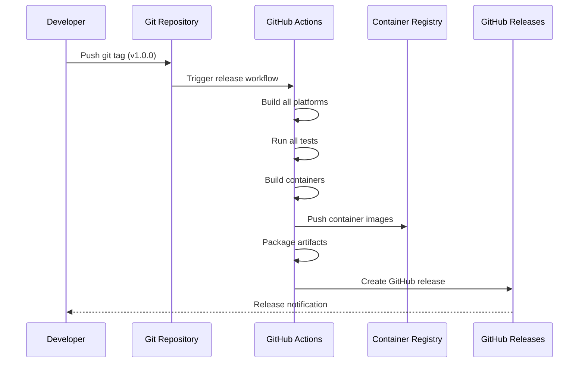
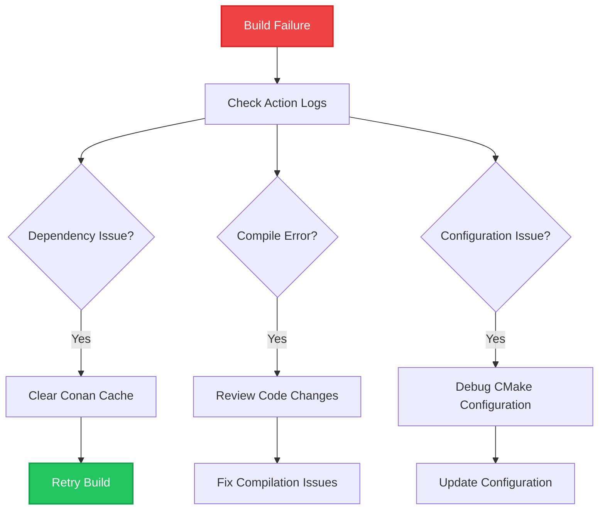

# GitHub Actions CI/CD Documentation

This comprehensive guide covers the complete GitHub Actions CI/CD pipeline for the Dashcam project, including design decisions, workflow explanations, and maintenance procedures.

## 🎯 Overview

Our GitHub Actions CI/CD system provides:
- **Multi-platform builds** (Windows, macOS, Linux)
- **Comprehensive testing** (unit, system, performance)
- **Docker image builds** with multi-architecture support
- **Automated releases** with artifact management
- **Test history tracking** with visual dashboards
- **Security scanning** and quality gates

## 🏗️ CI/CD Architecture

### Workflow Structure



## 📋 Workflow Details

### 1. Main CI/CD Pipeline (`.github/workflows/ci-cd.yml`)

This is the primary workflow that handles all core CI/CD operations.

#### **Trigger Configuration**
```yaml
on:
  push:
    branches: [ main, develop ]
    tags: [ 'v*' ]
  pull_request:
    branches: [ main ]
  workflow_dispatch:
    inputs:
      build_type:
        description: 'Build type'
        required: true
        default: 'Release'
        type: choice
        options: [Debug, Release, RelWithDebInfo]
```

**Design Rationale**:
- **Push to main/develop**: Ensures all changes are validated
- **Tags**: Triggers release builds for versioned releases
- **Pull requests**: Validates changes before merging
- **Manual dispatch**: Allows on-demand builds with custom parameters

#### **Pre-flight Checks Job**



**Purpose**: Optimizes CI/CD by only running builds when necessary files change.

**Key Features**:
- **Smart change detection**: Uses `dorny/paths-filter` to detect relevant file changes
- **Version extraction**: Handles git tags and commit-based versioning
- **Build type logic**: Automatically selects Debug/Release based on branch

#### **Multi-Platform Build Matrix**

```yaml
strategy:
  fail-fast: false
  matrix:
    include:
      - name: "Windows MSVC"
        os: windows-latest
        compiler: msvc
        generator: "Visual Studio 17 2022"
      - name: "macOS Clang"
        os: macos-latest
        compiler: clang
        generator: "Unix Makefiles"
      - name: "Linux GCC"
        os: ubuntu-latest
        compiler: gcc
        generator: "Unix Makefiles"
      - name: "Linux Clang"
        os: ubuntu-latest
        compiler: clang
        generator: "Unix Makefiles"
```

**Design Decisions**:

| Decision | Rationale | Alternative Considered |
|----------|-----------|----------------------|
| **fail-fast: false** | Allow all platforms to complete even if one fails | fail-fast: true (stops on first failure) |
| **Multiple Linux configs** | Test both GCC and Clang for compatibility | Single Linux configuration |
| **Latest OS versions** | Use most recent stable versions | Pinned OS versions |
| **Matrix naming** | Clear, descriptive names for easy identification | Default GitHub naming |

#### **Build Process Flow**



### 2. Test History Tracking (`.github/workflows/test-history.yml`)

This secondary workflow collects test metrics and maintains historical data.

#### **Test Metrics Collection**



**Key Features**:
- **Automated metric extraction** from test result XML files
- **Time-series data storage** in JSONL format
- **Visual dashboard generation** with HTML/CSS/JavaScript
- **GitHub Pages deployment** for easy access

## 🔧 Custom Actions

### Setup Build Environment Action

Located in `.github/actions/setup-build-env/action.yml`

**Purpose**: Standardizes build environment setup across all platforms.

**Key Features**:
- **Cross-platform compatibility**: Handles Windows, macOS, and Linux
- **Compiler flexibility**: Supports GCC, Clang, and MSVC
- **Version control**: Allows specific tool versions
- **Verification**: Confirms all tools are properly installed

**Usage Example**:
```yaml
- name: 🔧 Setup Build Environment
  uses: ./.github/actions/setup-build-env
  with:
    compiler: gcc
    cmake-version: '3.27.0'
    conan-version: '2.0.0'
```

## 🐳 Docker Integration

### Multi-Architecture Container Builds



**Container Strategy**:

1. **Multi-stage builds** minimize final image sizes
2. **Multi-architecture support** enables deployment on x86_64 and ARM64
3. **Registry integration** with GitHub Container Registry for seamless deployment
4. **Automated tagging** based on git branches and tags

### Container Security

```yaml
# Security best practices implemented
- name: 🔐 Login to Container Registry
  uses: docker/login-action@v3
  with:
    registry: ${{ env.DOCKER_REGISTRY }}
    username: ${{ github.actor }}
    password: ${{ secrets.GITHUB_TOKEN }}
```

**Security Features**:
- **No hardcoded credentials**: Uses GitHub tokens
- **Minimal base images**: Reduces attack surface
- **Non-root containers**: Enhances runtime security
- **Vulnerability scanning**: Automated security checks

## 📊 Test History and Metrics

### Dashboard Features

The test history system provides comprehensive insights:



### Metrics Tracked

| Metric Category | Data Points | Purpose |
|----------------|-------------|---------|
| **Test Results** | Pass/fail counts, success rates, duration | Quality monitoring |
| **Coverage** | Line/branch coverage percentages | Code quality |
| **Performance** | Benchmark results, timing data | Performance regression detection |
| **Build Health** | Build success rates, duration trends | CI/CD health monitoring |

## 🚀 Release Management

### Automated Release Process



**Release Features**:
- **Semantic versioning**: Follows semver conventions
- **Multi-platform artifacts**: Binaries for all supported platforms
- **Container images**: Tagged and pushed to registry
- **Release notes**: Auto-generated from commits
- **Asset management**: Automatic artifact attachment

### Release Triggers

1. **Git Tags**: `v*` pattern triggers release workflow
2. **Manual Dispatch**: Override for emergency releases
3. **Pre-release Detection**: Handles alpha/beta/rc versions

## 🔧 Configuration and Customization

### Environment Variables

```yaml
env:
  # Build configuration
  CMAKE_VERSION: '3.27.0'
  CONAN_VERSION: '2.0.0'
  
  # Docker configuration
  DOCKER_REGISTRY: 'ghcr.io'
  DOCKER_IMAGE_NAME: 'dashcam'
  
  # Test configuration
  ENABLE_COVERAGE: 'ON'
  CTEST_PARALLEL_LEVEL: 4
```

### Secrets Configuration

Required secrets in GitHub repository settings:

| Secret | Purpose | Example |
|--------|---------|---------|
| `GITHUB_TOKEN` | Automatic (no setup required) | Repository access |
| `DOCKER_REGISTRY_TOKEN` | Custom registry access | Optional for external registries |

### Branch Protection Rules

Recommended branch protection for `main`:

```yaml
# Recommended .github/branch_protection.yml
protection_rules:
  main:
    required_status_checks:
      strict: true
      contexts:
        - "🔨 Build (Windows MSVC)"
        - "🔨 Build (macOS Clang)"
        - "🔨 Build (Linux GCC)"
        - "🧪 Unit Tests (Windows)"
        - "🧪 Unit Tests (macOS)"
        - "🧪 Unit Tests (Linux)"
    enforce_admins: false
    required_pull_request_reviews:
      required_approving_review_count: 1
      dismiss_stale_reviews: true
    restrictions: null
```

## 🐛 Troubleshooting

### Common Issues and Solutions

#### Build Failures



#### Dependency Issues

**Symptom**: Conan dependency resolution fails
**Solution**:
```bash
# Clear Conan cache in workflow
- name: 🧹 Clear Conan Cache
  run: conan remove "*" --confirm
```

#### Test Failures

**Symptom**: Tests pass locally but fail in CI
**Common Causes**:
1. **Platform differences**: Different behavior on CI runners
2. **Timing issues**: Race conditions in CI environment
3. **Resource constraints**: Memory/CPU limitations

**Solutions**:
```yaml
# Increase test timeout
- name: 🧪 Run Tests with Extended Timeout
  run: ctest --timeout 300 --output-on-failure
```

### Debugging Actions

#### Enable Debug Logging

```yaml
- name: 🔍 Debug Action
  run: |
    echo "::debug::Debugging CI environment"
    env | sort
    echo "Available disk space:"
    df -h
  env:
    ACTIONS_STEP_DEBUG: true
```

#### Matrix Debugging

```yaml
# Debug specific matrix combinations
strategy:
  matrix:
    os: [ubuntu-latest]  # Temporarily limit to one OS
    compiler: [gcc]       # Temporarily limit to one compiler
```

## 📚 Best Practices

### 1. Workflow Design

- **Modular jobs**: Each job has a single responsibility
- **Fail-fast: false**: Allow all platforms to complete
- **Conditional execution**: Use `if` conditions to optimize runs
- **Artifact management**: Consistent naming and retention policies

### 2. Security

- **Minimal permissions**: Use least-privilege principle
- **Secret management**: No hardcoded credentials
- **Dependency scanning**: Regular security updates
- **Container security**: Non-root users, minimal images

### 3. Performance

- **Caching**: Aggressive caching of dependencies
- **Parallel execution**: Maximum parallelism where safe
- **Resource optimization**: Appropriate runner sizes
- **Build optimization**: Incremental builds where possible

### 4. Maintainability

- **Clear naming**: Descriptive job and step names
- **Documentation**: Inline comments for complex logic
- **Version pinning**: Specific action versions for stability
- **Regular updates**: Keep actions and tools current

## 🔄 Maintenance and Updates

### Regular Maintenance Tasks

#### Monthly Reviews

1. **Action Updates**: Check for new versions of used actions
2. **Tool Updates**: Update CMake, Conan, and other tool versions
3. **Security Patches**: Review and apply security updates
4. **Performance Review**: Analyze build times and optimize

#### Quarterly Reviews

1. **Strategy Assessment**: Review CI/CD strategy effectiveness
2. **Cost Analysis**: Monitor GitHub Actions usage and costs
3. **Feature Updates**: Evaluate new GitHub Actions features
4. **Documentation Updates**: Keep documentation current

### Update Procedures

#### Updating Tool Versions

```yaml
# 1. Update environment variables
env:
  CMAKE_VERSION: '3.28.0'  # Updated version
  CONAN_VERSION: '2.1.0'   # Updated version

# 2. Test in develop branch first
# 3. Monitor for issues
# 4. Rollback if problems occur
```

#### Updating Actions

```yaml
# Use Dependabot to automate action updates
# .github/dependabot.yml
version: 2
updates:
  - package-ecosystem: "github-actions"
    directory: "/"
    schedule:
      interval: "weekly"
```

## 📈 Metrics and Monitoring

### Key Performance Indicators

| KPI | Target | Measurement |
|-----|--------|-------------|
| **Build Success Rate** | > 95% | Successful builds / Total builds |
| **Test Success Rate** | > 98% | Passing tests / Total tests |
| **Build Duration** | < 15 minutes | Average build time across platforms |
| **Coverage** | > 85% | Line coverage percentage |

### Monitoring Setup

```yaml
# Example monitoring alert
- name: 📊 Check Build Health
  if: always()
  run: |
    if [[ "${{ job.status }}" == "failure" ]]; then
      echo "::error::Build health check failed"
      # Could integrate with external monitoring here
    fi
```

---

*This documentation covers the complete GitHub Actions CI/CD system for the Dashcam project. Update this guide when making changes to workflows or adding new features.*
