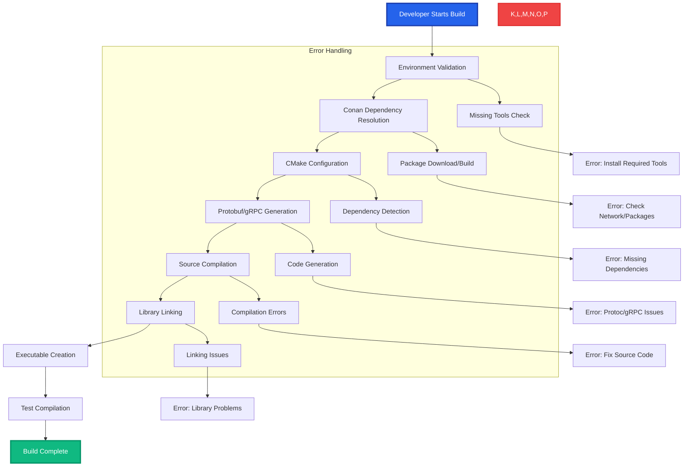
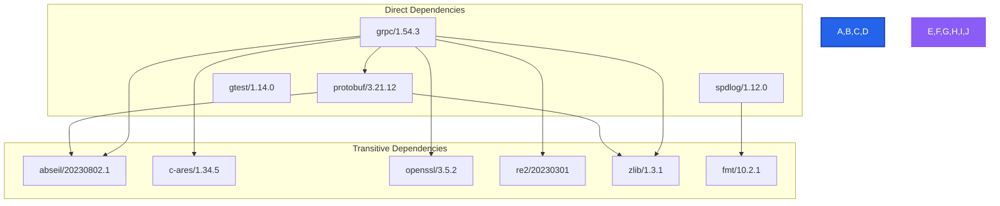
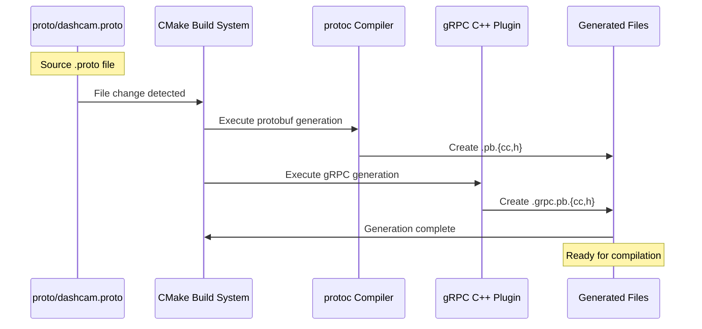

# Build Process Guide

This guide provides a comprehensive walkthrough of the build process for the Dashcam project, from initial setup to final executable generation.

## 🎯 Build Process Overview

The Dashcam project uses a multi-stage build process that combines modern C++ tooling with protocol buffer generation for a robust, cross-platform development experience.



## 🚀 Quick Start Build

### Using Build Scripts (Recommended)

```bash
# Windows PowerShell
.\scripts\build.ps1 debug

# Linux/macOS Bash
./scripts/build.sh debug
```

The build scripts handle the entire process automatically:
1. **Validation**: Check required tools and environment
2. **Dependencies**: Install Conan packages
3. **Configuration**: Set up CMake with proper toolchain
4. **Generation**: Create protobuf/gRPC files
5. **Compilation**: Build library and executable
6. **Cleanup**: Return to project root directory

## 📋 Prerequisites Checklist

Before building, ensure you have:

### Required Tools
- [ ] **CMake 3.20+**: Build system generator
- [ ] **Conan 2.0+**: C++ package manager
- [ ] **C++ Compiler**: 
  - Windows: Visual Studio 2019+ or GCC 9+
  - Linux: GCC 9+ or Clang 10+
  - macOS: Xcode 12+ or Homebrew GCC
- [ ] **Python 3.8.1+**: For system tests and tooling
- [ ] **Git**: Version control (for development)

### Environment Setup
- [ ] CMake in PATH
- [ ] Conan in PATH  
- [ ] Compiler accessible
- [ ] Internet connection (for first build)

### Verification Commands

```bash
# Check tool versions
cmake --version
conan --version
python --version

# Windows additional checks
cl.exe      # MSVC compiler
g++ --version  # MinGW compiler

# Linux/macOS additional checks  
gcc --version
clang++ --version
```

## 🔧 Detailed Build Steps

### Step 1: Environment Preparation

#### Create Build Directory
```bash
# Build scripts handle this automatically, but manual process:
mkdir build
cd build
```

#### Validate Environment
The build script performs these checks:
- Tool availability and versions
- Platform detection (Windows/Linux/macOS)
- Compiler toolchain validation
- Network connectivity for package downloads

### Step 2: Conan Dependency Resolution

#### Command Execution
```bash
conan install .. --output-folder=. --build=missing --settings=build_type=Debug
```

#### What Happens
1. **Profile Detection**: Conan detects your platform and compiler
2. **Dependency Resolution**: Analyzes `conanfile.txt` requirements
3. **Package Downloads**: Fetches binary packages or source code
4. **Binary Building**: Compiles packages marked as `build=missing`
5. **Generator Execution**: Creates CMake integration files

#### Key Generated Files
```
build/
├── conan_toolchain.cmake     # CMake toolchain configuration
├── conandata.yml            # Package metadata
├── conanbuild.{sh,bat}      # Build environment setup
├── conanrun.{sh,bat}        # Runtime environment setup
└── [various .cmake files]   # Find modules for packages
```

#### Dependency Tree


### Step 3: CMake Configuration

#### Command Execution
```bash
cmake .. -DCMAKE_TOOLCHAIN_FILE=conan_toolchain.cmake -DCMAKE_BUILD_TYPE=Debug
```

#### Configuration Process
1. **Toolchain Loading**: Conan provides compiler and library settings
2. **Project Setup**: Initialize project with version and languages
3. **Dependency Discovery**: Find all required packages via Conan modules
4. **Tool Detection**: Locate protoc and gRPC plugin executables
5. **Target Definition**: Set up build targets and dependencies
6. **Build File Generation**: Create platform-specific build files

#### CMake Output Analysis
```bash
-- Found gRPC C++ plugin: gRPC::grpc_cpp_plugin
-- Using protoc executable: C:/Users/[user]/.conan2/p/.../bin/protoc.exe
-- Configuring done (3.6s)
-- Generating done (0.1s)
-- Build files have been written to: C:/.../build
```

**Key Indicators:**
- ✅ All `find_package()` calls succeed
- ✅ Protoc and gRPC plugin located
- ✅ No configuration errors
- ✅ Build files generated successfully

### Step 4: Protobuf/gRPC Code Generation

#### Automatic Generation Process
CMake custom commands handle code generation:

```bash
# Protobuf message generation
protoc --cpp_out=generated -I../proto ../proto/dashcam.proto

# gRPC service generation  
protoc --grpc_out=generated --plugin=protoc-gen-grpc=[plugin_path] -I../proto ../proto/dashcam.proto
```

#### Generated Files
```
build/generated/
├── dashcam.pb.cc            # Protobuf message implementations
├── dashcam.pb.h             # Protobuf message headers
├── dashcam.grpc.pb.cc       # gRPC service implementations
└── dashcam.grpc.pb.h        # gRPC service headers
```

#### Generation Dependencies


### Step 5: Source Compilation

#### Compilation Order
1. **Generated Sources**: Protobuf and gRPC files
2. **Core Components**: Camera, video, storage managers
3. **Utility Components**: Logger, config parser
4. **gRPC Services**: Service implementation
5. **Main Application**: Entry point and orchestration

#### Compiler Invocations
```bash
# Example compilation commands (simplified)
cl.exe /c /I../include /Igenerated core/camera_manager.cpp
cl.exe /c /I../include /Igenerated core/video_recorder.cpp
cl.exe /c /I../include /Igenerated utils/logger.cpp
cl.exe /c /I../include /Igenerated grpc/grpc_service.cpp
cl.exe /c /I../include /Igenerated generated/dashcam.pb.cc
cl.exe /c /I../include /Igenerated generated/dashcam.grpc.pb.cc
```

#### Build Output Monitoring
```
Building Custom Rule C:/Users/.../CMakeLists.txt
camera_manager.cpp
video_recorder.cpp  
storage_manager.cpp
logger.cpp
config_parser.cpp
grpc_service.cpp
dashcam.pb.cc       # Generated protobuf
dashcam.grpc.pb.cc  # Generated gRPC
```

### Step 6: Library Linking

#### Library Creation
```bash
# Static library creation
lib.exe /out:dashcam_lib.lib *.obj

# Or dynamic library
cl.exe /LD /Fe:dashcam_lib.dll *.obj
```

#### Library Contents
- Core functionality (camera, video, storage)
- Utility functions (logging, configuration)
- gRPC service implementation
- Generated protobuf/gRPC code
- All external library dependencies

#### Dependency Linking
The library links against:
- `protobuf::protobuf` - Message serialization
- `gRPC::grpc++` - RPC framework core  
- `gRPC::grpc++_reflection` - Service reflection
- `spdlog::spdlog` - Logging framework
- `fmt::fmt` - String formatting

### Step 7: Executable Creation

#### Main Executable
```bash
cl.exe /Fe:dashcam_main.exe main.cpp dashcam_lib.lib [system_libs]
```

#### Executable Responsibilities
- Application initialization and configuration
- Component orchestration and lifecycle management
- Signal handling and graceful shutdown
- Command-line argument processing
- Error handling and logging setup

#### Runtime Dependencies
The executable requires:
- Dynamic libraries (if used)
- Configuration files
- Logging output directories
- Network access (for gRPC services)

### Step 8: Test Compilation

#### Unit Test Executable
```bash
cl.exe /Fe:unit_tests.exe tests/*.cpp dashcam_lib.lib gtest.lib
```

#### Test Structure
- **Core Tests**: Camera, video, storage manager functionality
- **Utility Tests**: Logger and configuration parser
- **Integration Tests**: gRPC service communication
- **Main Test Runner**: GoogleTest framework integration

#### Test Execution
```bash
# Run tests automatically
./unit_tests

# With detailed output
./unit_tests --gtest_output=xml:test_results.xml
```

## 🎯 Build Variants

### Debug Build
```bash
.\scripts\build.ps1 debug
```

**Features:**
- Debug symbols for debugging
- Assertions enabled
- AddressSanitizer (if supported)
- UndefinedBehaviorSanitizer (if supported)
- No optimizations for debugging clarity

**Use Cases:**
- Development and debugging
- Unit testing and integration testing
- Performance profiling (with symbols)
- Memory leak detection

### Release Build
```bash
.\scripts\build.ps1 release
```

**Features:**
- Full optimizations (-O3/O2)
- Assertions disabled
- No debug symbols (smaller size)
- Link-time optimization (if enabled)
- Production-ready performance

**Use Cases:**
- Production deployment
- Performance benchmarking
- Distribution to end users
- Final testing before release

### RelWithDebInfo Build
```bash
cmake -DCMAKE_BUILD_TYPE=RelWithDebInfo
```

**Features:**
- Optimizations enabled
- Debug symbols included
- Assertions may be enabled
- Good balance of performance and debuggability

**Use Cases:**
- Production debugging
- Performance analysis with symbols
- Customer support diagnostics

## ⚡ Performance Optimization

### Build Performance

#### Parallel Compilation
```bash
# Use all available cores
cmake --build . --parallel

# Specify core count
cmake --build . --parallel 8

# In build scripts
.\scripts\build.ps1 debug -Jobs 8
```

#### Incremental Builds
- Only modified files recompile
- Generated files only regenerate when .proto changes
- CMake tracks dependencies automatically
- Conan caches packages between builds

#### Build Time Monitoring
```bash
# Time the build
time cmake --build .

# On Windows PowerShell
Measure-Command { cmake --build . }

# Verbose output to see bottlenecks
cmake --build . --verbose
```

### Runtime Performance

#### Optimized Builds
- Use Release or RelWithDebInfo for production
- Enable Link-Time Optimization (LTO) if available
- Profile-guided optimization for critical paths
- Static linking for better optimization opportunities

#### Memory Usage
- Static linking reduces runtime overhead
- Protobuf arena allocation for large messages
- spdlog async logging for reduced I/O blocking
- Smart pointer usage for automatic memory management

## 🔧 Troubleshooting Build Issues

### Common Build Failures

#### 1. Dependency Resolution Failures
**Symptoms:**
```
ERROR: Package 'protobuf/3.21.12' not found
```

**Solutions:**
- Check internet connectivity
- Verify conanfile.txt syntax
- Update Conan package index: `conan search protobuf --remote=conancenter`
- Clear Conan cache: `conan remove "*" --force`

#### 2. Compiler Detection Issues
**Symptoms:**
```
CMake Error: No suitable C++ compiler found
```

**Solutions:**
- Install required compiler toolchain
- Set environment variables (CC, CXX)
- Use specific generator: `cmake -G "Visual Studio 17 2022"`
- Check PATH environment variable

#### 3. Protobuf Generation Failures
**Symptoms:**
```
'protoc' is not recognized as an internal or external command
```

**Solutions:**
- Clean build directory: `rm -rf build`
- Reinstall protobuf package
- Check protoc executable permissions
- Verify Conan package installation

#### 4. Linking Errors
**Symptoms:**
```
undefined reference to `grpc::Status::OK`
```

**Solutions:**
- Verify all required libraries are linked
- Check library link order
- Ensure compatible protobuf/gRPC versions
- Clean and rebuild completely

### Advanced Debugging

#### CMake Debug Output
```bash
# Detailed configuration output
cmake .. --debug-output

# Trace all CMake commands
cmake .. --trace

# Find specific issues
cmake .. --debug-find
```

#### Conan Debug Information
```bash
# Show dependency graph
conan graph info . --format=html > deps.html

# Show package details
conan search protobuf --remote=conancenter

# Show build requirements
conan install . --build=missing --build-require
```

#### Build System Analysis
```bash
# Show build commands
cmake --build . --verbose

# Analyze build dependencies
make -n  # Linux/macOS
msbuild /verbosity:detailed  # Windows
```

## 📊 Build Metrics and Monitoring

### Build Time Analysis

#### Timing Different Phases
```bash
# Time each major phase
time conan install .                    # Dependency resolution
time cmake ..                          # Configuration
time cmake --build . --target generate_protobuf_files  # Generation
time cmake --build . --target dashcam_lib              # Library build
time cmake --build . --target dashcam_main             # Executable build
```

#### Build Size Analysis
```bash
# Library sizes
ls -lh build/src/*.lib
ls -lh build/src/*.a

# Executable sizes  
ls -lh build/src/dashcam_main*

# Symbol analysis
nm -S dashcam_lib.a | sort -k2 -hr    # Linux
objdump -t dashcam_lib.lib             # Windows
```

### Dependency Analysis

#### Package Information
```bash
# Show all packages and versions
conan list "*"

# Show package dependency tree
conan graph info . --format=html

# Show package sizes
du -sh ~/.conan2/p/*/p/  # Linux/macOS
```

#### Build Artifact Analysis
```bash
# Show linked libraries
ldd dashcam_main        # Linux
otool -L dashcam_main   # macOS
dumpbin /dependents dashcam_main.exe  # Windows

# Show symbols
nm dashcam_main | grep protobuf
objdump -t dashcam_main.exe | findstr grpc
```

## 🎉 Build Success Indicators

### Successful Build Output
```
Build completed successfully!
Build type: Debug
Executable: C:/.../build/src/dashcam_main.exe
Unit tests: C:/.../build/tests/unit_tests.exe

Debug build includes:
- Debug symbols for debugging
- AddressSanitizer and UndefinedBehaviorSanitizer (if supported)
- Assertions enabled
```

### Verification Steps
```bash
# 1. Check executable exists and runs
./build/src/dashcam_main --version

# 2. Run unit tests
./build/tests/unit_tests

# 3. Verify gRPC functionality
./build/tests/unit_tests --gtest_filter="*gRPC*"

# 4. Check generated files
ls build/generated/
```

### Post-Build Actions
1. **Testing**: Run unit tests and integration tests
2. **Documentation**: Update any build-related documentation
3. **Packaging**: Create distribution packages if needed
4. **Deployment**: Copy executables to target systems

This comprehensive build process guide should help you understand every aspect of building the Dashcam project, from initial setup through final executable creation. The combination of modern tools, clear processes, and comprehensive error handling makes for a robust development experience.
