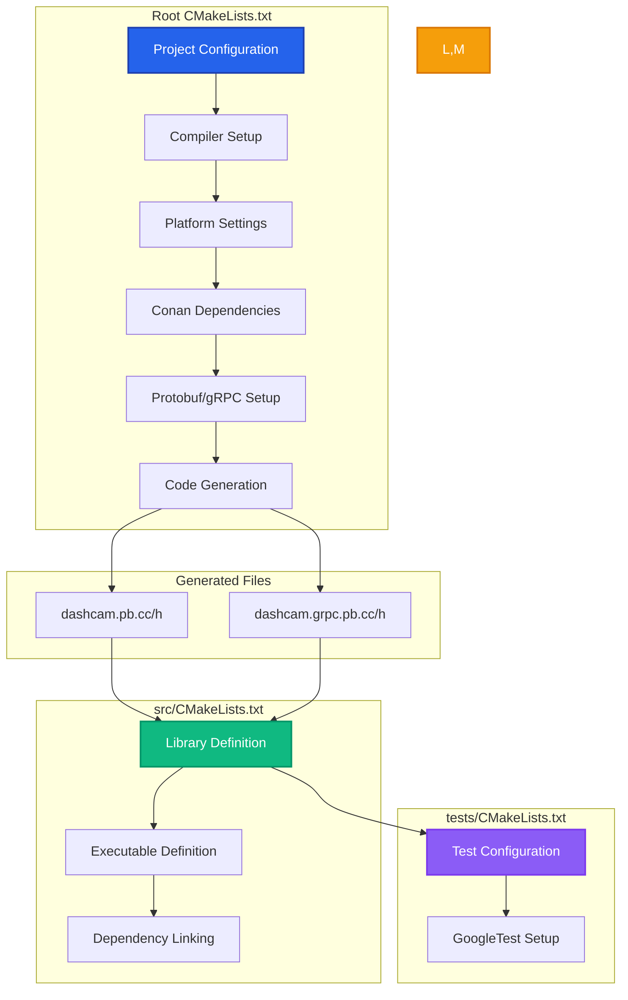
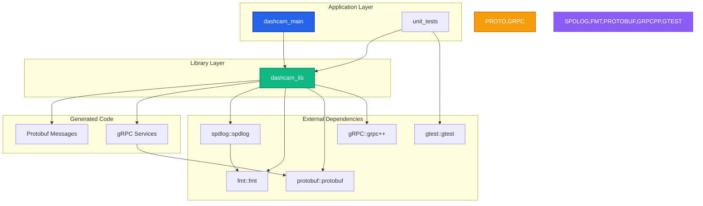

# CMake Architecture Summary

This document provides a high-level overview of the Dashcam project's CMake build system architecture, explaining how all components work together to create a robust, cross-platform build system.

## 🏗️ Overall Architecture



## 📁 File Structure and Responsibilities

### 1. Root CMakeLists.txt
**Primary Responsibilities:**
- **Project Configuration**: Version, language, standards
- **Toolchain Setup**: Compiler flags, platform settings
- **Dependency Management**: Conan package integration
- **Code Generation**: Protobuf/gRPC pipeline setup
- **Global Settings**: Include paths, build options

**Key Features:**
- Tiger Style safety-first compiler configuration
- Cross-platform compatibility (Windows, Linux, macOS)
- Automatic protobuf/gRPC code generation
- Modern CMake target-based approach

### 2. src/CMakeLists.txt
**Primary Responsibilities:**
- **Library Creation**: Main dashcam_lib static library
- **Executable Creation**: dashcam_main application
- **Source Organization**: Core, utility, and generated sources
- **Dependency Linking**: External library integration

**Key Features:**
- Clear separation of library and executable
- Automatic inclusion of generated sources
- Proper dependency propagation
- Platform-specific system library linking

### 3. tests/CMakeLists.txt
**Primary Responsibilities:**
- **Test Framework Setup**: GoogleTest integration
- **Test Executable Creation**: Unit test runner
- **Test Discovery**: Automatic test registration
- **Coverage Integration**: Code coverage support

## 🔄 Build Process Flow

### Phase 1: Configuration
1. **CMake Initialization**: Load root CMakeLists.txt
2. **Platform Detection**: Identify OS, compiler, architecture
3. **Conan Integration**: Load package metadata and toolchain
4. **Dependency Resolution**: Find all required packages
5. **Tool Detection**: Locate protoc and gRPC plugin
6. **Target Setup**: Define build targets and dependencies

### Phase 2: Code Generation
1. **Proto File Analysis**: Parse .proto service definitions
2. **Protobuf Generation**: Create message serialization code
3. **gRPC Generation**: Create service stub and implementation code
4. **Header Generation**: Create corresponding header files
5. **Dependency Registration**: Register generated files as target dependencies

### Phase 3: Compilation
1. **Generated Source Compilation**: Compile protobuf/gRPC code
2. **Core Source Compilation**: Compile application logic
3. **Library Creation**: Create static library with all objects
4. **Executable Linking**: Link main executable with library
5. **Test Compilation**: Compile and link unit tests

## 🎯 Key Design Principles

### Modern CMake Practices
- **Target-Based Configuration**: Uses targets instead of global variables
- **Property Propagation**: Automatic dependency and flag inheritance
- **Generator Expressions**: Build-time variable resolution
- **Interface Specification**: Clear public/private interface boundaries

### Tiger Style Integration
- **Safety First**: Memory sanitizers in debug builds
- **Performance Focus**: Aggressive optimization in release builds
- **Developer Experience**: Clear error messages and documentation
- **Cross-Platform**: Consistent behavior across all platforms

### Dependency Management
- **Conan Integration**: Modern C++ package management
- **Version Control**: Explicit dependency versions
- **Binary Caching**: Fast incremental builds
- **Transitive Dependencies**: Automatic dependency resolution

## 🔧 Configuration Variables

### Build Types
| Variable | Purpose | Debug Value | Release Value |
|----------|---------|-------------|---------------|
| `CMAKE_BUILD_TYPE` | Build configuration | `Debug` | `Release` |
| `CMAKE_CXX_FLAGS_DEBUG` | Debug flags | `-g -O0 -fsanitize=...` | N/A |
| `CMAKE_CXX_FLAGS_RELEASE` | Release flags | N/A | `-O3 -DNDEBUG` |

### Path Variables
| Variable | Purpose | Example |
|----------|---------|---------|
| `CMAKE_SOURCE_DIR` | Project root | `/path/to/dashcam` |
| `CMAKE_BINARY_DIR` | Build directory | `/path/to/dashcam/build` |
| `PROTO_OUTPUT_DIR` | Generated files | `${CMAKE_BINARY_DIR}/generated` |

### Tool Variables
| Variable | Purpose | Resolution Method |
|----------|---------|-------------------|
| `PROTOC_EXECUTABLE` | Protocol compiler | Target resolution + PATH search |
| `gRPC_CPP_PLUGIN_EXECUTABLE` | gRPC code generator | Conan target + PATH search |

## 🎮 Target Definitions

### Main Targets
```cmake
# Library target with all functionality
dashcam_lib              # Static library
├── Source files         # Core application logic
├── Generated sources    # Protobuf/gRPC code
├── Include directories  # Header search paths
└── Linked libraries     # External dependencies

# Executable target for application
dashcam_main            # Application executable
├── main.cpp            # Entry point
└── Links: dashcam_lib  # All functionality via library

# Test target for validation
unit_tests              # Test executable
├── Test sources        # GoogleTest-based tests
└── Links: dashcam_lib  # Test the library
```

### Custom Targets
```cmake
# Code generation target
generate_protobuf_files  # Custom target
├── Depends on          # .proto source files
├── Generates           # .pb.{cc,h} and .grpc.pb.{cc,h}
└── Commands            # protoc invocations
```

## 📊 Dependency Graph



## 🔍 Advanced Features

### Automatic Code Generation
- **Source Detection**: Automatically finds .proto files
- **Dependency Tracking**: Regenerates when .proto files change
- **Multi-Stage Generation**: Separate protobuf and gRPC generation
- **Error Handling**: Clear error messages for generation failures

### Cross-Platform Support
- **Compiler Detection**: Automatic toolchain configuration
- **Platform Libraries**: Conditional system library linking
- **Path Handling**: Proper path separators and formats
- **Tool Resolution**: Flexible executable finding

### Development Features
- **Incremental Builds**: Only rebuild changed components
- **Parallel Compilation**: Multi-core build support
- **Debug Support**: Full symbol and sanitizer integration
- **IDE Integration**: CMake export for VS Code, Visual Studio

## 🛠️ Customization Points

### Build Options
Add custom options for build variants:
```cmake
option(ENABLE_ASAN "Enable AddressSanitizer" ON)
option(ENABLE_COVERAGE "Enable code coverage" OFF)
option(BUILD_BENCHMARKS "Build performance benchmarks" OFF)
```

### Additional Dependencies
Add new Conan packages:
```cmake
# In conanfile.txt
[requires]
new_package/1.0.0

# In CMakeLists.txt
find_package(new_package REQUIRED)
target_link_libraries(dashcam_lib new_package::new_package)
```

### Platform Extensions
Add platform-specific features:
```cmake
if(RASPBERRYPI)
    target_compile_definitions(dashcam_lib PRIVATE RASPBERRY_PI_BUILD)
    target_link_libraries(dashcam_lib bcm_host)
endif()
```

## 📚 Best Practices Demonstrated

### Modern CMake
- Uses `target_*` commands instead of global variables
- Proper `PUBLIC`/`PRIVATE`/`INTERFACE` visibility
- Generator expressions for build-time resolution
- Clear target dependencies and ordering

### Code Organization
- Logical separation of concerns across CMakeLists.txt files
- Clear naming conventions for targets and variables
- Comprehensive documentation and comments
- Consistent formatting and structure

### Error Handling
- Graceful fallbacks for tool detection
- Clear error messages with actionable advice
- Validation of required components
- Platform-specific error handling

This architecture provides a solid foundation for a professional C++ project with modern build system practices, comprehensive dependency management, and excellent developer experience.
