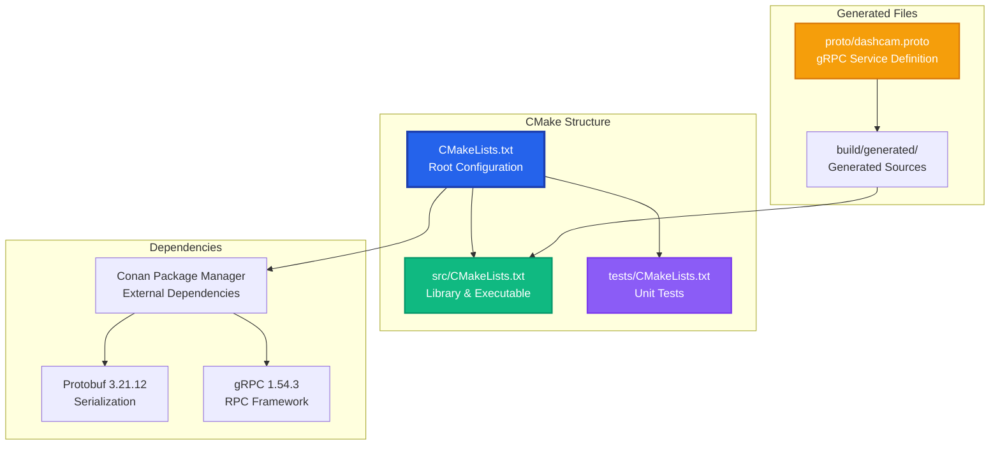
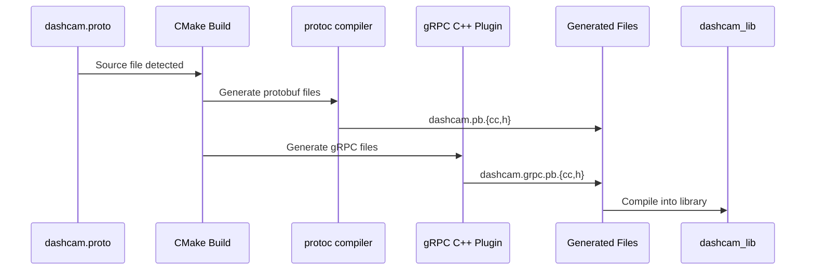

# CMake Build System Guide

This comprehensive guide explains the CMake build system for the Dashcam project, including structure, configuration, and the complete build process with protobuf/gRPC integration.

## 🏗️ CMake Architecture Overview

The project uses a modern CMake architecture designed for clarity, maintainability, and cross-platform compatibility.



## 📁 File Structure & Responsibilities

### Root CMakeLists.txt
**Location**: `CMakeLists.txt`  
**Purpose**: Main configuration, dependency management, and protobuf/gRPC generation

Key responsibilities:
- Project configuration and C++ standard setup
- Compiler flags and platform-specific settings
- Conan dependency resolution
- Protobuf/gRPC file generation pipeline
- Global include directories and build options

### Source CMakeLists.txt
**Location**: `src/CMakeLists.txt`  
**Purpose**: Library and executable definition

Key responsibilities:
- Main library (`dashcam_lib`) with all source files
- Executable (`dashcam_main`) linking to the library
- Generated protobuf/gRPC source integration
- Library linking and include directories

### Tests CMakeLists.txt
**Location**: `tests/CMakeLists.txt`  
**Purpose**: Unit test configuration

Key responsibilities:
- GoogleTest integration
- Unit test executable configuration
- Test discovery and execution setup

## 🔧 Detailed CMake Configuration

### 1. Project Setup and Standards

```cmake
cmake_minimum_required(VERSION 3.20)

project(dashcam
    VERSION 1.0.0
    DESCRIPTION "Homemade Dash Cam System"
    LANGUAGES CXX
)

# Set C++ standard - Tiger Style uses modern C++17
set(CMAKE_CXX_STANDARD 17)
set(CMAKE_CXX_STANDARD_REQUIRED ON)
set(CMAKE_CXX_EXTENSIONS OFF)
```

**Why C++17?**
- Balance between modern features and compatibility
- Structured bindings, `std::optional`, `std::variant`
- Filesystem library for cross-platform file operations
- Parallel algorithms for performance

### 2. Build Type Configuration

```cmake
# Set default build type to Debug if not specified
if(NOT CMAKE_BUILD_TYPE)
    set(CMAKE_BUILD_TYPE Debug CACHE STRING "Build type" FORCE)
endif()
```

**Build Types:**
- **Debug**: Debugging symbols, assertions, sanitizers
- **Release**: Optimizations, no assertions, production-ready

### 3. Compiler-Specific Optimizations

```cmake
if(CMAKE_CXX_COMPILER_ID MATCHES "GNU|Clang")
    # GCC/Clang flags - Tiger Style emphasizes safety
    set(CMAKE_CXX_FLAGS "${CMAKE_CXX_FLAGS} -Wall -Wextra -Wpedantic")
    set(CMAKE_CXX_FLAGS_DEBUG "${CMAKE_CXX_FLAGS_DEBUG} -g -O0 -DDEBUG")
    set(CMAKE_CXX_FLAGS_DEBUG "${CMAKE_CXX_FLAGS_DEBUG} -fsanitize=address -fsanitize=undefined")
    set(CMAKE_CXX_FLAGS_RELEASE "${CMAKE_CXX_FLAGS_RELEASE} -O3 -DNDEBUG")
elseif(CMAKE_CXX_COMPILER_ID STREQUAL "MSVC")
    # MSVC flags - Windows-specific optimizations
    set(CMAKE_CXX_FLAGS "${CMAKE_CXX_FLAGS} /W4")
    set(CMAKE_CXX_FLAGS_DEBUG "${CMAKE_CXX_FLAGS_DEBUG} /Od /Zi /DDEBUG")
    set(CMAKE_CXX_FLAGS_RELEASE "${CMAKE_CXX_FLAGS_RELEASE} /O2 /DNDEBUG")
endif()
```

**Key Features:**
- **Memory Safety**: AddressSanitizer and UndefinedBehaviorSanitizer in debug builds
- **Warning Coverage**: Comprehensive warning flags catch potential issues
- **Optimization**: Aggressive optimization in release builds for performance

### 4. Platform-Specific Settings

```cmake
if(WIN32)
    add_definitions(-DWIN32_LEAN_AND_MEAN)
    add_definitions(-DNOMINMAX)
elseif(UNIX AND NOT APPLE)
    # Linux settings
    set(CMAKE_CXX_FLAGS "${CMAKE_CXX_FLAGS} -pthread")
elseif(APPLE)
    # macOS settings
    set(CMAKE_CXX_FLAGS "${CMAKE_CXX_FLAGS} -pthread")
endif()
```

**Platform Considerations:**
- **Windows**: Minimize header bloat, avoid macro conflicts
- **Linux/macOS**: Enable pthread support for threading

## 🔗 Dependency Management with Conan

### Conan Integration

```cmake
# Find Conan dependencies
find_package(GTest REQUIRED)
find_package(spdlog REQUIRED)
find_package(Protobuf REQUIRED)
find_package(gRPC REQUIRED)
```

**Dependency Resolution Process:**
1. Conan installs packages during build script execution
2. CMake finds packages through Conan-generated find modules
3. Targets become available for linking

### Key Dependencies

| Package | Version | Purpose |
|---------|---------|---------|
| `protobuf` | 3.21.12 | Message serialization |
| `grpc` | 1.54.3 | RPC framework |
| `spdlog` | 1.12.0 | High-performance logging |
| `gtest` | 1.14.0 | Unit testing framework |
| `fmt` | 10.2.1 | String formatting (spdlog dependency) |

## 🔄 Protobuf/gRPC Generation Pipeline

### Overview

The build system automatically generates C++ code from `.proto` files using a sophisticated pipeline that handles both protobuf messages and gRPC services.



### 1. Tool Detection

```cmake
# Find the gRPC C++ plugin - Conan provides it through different possible targets
if(TARGET gRPC::grpc_cpp_plugin)
    set(gRPC_CPP_PLUGIN_EXECUTABLE $<TARGET_FILE:gRPC::grpc_cpp_plugin>)
    message(STATUS "Found gRPC C++ plugin: gRPC::grpc_cpp_plugin")
elseif(TARGET grpc_cpp_plugin)
    set(gRPC_CPP_PLUGIN_EXECUTABLE $<TARGET_FILE:grpc_cpp_plugin>)
    message(STATUS "Found gRPC C++ plugin: grpc_cpp_plugin")
else()
    find_program(gRPC_CPP_PLUGIN_EXECUTABLE grpc_cpp_plugin)
    if(NOT gRPC_CPP_PLUGIN_EXECUTABLE)
        message(FATAL_ERROR "gRPC C++ plugin not found.")
    endif()
endif()
```

**Tool Resolution Strategy:**
1. Try Conan-provided gRPC plugin targets
2. Fall back to system PATH search
3. Fail fast with clear error message

### 2. Protoc Executable Resolution

```cmake
# For custom commands, we need to resolve the protoc executable path
if(TARGET protobuf::protoc)
    # Try to get the executable location
    get_target_property(PROTOC_EXECUTABLE protobuf::protoc IMPORTED_LOCATION)
    if(NOT PROTOC_EXECUTABLE)
        get_target_property(PROTOC_EXECUTABLE protobuf::protoc IMPORTED_LOCATION_RELEASE)
    endif()
    if(NOT PROTOC_EXECUTABLE)
        get_target_property(PROTOC_EXECUTABLE protobuf::protoc IMPORTED_LOCATION_DEBUG)
    endif()
    
    # If we still can't get the location, use generator expression
    if(NOT PROTOC_EXECUTABLE AND TARGET protobuf::protoc)
        set(PROTOC_EXECUTABLE "$<TARGET_FILE:protobuf::protoc>")
        message(STATUS "Using protoc target: protobuf::protoc (path resolved at build time)")
    endif()
endif()
```

**Resolution Challenges:**
- Conan packages use complex target structures
- Imported targets have different property names
- Generator expressions resolve at build time, not configure time

### 3. File Generation Setup

```cmake
# Generate protobuf and gRPC files
set(PROTO_FILES
    ${CMAKE_SOURCE_DIR}/proto/dashcam.proto
)

# Create output directory for generated files
set(PROTO_OUTPUT_DIR ${CMAKE_BINARY_DIR}/generated)
file(MAKE_DIRECTORY ${PROTO_OUTPUT_DIR})
```

**Output Organization:**
- All generated files go to `build/generated/`
- Consistent location for includes and linking
- Clean separation from source files

### 4. Custom Commands for Generation

```cmake
foreach(PROTO_FILE ${PROTO_FILES})
    get_filename_component(PROTO_NAME ${PROTO_FILE} NAME_WE)
    
    # Define output file paths
    set(PROTO_SRC ${PROTO_OUTPUT_DIR}/${PROTO_NAME}.pb.cc)
    set(PROTO_HDR ${PROTO_OUTPUT_DIR}/${PROTO_NAME}.pb.h)
    set(GRPC_SRC ${PROTO_OUTPUT_DIR}/${PROTO_NAME}.grpc.pb.cc)
    set(GRPC_HDR ${PROTO_OUTPUT_DIR}/${PROTO_NAME}.grpc.pb.h)
    
    # Generate protobuf files
    add_custom_command(
        OUTPUT ${PROTO_SRC} ${PROTO_HDR}
        COMMAND ${PROTOC_EXECUTABLE}
        ARGS --cpp_out=${PROTO_OUTPUT_DIR}
             -I${CMAKE_SOURCE_DIR}/proto
             ${PROTO_FILE}
        DEPENDS ${PROTO_FILE}
        COMMENT "Generating protobuf files for ${PROTO_FILE}"
        VERBATIM
    )
    
    # Generate gRPC files  
    add_custom_command(
        OUTPUT ${GRPC_SRC} ${GRPC_HDR}
        COMMAND ${PROTOC_EXECUTABLE}
        ARGS --grpc_out=${PROTO_OUTPUT_DIR}
             --plugin=protoc-gen-grpc=${gRPC_CPP_PLUGIN_EXECUTABLE}
             -I${CMAKE_SOURCE_DIR}/proto
             ${PROTO_FILE}
        DEPENDS ${GRPC_FILE}
        COMMENT "Generating gRPC files for ${PROTO_FILE}"
        VERBATIM
    )
endforeach()
```

**Custom Command Features:**
- **VERBATIM**: Handles spaces and special characters in paths correctly
- **DEPENDS**: Ensures regeneration when .proto files change
- **OUTPUT**: Defines what files will be created
- **COMMENT**: Provides clear build feedback

### 5. Target Dependencies

```cmake
# Create a target for generated files
add_custom_target(generate_protobuf_files 
    DEPENDS ${PROTO_SRCS} ${PROTO_HDRS} ${GRPC_SRCS} ${GRPC_HDRS}
    COMMENT "Generating all protobuf and gRPC files"
)

# In src/CMakeLists.txt - ensure files are generated before library
add_dependencies(dashcam_lib generate_protobuf_files)
```

**Dependency Chain:**
1. `generate_protobuf_files` target depends on generated files
2. `dashcam_lib` depends on `generate_protobuf_files`
3. Build system ensures correct order

## 🔨 Build Process Step-by-Step

### 1. Environment Setup

```bash
# Windows PowerShell
.\scripts\build.ps1 debug

# Linux/macOS  
./scripts/build.sh debug
```

### 2. Conan Dependency Installation

```bash
conan install . --output-folder=build --build=missing --settings=build_type=Debug
```

**What happens:**
- Downloads and builds missing packages
- Generates `conan_toolchain.cmake`
- Creates find modules for CMake
- Sets up build environment variables

### 3. CMake Configuration

```bash
cmake . -DCMAKE_TOOLCHAIN_FILE=build/conan_toolchain.cmake -DCMAKE_BUILD_TYPE=Debug
```

**Configuration steps:**
1. Load Conan toolchain
2. Detect compiler and platform
3. Find all dependencies
4. Set up protobuf/gRPC generation rules
5. Generate build files (Makefiles/Visual Studio projects)

### 4. Protobuf/gRPC Generation

During the build, CMake executes custom commands:

```bash
# Generate protobuf files
protoc --cpp_out=build/generated -Iproto proto/dashcam.proto

# Generate gRPC files  
protoc --grpc_out=build/generated --plugin=protoc-gen-grpc=<grpc_plugin> -Iproto proto/dashcam.proto
```

**Generated files:**
- `dashcam.pb.{cc,h}` - Message serialization
- `dashcam.grpc.pb.{cc,h}` - Service stubs and implementations

### 5. Source Compilation

```bash
# Compile library with generated sources
g++ -c src/core/*.cpp src/utils/*.cpp src/grpc/*.cpp build/generated/*.cc

# Link library
ar rcs libdashcam_lib.a *.o

# Compile and link executable
g++ src/main.cpp -ldashcam_lib -lprotobuf -lgrpc++ -o dashcam_main
```

### 6. Test Compilation

```bash
# Compile tests
g++ tests/*.cpp -ldashcam_lib -lgtest -lgtest_main -o unit_tests
```

## 🛠️ Advanced Build Configuration

### Custom Build Options

You can customize the build with various options:

```bash
# Different build types
cmake -DCMAKE_BUILD_TYPE=Release
cmake -DCMAKE_BUILD_TYPE=Debug
cmake -DCMAKE_BUILD_TYPE=RelWithDebInfo

# Enable specific features
cmake -DENABLE_ASAN=ON          # Address Sanitizer
cmake -DENABLE_TSAN=ON          # Thread Sanitizer  
cmake -DENABLE_COVERAGE=ON      # Code coverage
```

### Parallel Building

```bash
# Use all available cores
cmake --build . --parallel

# Specify core count
cmake --build . --parallel 8
```

### Clean Rebuilds

```bash
# Clean build directory
rm -rf build && mkdir build

# Or use build scripts which handle this
.\scripts\build.ps1 debug
```

## 🐛 Troubleshooting Common Issues

### Issue: Protoc Not Found

**Symptoms:**
```
CMake Error: Could not find protoc executable
```

**Solution:**
1. Ensure Conan installed protobuf correctly
2. Check `conan install` output for errors
3. Verify protobuf package in `conanfile.txt`

### Issue: gRPC Plugin Missing

**Symptoms:**
```
gRPC C++ plugin not found
```

**Solution:**
1. Verify gRPC package installation
2. Check Conan build modules are included
3. Ensure proper target name in CMake

### Issue: Generated Files Not Found

**Symptoms:**
```
Cannot open source file 'dashcam.pb.cc'
```

**Solution:**
1. Clean and rebuild: `rm -rf build && .\scripts\build.ps1`
2. Check custom command dependencies
3. Verify output directory creation

### Issue: Linking Errors

**Symptoms:**
```
undefined reference to protobuf symbols
```

**Solution:**
1. Check library linking order in CMakeLists.txt
2. Verify all required libraries are linked
3. Ensure protobuf/gRPC versions are compatible

## 📈 Performance Considerations

### Build Performance

1. **Parallel Building**: Use `--parallel` flag
2. **Incremental Builds**: Only modified files rebuild
3. **Conan Cache**: Dependencies cached between builds
4. **Generated File Caching**: Only regenerated when .proto changes

### Runtime Performance

1. **Release Builds**: Full optimization enabled
2. **Link-Time Optimization**: Consider enabling LTO
3. **Profile-Guided Optimization**: For production builds

## 🔍 Build System Monitoring

### Verbose Output

```bash
# See detailed build commands
cmake --build . --verbose

# See CMake configuration details
cmake . --debug-output
```

### Build Timing

```bash
# Time the build process
time cmake --build .

# On Windows
Measure-Command { cmake --build . }
```

### Dependency Analysis

```bash
# Show dependency tree
conan graph info . --graph=deps.html

# Analyze library dependencies
ldd dashcam_main  # Linux
otool -L dashcam_main  # macOS
```

## 📚 Best Practices

### CMake Style

1. **Modern CMake**: Use targets and properties, not variables
2. **Clear Naming**: Descriptive target and variable names
3. **Documentation**: Comment complex logic
4. **Modular Design**: Separate concerns across files

### Dependency Management

1. **Version Pinning**: Specify exact versions in conanfile.txt
2. **Minimal Dependencies**: Only include what you need
3. **Regular Updates**: Keep dependencies current for security

### Build Scripts

1. **Error Handling**: Check exit codes and provide clear messages
2. **Cross-Platform**: Use appropriate shell for each platform
3. **Development Experience**: Return to project root on completion

This comprehensive guide should help you understand and work with the CMake build system effectively. The combination of modern CMake practices, Conan integration, and protobuf/gRPC generation creates a robust and maintainable build system suitable for professional C++ development.
