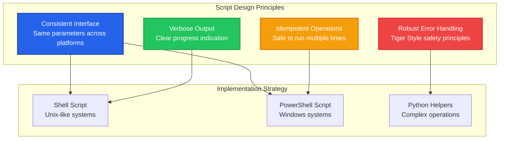
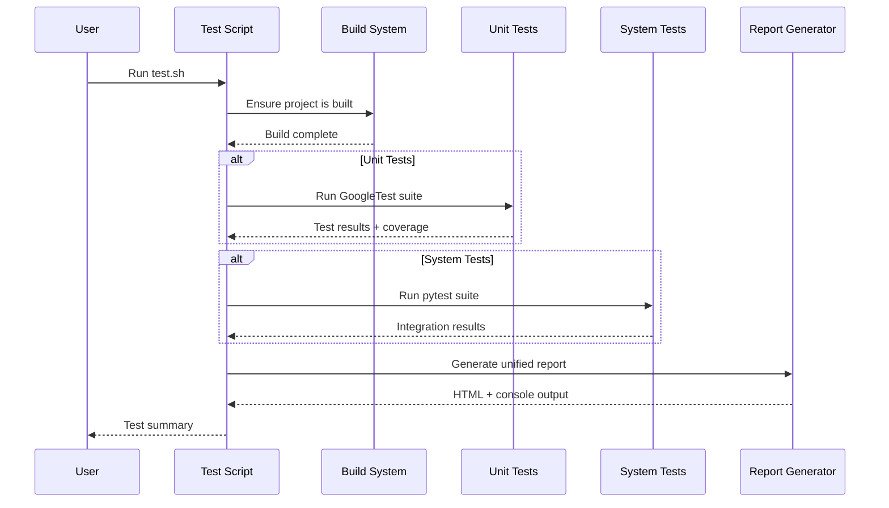
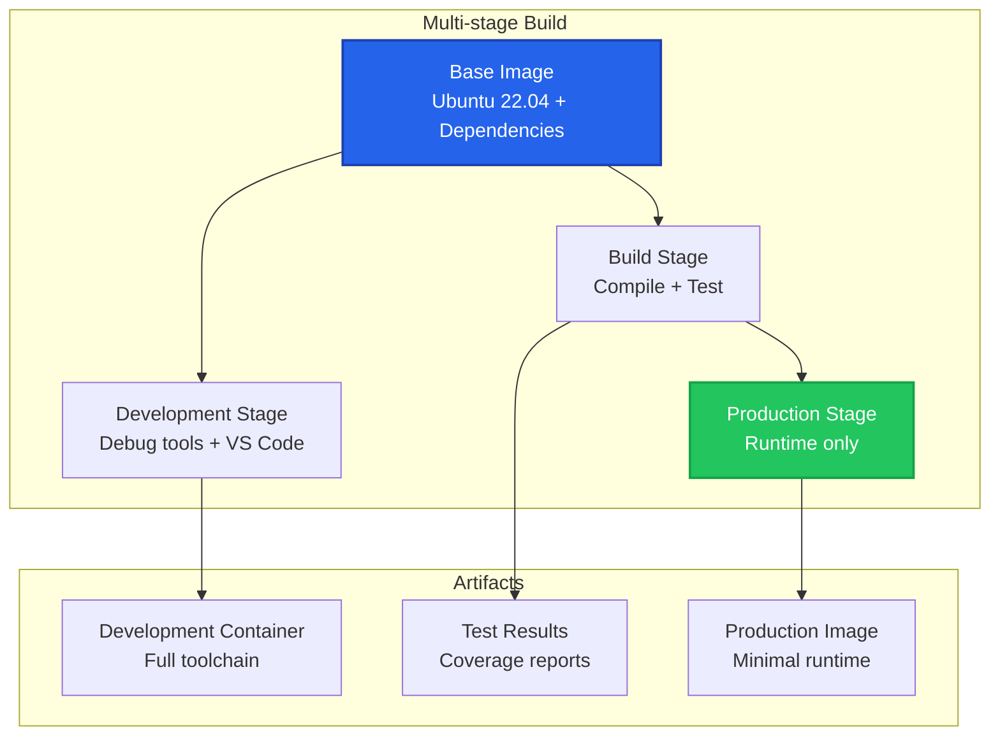

# Build Scripts Documentation

This document provides comprehensive documentation for all build and automation scripts in the Dashcam project. Our scripts are designed for cross-platform compatibility and follow Tiger Style principles for reliability and maintainability.

## 📁 Scripts Overview

### Script Structure

```
scripts/
├── setup.sh / setup.ps1          # Environment setup
├── build.sh / build.ps1          # Build automation
├── test.sh / test.ps1             # Test execution
├── clean.sh / clean.ps1          # Cleanup operations (NEW)
├── docker-build.sh / docker-build.ps1  # Docker operations
├── docs/
│   ├── serve_docs.py             # Documentation server
│   └── generate_docs.py          # Documentation generation
└── ci/
    ├── prebuild_checks.sh/.ps1   # Pre-build validation
    ├── post_build_checks.sh/.ps1 # Post-build validation
    └── package.sh/.ps1           # Release packaging
```

### New: Cleanup Scripts

The cleanup scripts (`clean.sh` / `clean.ps1`) provide comprehensive environment cleanup capabilities:

- **Selective cleaning**: Choose specific components (build, Python, Docker, etc.)
- **Safety features**: Confirmation prompts and dry-run mode
- **Complete documentation**: See [Cleanup Guide](cleanup_guide.html) for full details
- **Cross-platform**: Identical functionality on Windows, Linux, and macOS

**Quick usage:**
```bash
# Preview what will be cleaned
./scripts/clean.sh --dry-run

# Clean everything with confirmation
./scripts/clean.sh --all

# Clean only build artifacts
./scripts/clean.sh --build

# Clean without prompts (for automation)
./scripts/clean.sh --all --force
```

### Cross-Platform Design Philosophy



## 🚀 Setup Scripts

### setup.sh / setup.ps1

**Purpose**: Automated development environment setup

**Usage**:
```bash
# Unix-like systems
./scripts/setup.sh [--minimal] [--skip-tools] [--help]

# Windows
.\scripts\setup.ps1 [-Minimal] [-SkipTools] [-Help]
```

**Parameters**:
- `--minimal/-Minimal`: Install only essential tools (no IDE extensions)
- `--skip-tools/-SkipTools`: Skip optional development tools
- `--help/-Help`: Show detailed usage information

### Implementation Details

#### Unix Setup Script (setup.sh)

```bash
#!/bin/bash
# scripts/setup.sh - Cross-platform development setup for Unix-like systems

set -euo pipefail  # Exit on error, undefined vars, pipe failures

# Script configuration
readonly SCRIPT_DIR="$(cd "$(dirname "${BASH_SOURCE[0]}")" && pwd)"
readonly PROJECT_ROOT="$(dirname "$SCRIPT_DIR")"
readonly LOG_FILE="$PROJECT_ROOT/setup.log"

# Color codes for output
readonly RED='\033[0;31m'
readonly GREEN='\033[0;32m'
readonly YELLOW='\033[1;33m'
readonly BLUE='\033[0;34m'
readonly NC='\033[0m' # No Color

# Default options
MINIMAL_INSTALL=false
SKIP_TOOLS=false
VERBOSE=false

# Logging functions
log_info() {
    echo -e "${BLUE}[INFO]${NC} $1" | tee -a "$LOG_FILE"
}

log_success() {
    echo -e "${GREEN}[SUCCESS]${NC} $1" | tee -a "$LOG_FILE"
}

log_warning() {
    echo -e "${YELLOW}[WARNING]${NC} $1" | tee -a "$LOG_FILE"
}

log_error() {
    echo -e "${RED}[ERROR]${NC} $1" | tee -a "$LOG_FILE"
}

# Error handling
error_exit() {
    log_error "Setup failed: $1"
    log_error "Check $LOG_FILE for details"
    exit 1
}

# Platform detection
detect_platform() {
    case "$(uname -s)" in
        Linux*)
            if command -v pacman >/dev/null 2>&1; then
                echo "arch"
            elif grep -q "ID=raspbian" /etc/os-release 2>/dev/null; then
                echo "raspbian"
            elif command -v apt >/dev/null 2>&1; then
                echo "debian"
            else
                echo "linux"
            fi
            ;;
        Darwin*)
            echo "macos"
            ;;
        *)
            echo "unknown"
            ;;
    esac
}

# Package managers
install_packages_arch() {
    local packages=("$@")
    log_info "Installing packages with pacman: ${packages[*]}"
    sudo pacman -S --noconfirm "${packages[@]}" || error_exit "Failed to install packages"
}

install_packages_debian() {
    local packages=("$@")
    log_info "Installing packages with apt: ${packages[*]}"
    sudo apt update
    sudo apt install -y "${packages[@]}" || error_exit "Failed to install packages"
}

install_packages_macos() {
    local packages=("$@")
    log_info "Installing packages with brew: ${packages[*]}"
    
    # Install Homebrew if not present
    if ! command -v brew >/dev/null 2>&1; then
        log_info "Installing Homebrew..."
        /bin/bash -c "$(curl -fsSL https://raw.githubusercontent.com/Homebrew/install/HEAD/install.sh)"
    fi
    
    brew install "${packages[@]}" || error_exit "Failed to install packages"
}

# Main installation logic
install_dependencies() {
    local platform
    platform=$(detect_platform)
    log_info "Detected platform: $platform"
    
    case "$platform" in
        arch)
            install_packages_arch base-devel cmake git python python-pip clang llvm gdb
            ;;
        debian|raspbian)
            install_packages_debian build-essential cmake git python3 python3-pip clang llvm gdb
            ;;
        macos)
            install_packages_macos cmake git python@3.11 llvm
            ;;
        *)
            error_exit "Unsupported platform: $platform"
            ;;
    esac
}

# Conan setup
setup_conan() {
    log_info "Setting up Conan package manager..."
    
    # Install Conan
    if ! command -v conan >/dev/null 2>&1; then
        log_info "Installing Conan..."
        pip3 install --user "conan>=2.0" || error_exit "Failed to install Conan"
        
        # Add to PATH
        local pip_bin_dir
        pip_bin_dir=$(python3 -m site --user-base)/bin
        if [[ ":$PATH:" != *":$pip_bin_dir:"* ]]; then
            echo "export PATH=\"$pip_bin_dir:\$PATH\"" >> ~/.bashrc
            export PATH="$pip_bin_dir:$PATH"
        fi
    fi
    
    # Set up Conan profile
    conan profile detect --force || error_exit "Failed to set up Conan profile"
    log_success "Conan setup complete"
}

# VS Code setup
setup_vscode() {
    if [[ "$SKIP_TOOLS" == true ]]; then
        log_info "Skipping VS Code setup (--skip-tools specified)"
        return
    fi
    
    log_info "Setting up VS Code..."
    
    # Install VS Code if not present
    if ! command -v code >/dev/null 2>&1; then
        local platform
        platform=$(detect_platform)
        
        case "$platform" in
            arch)
                if command -v yay >/dev/null 2>&1; then
                    yay -S --noconfirm visual-studio-code-bin
                else
                    log_warning "VS Code installation requires AUR helper (yay). Please install manually."
                fi
                ;;
            debian|raspbian)
                wget -qO- https://packages.microsoft.com/keys/microsoft.asc | gpg --dearmor > packages.microsoft.gpg
                sudo install -o root -g root -m 644 packages.microsoft.gpg /etc/apt/trusted.gpg.d/
                sudo sh -c 'echo "deb [arch=amd64,arm64,armhf signed-by=/etc/apt/trusted.gpg.d/packages.microsoft.gpg] https://packages.microsoft.com/repos/code stable main" > /etc/apt/sources.list.d/vscode.list'
                sudo apt update
                sudo apt install -y code
                ;;
            macos)
                brew install --cask visual-studio-code
                ;;
        esac
    fi
    
    # Install extensions
    if [[ "$MINIMAL_INSTALL" == false ]]; then
        log_info "Installing VS Code extensions..."
        local extensions=(
            "ms-vscode.cpptools"
            "ms-vscode.cmake-tools"
            "ms-python.python"
            "ms-vscode.cpptools-extension-pack"
        )
        
        for ext in "${extensions[@]}"; do
            code --install-extension "$ext" || log_warning "Failed to install extension: $ext"
        done
    fi
    
    log_success "VS Code setup complete"
}

# Docker setup
setup_docker() {
    if [[ "$SKIP_TOOLS" == true ]]; then
        log_info "Skipping Docker setup (--skip-tools specified)"
        return
    fi
    
    log_info "Setting up Docker..."
    
    local platform
    platform=$(detect_platform)
    
    case "$platform" in
        arch)
            sudo pacman -S --noconfirm docker docker-compose
            ;;
        debian|raspbian)
            sudo apt install -y docker.io docker-compose
            ;;
        macos)
            brew install --cask docker
            ;;
    esac
    
    # Add user to docker group (Linux only)
    if [[ "$platform" != "macos" ]]; then
        sudo usermod -aG docker "$USER" || log_warning "Failed to add user to docker group"
        log_warning "Please log out and log back in for Docker group changes to take effect"
    fi
    
    log_success "Docker setup complete"
}

# Verification
verify_setup() {
    log_info "Verifying installation..."
    
    local tools=(
        "cmake:cmake --version"
        "git:git --version"
        "python3:python3 --version"
        "conan:conan --version"
    )
    
    if [[ "$SKIP_TOOLS" == false ]]; then
        tools+=("code:code --version")
        tools+=("docker:docker --version")
    fi
    
    local failed=0
    for tool_check in "${tools[@]}"; do
        local tool="${tool_check%%:*}"
        local command="${tool_check#*:}"
        
        if $command >/dev/null 2>&1; then
            log_success "$tool: OK"
        else
            log_error "$tool: FAILED"
            ((failed++))
        fi
    done
    
    if [[ $failed -eq 0 ]]; then
        log_success "All tools verified successfully!"
        return 0
    else
        log_error "$failed tools failed verification"
        return 1
    fi
}

# Usage information
show_help() {
    cat << EOF
Dashcam Development Environment Setup

USAGE:
    $0 [OPTIONS]

OPTIONS:
    --minimal       Install only essential tools (no IDE extensions)
    --skip-tools    Skip optional development tools (VS Code, Docker)
    --verbose       Enable verbose output
    --help          Show this help message

EXAMPLES:
    $0                    # Full setup
    $0 --minimal          # Minimal setup
    $0 --skip-tools       # Skip optional tools

EOF
}

# Argument parsing
parse_arguments() {
    while [[ $# -gt 0 ]]; do
        case $1 in
            --minimal)
                MINIMAL_INSTALL=true
                shift
                ;;
            --skip-tools)
                SKIP_TOOLS=true
                shift
                ;;
            --verbose)
                VERBOSE=true
                set -x  # Enable bash tracing
                shift
                ;;
            --help)
                show_help
                exit 0
                ;;
            *)
                log_error "Unknown option: $1"
                show_help
                exit 1
                ;;
        esac
    done
}

# Main execution
main() {
    log_info "Starting Dashcam development environment setup..."
    log_info "Platform: $(detect_platform)"
    log_info "Log file: $LOG_FILE"
    
    # Create log file
    touch "$LOG_FILE" || error_exit "Cannot create log file: $LOG_FILE"
    
    # Install dependencies
    install_dependencies
    
    # Set up tools
    setup_conan
    setup_vscode
    setup_docker
    
    # Verify everything works
    if verify_setup; then
        log_success "🎉 Setup completed successfully!"
        log_info "You can now build the project with: ./scripts/build.sh"
    else
        error_exit "Setup verification failed"
    fi
}

# Script entry point
if [[ "${BASH_SOURCE[0]}" == "${0}" ]]; then
    parse_arguments "$@"
    main
fi
```

#### Windows Setup Script (setup.ps1)

```powershell
# scripts/setup.ps1 - Windows development environment setup

[CmdletBinding()]
param(
    [switch]$Minimal,
    [switch]$SkipTools,
    [switch]$Help
)

# Script configuration
$ScriptDir = Split-Path -Parent $MyInvocation.MyCommand.Path
$ProjectRoot = Split-Path -Parent $ScriptDir
$LogFile = Join-Path $ProjectRoot "setup.log"

# Initialize log file
"" | Out-File -FilePath $LogFile -Force

# Logging functions
function Write-Log {
    param([string]$Level, [string]$Message)
    $timestamp = Get-Date -Format "yyyy-MM-dd HH:mm:ss"
    $logMessage = "[$timestamp] [$Level] $Message"
    Write-Host $logMessage
    $logMessage | Out-File -FilePath $LogFile -Append
}

function Write-Info { Write-Log "INFO" $args[0] }
function Write-Success { Write-Log "SUCCESS" $args[0] }
function Write-Warning { Write-Log "WARNING" $args[0] }
function Write-Error { Write-Log "ERROR" $args[0] }

# Error handling
function Exit-WithError {
    param([string]$Message)
    Write-Error $Message
    Write-Error "Check $LogFile for details"
    exit 1
}

# Check administrator privileges
function Test-Administrator {
    $currentUser = [Security.Principal.WindowsIdentity]::GetCurrent()
    $principal = New-Object Security.Principal.WindowsPrincipal($currentUser)
    return $principal.IsInRole([Security.Principal.WindowsBuiltInRole]::Administrator)
}

# Chocolatey installation
function Install-Chocolatey {
    if (!(Get-Command choco -ErrorAction SilentlyContinue)) {
        Write-Info "Installing Chocolatey..."
        Set-ExecutionPolicy Bypass -Scope Process -Force
        [System.Net.ServicePointManager]::SecurityProtocol = [System.Net.ServicePointManager]::SecurityProtocol -bor 3072
        iex ((New-Object System.Net.WebClient).DownloadString('https://community.chocolatey.org/install.ps1'))
        refreshenv
    } else {
        Write-Info "Chocolatey already installed"
    }
}

# Package installation
function Install-Packages {
    param([string[]]$Packages)
    
    foreach ($package in $Packages) {
        Write-Info "Installing $package..."
        choco install -y $package
        if ($LASTEXITCODE -ne 0) {
            Exit-WithError "Failed to install $package"
        }
    }
}

# Main dependency installation
function Install-Dependencies {
    Write-Info "Installing core dependencies..."
    
    # Core packages
    $corePackages = @(
        "cmake",
        "python",
        "git",
        "visualstudio2022buildtools"
    )
    
    Install-Packages $corePackages
    
    # Install Conan
    Write-Info "Installing Conan..."
    & pip install "conan>=2.0"
    if ($LASTEXITCODE -ne 0) {
        Exit-WithError "Failed to install Conan"
    }
}

# VS Code setup
function Setup-VSCode {
    if ($SkipTools) {
        Write-Info "Skipping VS Code setup (-SkipTools specified)"
        return
    }
    
    Write-Info "Setting up VS Code..."
    
    # Install VS Code
    choco install -y vscode
    
    if (!$Minimal) {
        Write-Info "Installing VS Code extensions..."
        $extensions = @(
            "ms-vscode.cpptools",
            "ms-vscode.cmake-tools",
            "ms-python.python",
            "ms-vscode.cpptools-extension-pack"
        )
        
        foreach ($ext in $extensions) {
            & code --install-extension $ext
            if ($LASTEXITCODE -ne 0) {
                Write-Warning "Failed to install extension: $ext"
            }
        }
    }
}

# Docker setup
function Setup-Docker {
    if ($SkipTools) {
        Write-Info "Skipping Docker setup (-SkipTools specified)"
        return
    }
    
    Write-Info "Setting up Docker..."
    choco install -y docker-desktop
}

# Conan setup
function Setup-Conan {
    Write-Info "Setting up Conan profile..."
    & conan profile detect --force
    if ($LASTEXITCODE -ne 0) {
        Exit-WithError "Failed to set up Conan profile"
    }
}

# Verification
function Test-Setup {
    Write-Info "Verifying installation..."
    
    $tools = @{
        "CMake" = "cmake --version"
        "Python" = "python --version"
        "Git" = "git --version"
        "Conan" = "conan --version"
    }
    
    if (!$SkipTools) {
        $tools["VS Code"] = "code --version"
        $tools["Docker"] = "docker --version"
    }
    
    $failed = 0
    foreach ($tool in $tools.GetEnumerator()) {
        try {
            $null = Invoke-Expression $tool.Value
            Write-Success "$($tool.Key): OK"
        } catch {
            Write-Error "$($tool.Key): FAILED"
            $failed++
        }
    }
    
    if ($failed -eq 0) {
        Write-Success "All tools verified successfully!"
        return $true
    } else {
        Write-Error "$failed tools failed verification"
        return $false
    }
}

# Help information
function Show-Help {
    @"
Dashcam Development Environment Setup (Windows)

USAGE:
    .\scripts\setup.ps1 [OPTIONS]

OPTIONS:
    -Minimal        Install only essential tools (no IDE extensions)
    -SkipTools      Skip optional development tools (VS Code, Docker)
    -Help           Show this help message

EXAMPLES:
    .\scripts\setup.ps1                # Full setup
    .\scripts\setup.ps1 -Minimal       # Minimal setup
    .\scripts\setup.ps1 -SkipTools     # Skip optional tools

REQUIREMENTS:
    - Windows 10/11
    - PowerShell 5.1 or later
    - Administrator privileges

"@
}

# Main execution
function Main {
    if ($Help) {
        Show-Help
        return
    }
    
    Write-Info "Starting Dashcam development environment setup for Windows..."
    Write-Info "Log file: $LogFile"
    
    if (!(Test-Administrator)) {
        Exit-WithError "This script requires Administrator privileges. Please run as Administrator."
    }
    
    Install-Chocolatey
    Install-Dependencies
    Setup-Conan
    Setup-VSCode
    Setup-Docker
    
    if (Test-Setup) {
        Write-Success "🎉 Setup completed successfully!"
        Write-Info "You can now build the project with: .\scripts\build.ps1"
    } else {
        Exit-WithError "Setup verification failed"
    }
}

# Entry point
Main
```

## 🔨 Build Scripts

### build.sh / build.ps1

**Purpose**: Automated project building with multiple configurations

**Usage**:
```bash
# Unix-like systems
./scripts/build.sh [debug|release|relwithdebinfo] [--clean] [--parallel N] [--verbose]

# Windows
.\scripts\build.ps1 [-BuildType Debug|Release|RelWithDebInfo] [-Clean] [-Parallel N] [-Verbose]
```

### Key Features

- **Automatic dependency resolution** with Conan
- **Parallel builds** with optimal core utilization
- **Configuration validation** before building
- **Comprehensive error reporting**
- **Build artifact organization**

## 🧪 Test Scripts

### test.sh / test.ps1

**Purpose**: Comprehensive test execution with reporting

**Usage**:
```bash
# Unix-like systems
./scripts/test.sh [unit|system|all] [--coverage] [--verbose] [--filter PATTERN]

# Windows
.\scripts\test.ps1 [-TestType Unit|System|All] [-Coverage] [-Verbose] [-Filter PATTERN]
```

### Test Execution Flow



## 🐳 Docker Scripts

### docker-build.sh / docker-build.ps1

**Purpose**: Container-based builds for consistent environments

**Usage**:
```bash
# Build development container
./scripts/docker-build.sh dev

# Build production container
./scripts/docker-build.sh prod [--push] [--tag custom-tag]

# Run tests in container
./scripts/docker-build.sh test
```

### Container Strategy



## 🧹 Cleanup Scripts

### clean.sh / clean.ps1

**Purpose**: Comprehensive project cleanup

**Usage**:
```bash
# Clean build artifacts
./scripts/clean.sh build

# Clean all generated files
./scripts/clean.sh all

# Clean specific components
./scripts/clean.sh [logs|coverage|cache|temp]
```

### Cleanup Strategy

- **Safe by default**: Never delete source code
- **Configurable depth**: From build artifacts to complete reset
- **Confirmation prompts**: For destructive operations
- **Restore instructions**: How to regenerate cleaned files

## 📊 Script Monitoring and Logging

### Execution Tracking

All scripts implement comprehensive logging:

```bash
# Log structure
logs/
├── setup.log              # Environment setup
├── build_YYYYMMDD_HHMMSS.log    # Build logs with timestamps
├── test_YYYYMMDD_HHMMSS.log     # Test execution logs
└── scripts/
    ├── last_build.log      # Symlink to latest build log
    └── last_test.log       # Symlink to latest test log
```

### Performance Metrics

Scripts collect and report:
- **Execution time** for each phase
- **Resource usage** (CPU, memory, disk)
- **Success/failure rates** over time
- **Dependency resolution time**

## 🔧 Customization and Extension

### Environment Variables

Scripts respect these environment variables:

```bash
# Build configuration
export DASHCAM_BUILD_TYPE=Debug        # Default build type
export DASHCAM_PARALLEL_JOBS=8         # Parallel build jobs
export DASHCAM_VERBOSE=1               # Enable verbose output

# Platform-specific
export DASHCAM_TOOLCHAIN=/path/to/toolchain.cmake
export DASHCAM_CONAN_PROFILE=custom-profile

# CI/CD integration
export CI=true                         # Enable CI mode
export DASHCAM_SKIP_INTERACTIVE=1      # No user prompts
```

### Custom Script Integration

Add custom scripts to `scripts/custom/`:

```bash
scripts/custom/
├── my_custom_build.sh     # Custom build variant
├── deploy_to_pi.sh        # Raspberry Pi deployment
└── benchmark.sh           # Performance benchmarking
```

Register custom scripts in `scripts/registry.json`:

```json
{
    "custom_scripts": {
        "my_custom_build": {
            "description": "Custom build with special options",
            "script": "custom/my_custom_build.sh",
            "platforms": ["linux", "macos"]
        }
    }
}
```

---

*This scripts documentation covers all automation tools in the project. When adding new scripts, update this documentation to maintain consistency and usability.*
