# Development Setup Guide

This comprehensive guide covers setting up the development environment for the Dashcam project across Windows, macOS, Arch Linux, and Raspberry Pi. The setup is designed to work consistently across all platforms while providing platform-specific optimizations.

**🚀 New:** This project now uses [uv](https://github.com/astral-sh/uv) for Python package management, providing 10-100x faster installation speeds and better dependency resolution than pip.

## 🎯 Prerequisites Overview

### System Requirements


### Hardware Requirements

| Component | Minimum | Recommended | Raspberry Pi |
|-----------|---------|-------------|--------------|
| **CPU** | 4 cores, 2.0 GHz | 8 cores, 3.0 GHz | ARM64 Cortex-A72+ |
| **RAM** | 8 GB | 16 GB | 4 GB (8 GB preferred) |
| **Storage** | 20 GB free | 50 GB SSD | 32 GB+ SD Card (Class 10) |
| **Network** | 100 Mbps | Gigabit | WiFi or Ethernet |

## 🪟 Windows Setup

### Automated Setup

```powershell
# scripts/setup.ps1 - Modern setup with uv package manager
# This script automates the complete Windows development setup

Write-Host "🚀 Setting up Dashcam development environment on Windows..." -ForegroundColor Blue

# Install Chocolatey if not present
if (!(Get-Command choco -ErrorAction SilentlyContinue)) {
    Write-Host "Installing Chocolatey..." -ForegroundColor Yellow
    Set-ExecutionPolicy Bypass -Scope Process -Force
    [System.Net.ServicePointManager]::SecurityProtocol = [System.Net.ServicePointManager]::SecurityProtocol -bor 3072
    iex ((New-Object System.Net.WebClient).DownloadString('https://community.chocolatey.org/install.ps1'))
    refreshenv
}

# Install core dependencies
Write-Host "Installing core dependencies..." -ForegroundColor Yellow
choco install -y cmake --version=3.27.0
choco install -y python --version=3.12.0  # Updated to 3.12 for uv compatibility
choco install -y git
choco install -y vscode
choco install -y docker-desktop

# Install Visual Studio Build Tools
Write-Host "Installing Visual Studio Build Tools..." -ForegroundColor Yellow
choco install -y visualstudio2022buildtools --package-parameters "--add Microsoft.VisualStudio.Workload.VCTools"

# Install uv (fast Python package manager)
Write-Host "Installing uv (fast Python package manager)..." -ForegroundColor Green
Invoke-WebRequest -Uri "https://astral.sh/uv/install.ps1" -OutFile "$env:TEMP\install-uv.ps1"
& powershell -ExecutionPolicy Bypass -File "$env:TEMP\install-uv.ps1"
Remove-Item "$env:TEMP\install-uv.ps1" -ErrorAction SilentlyContinue

# Add uv to PATH for current session
$env:PATH = "$env:USERPROFILE\.cargo\bin;$env:PATH"

# Install Conan using uv
Write-Host "Installing Conan using uv..." -ForegroundColor Yellow
uv tool install conan
Write-Host "Installing Conan package manager..." -ForegroundColor Yellow
pip install "conan>=2.0"

# Verify installations
Write-Host "Verifying installations..." -ForegroundColor Yellow
$checks = @(
    @{Name="CMake"; Command="cmake"; Args="--version"; Pattern="cmake version"}
    @{Name="Python"; Command="python"; Args="--version"; Pattern="Python 3."}
    @{Name="Git"; Command="git"; Args="--version"; Pattern="git version"}
    @{Name="Conan"; Command="conan"; Args="--version"; Pattern="Conan version"}
)

foreach ($check in $checks) {
    try {
        $output = & $check.Command $check.Args 2>&1
        if ($output -match $check.Pattern) {
            Write-Host "✅ $($check.Name): OK" -ForegroundColor Green
        } else {
            Write-Host "❌ $($check.Name): Unexpected output" -ForegroundColor Red
        }
    } catch {
        Write-Host "❌ $($check.Name): Not found or error" -ForegroundColor Red
    }
}

Write-Host "Setting up Conan profile..." -ForegroundColor Yellow
conan profile detect --force

Write-Host "🎉 Windows setup complete!" -ForegroundColor Green
Write-Host "Please restart your terminal and VS Code to ensure all tools are available." -ForegroundColor Yellow
```

### Manual Windows Setup

If you prefer manual installation or troubleshooting:

1. **Install Visual Studio 2022 Community or Build Tools**
   ```powershell
   # Download from: https://visualstudio.microsoft.com/downloads/
   # Required workloads: C++ build tools, Windows 10/11 SDK
   ```

2. **Install CMake**
   ```powershell
   # Download from: https://cmake.org/download/
   # Add to PATH during installation
   ```

3. **Install Python 3.8+**
   ```powershell
   # Download from: https://python.org/downloads/
   # Check "Add Python to PATH" during installation
   ```

4. **Install Conan**
   ```powershell
   pip install "conan>=2.0"
   conan profile detect --force
   ```

### Windows-Specific Configuration

```powershell
# Set up development environment variables
[Environment]::SetEnvironmentVariable("DASHCAM_PLATFORM", "Windows", "User")
[Environment]::SetEnvironmentVariable("DASHCAM_BUILD_TYPE", "Debug", "User")

# Configure Git for Windows line endings
git config --global core.autocrlf true
git config --global core.eol crlf

# Set up VS Code for Windows development
code --install-extension ms-vscode.cpptools
code --install-extension ms-vscode.cmake-tools
code --install-extension ms-python.python
```

## 🍎 macOS Setup

### Automated Setup

```bash
#!/bin/bash
# scripts/setup.sh - macOS version

set -e  # Exit on any error

echo "🚀 Setting up Dashcam development environment on macOS..."

# Check if Homebrew is installed
if ! command -v brew &> /dev/null; then
    echo "Installing Homebrew..."
    /bin/bash -c "$(curl -fsSL https://raw.githubusercontent.com/Homebrew/install/HEAD/install.sh)"
fi

# Update Homebrew
echo "Updating Homebrew..."
brew update

# Install core dependencies
echo "Installing core dependencies..."
brew install cmake
brew install python@3.11
brew install git
brew install conan

# Install development tools
echo "Installing development tools..."
brew install --cask visual-studio-code
brew install --cask docker
brew install lldb
brew install clang-format

# Install VS Code extensions
echo "Installing VS Code extensions..."
code --install-extension ms-vscode.cpptools
code --install-extension ms-vscode.cmake-tools
code --install-extension ms-python.python
code --install-extension ms-vscode.cpptools-extension-pack

# Set up Conan profile
echo "Setting up Conan profile..."
conan profile detect --force

# macOS specific: Install Xcode Command Line Tools if not present
if ! xcode-select -p &> /dev/null; then
    echo "Installing Xcode Command Line Tools..."
    xcode-select --install
fi

# Verify installations
echo "Verifying installations..."
declare -A checks=(
    ["CMake"]="cmake --version"
    ["Python"]="python3 --version"
    ["Git"]="git --version"
    ["Conan"]="conan --version"
    ["Clang"]="clang --version"
)

for tool in "${!checks[@]}"; do
    if ${checks[$tool]} &> /dev/null; then
        echo "✅ $tool: OK"
    else
        echo "❌ $tool: Not found"
    fi
done

echo "🎉 macOS setup complete!"
```

### macOS-Specific Configuration

```bash
# Set up environment variables
echo 'export DASHCAM_PLATFORM=macOS' >> ~/.zshrc
echo 'export DASHCAM_BUILD_TYPE=Debug' >> ~/.zshrc

# Configure for Apple Silicon vs Intel
if [[ $(uname -m) == "arm64" ]]; then
    echo 'export DASHCAM_ARCH=arm64' >> ~/.zshrc
    # Configure Conan for Apple Silicon
    conan profile update conf.tools.system.package_manager:mode=install default
else
    echo 'export DASHCAM_ARCH=x86_64' >> ~/.zshrc
fi

# Set up proper compiler paths
echo 'export CC=/usr/bin/clang' >> ~/.zshrc
echo 'export CXX=/usr/bin/clang++' >> ~/.zshrc

source ~/.zshrc
```

## 🐧 Arch Linux Setup

### Automated Setup

```bash
#!/bin/bash
# scripts/setup.sh - Arch Linux version

set -e

echo "🚀 Setting up Dashcam development environment on Arch Linux..."

# Update system
echo "Updating system packages..."
sudo pacman -Syu --noconfirm

# Install core dependencies
echo "Installing core dependencies..."
sudo pacman -S --noconfirm \
    base-devel \
    cmake \
    git \
    python \
    python-pip \
    gdb \
    clang \
    llvm \
    docker \
    docker-compose

# Install VS Code from AUR (if yay is available) or snap
if command -v yay &> /dev/null; then
    echo "Installing VS Code via yay..."
    yay -S --noconfirm visual-studio-code-bin
elif command -v snap &> /dev/null; then
    echo "Installing VS Code via snap..."
    sudo snap install code --classic
else
    echo "Installing VS Code manually..."
    curl -L "https://code.visualstudio.com/sha/download?build=stable&os=linux-x64" -o code.tar.gz
    sudo tar -xzf code.tar.gz -C /opt/
    sudo ln -sf /opt/VSCode-linux-x64/code /usr/local/bin/code
    rm code.tar.gz
fi

# Install Conan
echo "Installing Conan..."
pip install "conan>=2.0" --user

# Add pip user binaries to PATH
echo 'export PATH="$HOME/.local/bin:$PATH"' >> ~/.bashrc
source ~/.bashrc

# Set up Conan profile
echo "Setting up Conan profile..."
conan profile detect --force

# Configure Docker (add user to docker group)
sudo usermod -aG docker $USER
echo "⚠️  Please log out and log back in for Docker group changes to take effect"

# Install VS Code extensions
echo "Installing VS Code extensions..."
code --install-extension ms-vscode.cpptools
code --install-extension ms-vscode.cmake-tools
code --install-extension ms-python.python

echo "🎉 Arch Linux setup complete!"
```

### Arch-Specific Configuration

```bash
# Set up environment variables
echo 'export DASHCAM_PLATFORM=ArchLinux' >> ~/.bashrc
echo 'export DASHCAM_BUILD_TYPE=Debug' >> ~/.bashrc

# Configure compiler
echo 'export CC=clang' >> ~/.bashrc
echo 'export CXX=clang++' >> ~/.bashrc

# Set up proper library paths
echo 'export LD_LIBRARY_PATH=/usr/local/lib:$LD_LIBRARY_PATH' >> ~/.bashrc

source ~/.bashrc
```

## 🥧 Raspberry Pi Setup

### Automated Setup

```bash
#!/bin/bash
# scripts/setup.sh - Raspberry Pi version

set -e

echo "🚀 Setting up Dashcam development environment on Raspberry Pi..."

# Check if running on Raspberry Pi
if ! grep -q "Raspberry Pi" /proc/cpuinfo; then
    echo "⚠️  This script is optimized for Raspberry Pi. Continuing anyway..."
fi

# Update system
echo "Updating system packages..."
sudo apt update && sudo apt upgrade -y

# Install core dependencies
echo "Installing core dependencies..."
sudo apt install -y \
    build-essential \
    cmake \
    git \
    python3 \
    python3-pip \
    gdb \
    clang \
    docker.io \
    docker-compose

# Install VS Code for ARM
echo "Installing VS Code..."
wget -qO- https://packages.microsoft.com/keys/microsoft.asc | gpg --dearmor > packages.microsoft.gpg
sudo install -o root -g root -m 644 packages.microsoft.gpg /etc/apt/trusted.gpg.d/
sudo sh -c 'echo "deb [arch=arm64,armhf signed-by=/etc/apt/trusted.gpg.d/packages.microsoft.gpg] https://packages.microsoft.com/repos/code stable main" > /etc/apt/sources.list.d/vscode.list'
sudo apt update
sudo apt install -y code

# Install Conan
echo "Installing Conan..."
pip3 install "conan>=2.0" --user

# Add pip user binaries to PATH
echo 'export PATH="$HOME/.local/bin:$PATH"' >> ~/.bashrc
source ~/.bashrc

# Set up Conan profile for ARM
echo "Setting up Conan profile..."
conan profile detect --force

# Raspberry Pi specific: optimize for limited resources
echo "Configuring for Raspberry Pi..."
# Limit parallel builds to prevent memory exhaustion
echo 'export MAKEFLAGS="-j2"' >> ~/.bashrc

# Configure swap if needed (for builds)
if [ $(swapon --show | wc -l) -eq 0 ]; then
    echo "Setting up swap file for builds..."
    sudo fallocate -l 2G /swapfile
    sudo chmod 600 /swapfile
    sudo mkswap /swapfile
    sudo swapon /swapfile
    echo '/swapfile none swap sw 0 0' | sudo tee -a /etc/fstab
fi

# Configure Docker for Pi
sudo usermod -aG docker $USER
sudo systemctl enable docker

echo "🎉 Raspberry Pi setup complete!"
echo "⚠️  Please reboot to ensure all changes take effect"
```

### Raspberry Pi Optimizations

```bash
# Create Pi-specific build configuration
cat > ~/.conan/profiles/rpi << EOF
[settings]
os=Linux
arch=armv8
compiler=gcc
compiler.version=9
compiler.libcxx=libstdc++11
build_type=Release

[options]

[conf]
tools.system.package_manager:mode=install
tools.system.package_manager:sudo=True

[buildenv]
CC=gcc
CXX=g++
CFLAGS=-mcpu=cortex-a72 -mtune=cortex-a72
CXXFLAGS=-mcpu=cortex-a72 -mtune=cortex-a72
EOF

# Configure CMake for Pi
cat > ~/.cmake_toolchain_rpi.cmake << EOF
set(CMAKE_SYSTEM_NAME Linux)
set(CMAKE_SYSTEM_PROCESSOR arm)
set(CMAKE_C_COMPILER gcc)
set(CMAKE_CXX_COMPILER g++)
set(CMAKE_C_FLAGS "-mcpu=cortex-a72 -mtune=cortex-a72")
set(CMAKE_CXX_FLAGS "-mcpu=cortex-a72 -mtune=cortex-a72")
EOF
```

## 🔧 Project Build Setup

### Initial Project Configuration

After setting up your platform, configure the project:

```bash
# 1. Clone the repository
git clone <repository-url> dashcam
cd dashcam

# 2. Create build directory
mkdir build
cd build

# 3. Install dependencies with Conan
conan install .. --build=missing

# 4. Configure with CMake
cmake .. -DCMAKE_BUILD_TYPE=Debug

# 5. Build the project
cmake --build . --parallel

# 6. Run tests to verify setup
ctest --output-on-failure
```

### Platform-Specific Build Commands

#### Windows (PowerShell)
```powershell
# Use the provided PowerShell scripts
.\scripts\build.ps1 -BuildType Debug -Parallel 8

# Or manual build
cd build
cmake .. -G "Visual Studio 17 2022" -A x64
cmake --build . --config Debug --parallel 8
```

#### Unix-like Systems (macOS/Linux/Pi)
```bash
# Use the provided shell scripts
./scripts/build.sh debug

# Or manual build
cd build
cmake .. -DCMAKE_BUILD_TYPE=Debug
make -j$(nproc)
```

## 🐛 Troubleshooting Common Issues

### CMake Configuration Issues

```mermaid
flowchart TD
    Error[CMake Error] --> CheckCMake{CMake Version ≥ 3.20?}
    CheckCMake -->|No| UpdateCMake[Update CMake]
    CheckCMake -->|Yes| CheckConan{Conan Installed?}
    
    CheckConan -->|No| InstallConan[Install Conan]
    CheckConan -->|Yes| CheckProfile{Conan Profile?}
    
    CheckProfile -->|No| CreateProfile[conan profile detect]
    CheckProfile -->|Yes| CheckDeps{Dependencies Built?}
    
    CheckDeps -->|No| BuildDeps[conan install --build=missing]
    CheckDeps -->|Yes| CheckCompiler{Compiler Found?}
    
    CheckCompiler -->|No| InstallCompiler[Install Build Tools]
    CheckCompiler -->|Yes| Success[Build Success]
    
    UpdateCMake --> CheckConan
    InstallConan --> CheckProfile
    CreateProfile --> CheckDeps
    BuildDeps --> CheckCompiler
    InstallCompiler --> Success
    
    style Error fill:#ef4444,stroke:#dc2626,stroke-width:2px,color:#fff
    style Success fill:#22c55e,stroke:#16a34a,stroke-width:2px,color:#fff
```



### Common Error Solutions

#### "CMake not found"
```bash
# Check installation
cmake --version

# If not found, ensure it's in PATH
# Windows: Add C:\Program Files\CMake\bin to PATH
# macOS: brew install cmake
# Linux: sudo apt install cmake / sudo pacman -S cmake
```

#### "Conan not found"
```bash
# Check installation
conan --version

# If not found
pip install "conan>=2.0"

# Ensure user bin directory is in PATH
export PATH="$HOME/.local/bin:$PATH"  # Linux/macOS
```

#### "Compiler not found"
```bash
# Windows: Install Visual Studio Build Tools
# macOS: xcode-select --install
# Linux: sudo apt install build-essential

# Verify compiler
gcc --version   # or clang --version
```

#### "Permission denied" (Docker)
```bash
# Add user to docker group
sudo usermod -aG docker $USER

# Log out and log back in, or:
newgrp docker
```

#### Raspberry Pi Memory Issues
```bash
# Check memory usage
free -h

# Increase swap if needed
sudo dphys-swapfile swapoff
sudo sed -i 's/CONF_SWAPSIZE=100/CONF_SWAPSIZE=2048/' /etc/dphys-swapfile
sudo dphys-swapfile setup
sudo dphys-swapfile swapon

# Reduce parallel build jobs
export MAKEFLAGS="-j1"  # Use only 1 core for builds
```

### VS Code Configuration Issues

#### C++ IntelliSense not working
```json
// .vscode/c_cpp_properties.json
{
    "configurations": [
        {
            "name": "Linux/macOS",
            "includePath": [
                "${workspaceFolder}/**",
                "${workspaceFolder}/build/**",
                "${workspaceFolder}/include/**"
            ],
            "compilerPath": "/usr/bin/clang++",
            "cStandard": "c17",
            "cppStandard": "c++17",
            "compileCommands": "${workspaceFolder}/build/compile_commands.json"
        },
        {
            "name": "Windows",
            "includePath": [
                "${workspaceFolder}/**",
                "${workspaceFolder}/build/**",
                "${workspaceFolder}/include/**"
            ],
            "compilerPath": "cl.exe",
            "cStandard": "c17",
            "cppStandard": "c++17",
            "compileCommands": "${workspaceFolder}/build/compile_commands.json"
        }
    ],
    "version": 4
}
```

#### CMake Tools configuration
```json
// .vscode/settings.json
{
    "cmake.buildDirectory": "${workspaceFolder}/build",
    "cmake.generator": "Unix Makefiles",  // or "Visual Studio 17 2022" on Windows
    "cmake.configureArgs": [
        "-DCMAKE_BUILD_TYPE=Debug",
        "-DCMAKE_EXPORT_COMPILE_COMMANDS=ON"
    ],
    "python.defaultInterpreterPath": "/usr/bin/python3"  // Adjust path as needed
}
```

## � Advanced Build System Features

### Protobuf and gRPC Integration

The Dashcam project includes comprehensive protobuf and gRPC support for remote monitoring and control capabilities:


#### Key Features
- **Automatic Code Generation**: `.proto` files automatically generate C++ code during build
- **Cross-Platform Compatibility**: Works consistently across Windows, Linux, and macOS
- **Dependency Management**: Conan handles complex protobuf/gRPC dependency chains
- **Modern CMake Integration**: Uses targets and properties for clean configuration

#### Generated Components
- **Message Serialization**: `dashcam.pb.{cc,h}` for data structures
- **Service Definitions**: `dashcam.grpc.pb.{cc,h}` for RPC services
- **Client/Server Code**: Ready-to-use stubs for communication

### Build System Documentation

For comprehensive information about the build system:

📖 **[CMake Build System Guide](cmake_guide.md)**
- Complete CMake architecture overview
- Dependency management with Conan
- Protobuf/gRPC generation pipeline
- Advanced configuration options
- Troubleshooting common issues

📖 **[Build Process Guide](build_process.md)**
- Step-by-step build walkthrough
- Performance optimization tips
- Build variant configuration
- Error diagnosis and resolution
- Build monitoring and metrics

### Quick Build Reference

```bash
# Standard debug build
.\scripts\build.ps1 debug     # Windows
./scripts/build.sh debug      # Linux/macOS

# Release build for production
.\scripts\build.ps1 release   # Windows
./scripts/build.sh release    # Linux/macOS

# Clean rebuild (if needed)
Remove-Item -Recurse build; .\scripts\build.ps1 debug  # Windows
rm -rf build && ./scripts/build.sh debug                # Linux/macOS
```

### Development Workflow

1. **Edit Source Code**: Modify `.cpp`, `.h`, or `.proto` files
2. **Automatic Regeneration**: Build system detects changes and regenerates code
3. **Incremental Build**: Only changed files recompile
4. **Test Integration**: Unit tests automatically include new functionality
5. **Debug/Profile**: Full debugging support with symbols and sanitizers

## �📋 Verification Checklist

After setup, verify everything works:

```bash
# 1. Check all tools are installed
cmake --version      # Should be ≥ 3.20
conan --version      # Should be ≥ 2.0
python --version     # Should be ≥ 3.8
git --version        # Any recent version
uv --version         # Fast Python package manager

# 2. Build the project with protobuf/gRPC
cd dashcam
./scripts/build.sh debug  # or .\scripts\build.ps1 on Windows

# 3. Verify generated files exist
ls build/generated/    # Should contain .pb.cc and .grpc.pb.cc files

# 4. Run tests including gRPC integration tests
cd build
ctest --output-on-failure

# 5. Run the application
./src/dashcam_main --help

# 6. Check VS Code integration
code .  # Open project in VS Code
# - IntelliSense should work with generated code
# - CMake extension should detect protobuf targets
# - Debug configuration should include all components
```

### Troubleshooting Setup Issues

#### Common Problems and Solutions

**protoc Not Found:**
```bash
# Clean Conan cache and rebuild
conan remove "*" --force
./scripts/build.sh debug
```

**CMake Configuration Fails:**
```bash
# Ensure all dependencies are installed
conan install . --build=missing
cmake .. -DCMAKE_TOOLCHAIN_FILE=conan_toolchain.cmake
```

**Generated Files Missing:**
```bash
# Force clean rebuild
rm -rf build
./scripts/build.sh debug
```

For detailed troubleshooting, see the [Build Process Guide](build_process.md#troubleshooting-build-issues).

---

*This setup guide covers all supported platforms and common scenarios. The build system automatically handles protobuf/gRPC integration, making development seamless across all platforms. For platform-specific issues not covered here, check the platform documentation or create an issue in the project repository.*
