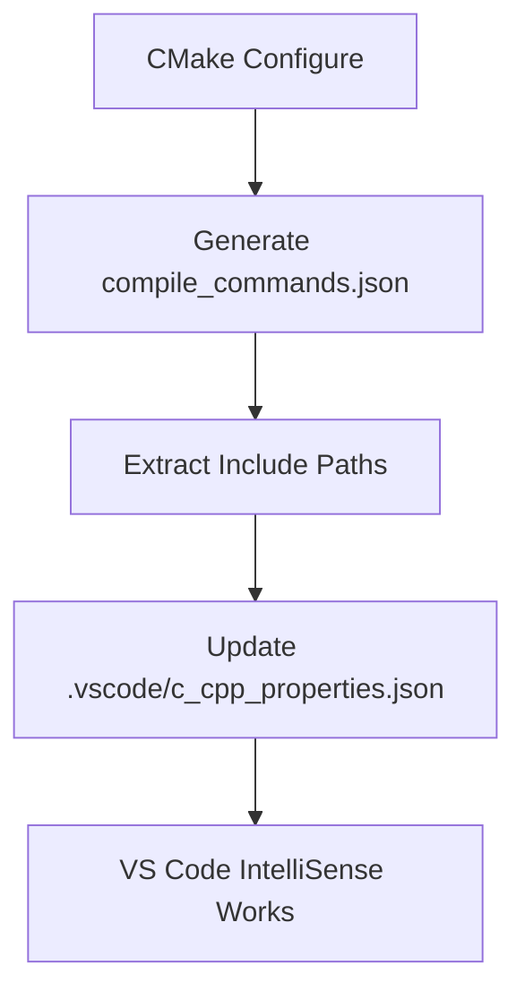

# VS Code Development Setup

This document explains how to set up VS Code for development with the OpenDash project, including automatic integration with Conan package management.

## Overview

The OpenDash project uses a sophisticated toolchain combining CMake, Conan, and automated VS Code configuration to provide a seamless development experience. The key innovation is our automatic VS Code configuration system that extracts include paths from the CMake compilation database and updates VS Code's IntelliSense settings.

## Quick Start

1. **Initial Setup**: Run the setup script which includes VS Code configuration
   ```bash
   ./scripts/setup.sh
   ```

2. **Build the Project**: This automatically updates VS Code configuration
   ```bash
   ./scripts/build.sh debug
   ```

3. **Reload VS Code**: Apply the new configuration
   - Press `Cmd+Shift+P` (macOS) or `Ctrl+Shift+P` (Windows/Linux)
   - Type "Developer: Reload Window" and select it

## How VS Code + Conan Integration Works

### The Problem
Traditional C++ development with VS Code and package managers faces a common challenge:

- **Conan** installs packages in dynamic cache directories (e.g., `/Users/user/.conan2/p/b/spdlog123abc/p/include`)
- **VS Code** needs to know where to find these headers for IntelliSense
- **Manual configuration** is tedious and breaks when Conan cache changes

### Our Solution
We've automated the entire process using a three-step integration:



### Technical Details

#### 1. Compilation Database Generation
CMake generates `compile_commands.json` with exact compiler commands:
```json
{
  "directory": "/path/to/build",
  "command": "clang++ -I/Users/user/.conan2/p/b/spdlog123/p/include ...",
  "file": "/path/to/source.cpp"
}
```

#### 2. Automatic Path Extraction
Our Python script (`scripts/update_vscode_config.py`) parses the compilation database and extracts:
- `-I` flags (project include directories)
- `-isystem` flags (system/library include directories)
- Filters out irrelevant paths (system SDK, etc.)

#### 3. VS Code Configuration Update
The script updates `.vscode/c_cpp_properties.json` with:
```json
{
  "configurations": [{
    "name": "Mac",
    "includePath": [
      "${workspaceFolder}/include",
      "${workspaceFolder}/build/generated",
      "/Users/user/.conan2/p/b/spdlog123/p/include",
      "/Users/user/.conan2/p/b/fmt456/p/include"
    ],
    "compileCommands": "${workspaceFolder}/compile_commands.json"
  }]
}
```

## Integration Points

### Automatic Updates
The VS Code configuration is automatically updated at these points:

1. **During Setup**: `./scripts/setup.sh` runs the configuration update
2. **During Build**: `./scripts/build.sh` updates configuration after successful build
3. **Manual Update**: `./scripts/update_vscode.sh` for on-demand updates

### Script Details

#### `scripts/update_vscode_config.py`
The core automation script:
- **Input**: `compile_commands.json` (CMake compilation database)
- **Output**: `.vscode/c_cpp_properties.json` (VS Code C++ configuration)
- **Features**:
  - Preserves existing VS Code settings
  - Adds required preprocessor definitions
  - Filters system paths to avoid clutter
  - Handles cross-platform path differences

#### `scripts/update_vscode.sh`
Convenience wrapper for manual updates:
```bash
#!/bin/bash
# Standalone script to update VS Code configuration
./scripts/update_vscode.sh
```

## Supported Dependencies

The automated configuration handles all Conan-managed dependencies:

- **spdlog**: Logging library (`#include <spdlog/spdlog.h>`)
- **fmt**: String formatting (`#include <fmt/format.h>`)
- **gRPC**: RPC framework (`#include <grpcpp/grpcpp.h>`)
- **protobuf**: Serialization (`#include <google/protobuf/message.h>`)
- **gtest**: Testing framework (`#include <gtest/gtest.h>`)
- **abseil**: Google utilities (`#include <absl/strings/string_view.h>`)

## Manual Configuration (Advanced)

If you need to manually configure VS Code (not recommended), you can edit `.vscode/c_cpp_properties.json`:

```json
{
  "configurations": [
    {
      "name": "Mac",
      "includePath": [
        "${workspaceFolder}/include",
        "${workspaceFolder}/build/generated",
        // Add custom paths here
      ],
      "defines": [
        "SPDLOG_COMPILED_LIB",
        "SPDLOG_FMT_EXTERNAL", 
        "CARES_STATICLIB"
      ],
      "compilerPath": "/usr/bin/clang++",
      "cStandard": "c17",
      "cppStandard": "c++17",
      "intelliSenseMode": "macos-clang-arm64",
      "compileCommands": "${workspaceFolder}/compile_commands.json"
    }
  ],
  "version": 4
}
```

## Troubleshooting

### Include Errors After Conan Update
If you see include errors after updating Conan dependencies:

1. **Rebuild**: `./scripts/build.sh` (automatically updates VS Code config)
2. **Manual Update**: `./scripts/update_vscode.sh`
3. **Reload VS Code**: `Cmd+Shift+P` → "Developer: Reload Window"

### Missing `compile_commands.json`
If the script reports missing compilation database:

```bash
# Build the project first
./scripts/build.sh debug

# Then update VS Code configuration
./scripts/update_vscode.sh
```

### VS Code Still Shows Include Errors
Try these steps in order:

1. **Reload Window**: `Cmd+Shift+P` → "Developer: Reload Window"
2. **Reset IntelliSense**: `Cmd+Shift+P` → "C/C++: Reset IntelliSense Database"
3. **Check Configuration**: Verify `.vscode/c_cpp_properties.json` contains Conan paths
4. **Rebuild**: `./scripts/build.sh debug` to regenerate compilation database

### Configuration Not Preserved
The update script preserves existing settings by default. If settings are lost:

1. Check for JSON syntax errors in `.vscode/c_cpp_properties.json`
2. The script will warn about invalid JSON and create a new file
3. Manually restore custom settings if needed

## VS Code Extensions

The setup script automatically installs recommended extensions:

- **C/C++ Extension Pack**: Complete C++ development environment
- **CMake Tools**: CMake integration and build management
- **Python**: For automation scripts

## Cross-Platform Support

The automation works across platforms with platform-specific configurations:

### macOS Configuration
```json
{
  "name": "Mac",
  "intelliSenseMode": "macos-clang-arm64",
  "compilerPath": "/usr/bin/clang++",
  "macFrameworkPath": ["..."]
}
```

### Windows Configuration (Future)
```json
{
  "name": "Win32", 
  "intelliSenseMode": "windows-msvc-x64",
  "compilerPath": "cl.exe"
}
```

### Linux Configuration (Future)
```json
{
  "name": "Linux",
  "intelliSenseMode": "linux-gcc-x64", 
  "compilerPath": "/usr/bin/gcc"
}
```

## Performance Considerations

### Include Path Optimization
The script automatically optimizes include paths:

- **Deduplication**: Removes duplicate paths
- **Ordering**: Prioritizes project paths over system paths
- **Filtering**: Excludes irrelevant system SDK paths

### IntelliSense Performance
To improve IntelliSense performance:

1. **Use compilation database**: Always prefer `compileCommands` over manual `includePath`
2. **Minimize custom paths**: Let the automation handle most paths
3. **Exclude large directories**: Use `.vscode/settings.json` to exclude build artifacts

```json
{
  "files.exclude": {
    "build/": true,
    "**/.conan2/": true
  }
}
```

## Future Enhancements

Planned improvements to the VS Code integration:

1. **Multi-configuration support**: Debug/Release configurations
2. **Windows/Linux support**: Cross-platform compiler detection
3. **Custom toolchain support**: Support for different compilers
4. **VS Code task integration**: Build/test tasks in VS Code
5. **Debugger configuration**: Automatic debug configuration

## Contributing

When contributing to the VS Code integration:

1. **Test automation**: Ensure scripts work on clean environments
2. **Preserve settings**: Always preserve existing user configurations  
3. **Handle errors gracefully**: Provide clear error messages
4. **Document changes**: Update this documentation for any changes
5. **Cross-platform**: Consider Windows/Linux compatibility

## Related Documentation

- [Setup Guide](setup.md): Initial environment setup
- [Build Process](build_process.md): Understanding the build system
- [CMake Guide](cmake_guide.md): CMake configuration details
- [Scripts Documentation](scripts.md): All available scripts
