# GitHub Actions Quick Start Guide

This guide helps you get started with the Dashcam project's GitHub Actions CI/CD pipeline, even if you're new to GitHub Actions.

## 🚀 What is GitHub Actions?

GitHub Actions is GitHub's built-in CI/CD platform that automatically runs workflows when certain events happen in your repository (like pushing code or creating pull requests).

Think of it as an automated assistant that:
- Builds your code on multiple platforms
- Runs tests to catch bugs
- Creates Docker containers
- Releases your software
- Keeps track of code quality over time

## 🏗️ How Our CI/CD Works

```mermaid
graph LR
    You[👨‍💻 You push code] --> GitHub[📁 GitHub Repository]
    GitHub --> Actions[🤖 GitHub Actions]
    Actions --> Build[🔨 Build & Test]
    Build --> Results[📊 Results & Artifacts]
    
    style You fill:#2563eb,stroke:#1e40af,stroke-width:2px,color:#fff
    style Actions fill:#22c55e,stroke:#16a34a,stroke-width:2px,color:#fff
    style Results fill:#8b5cf6,stroke:#7c3aed,stroke-width:2px,color:#fff
```



## 🎯 Getting Started

### Step 1: Enable GitHub Actions

1. Go to your GitHub repository
2. Click the **"Actions"** tab
3. GitHub will automatically detect our workflow files
4. Click **"I understand my workflows, go ahead and enable them"**

### Step 2: Make Your First Change

1. **Edit a file** (like `README.md`)
2. **Commit and push** to the `develop` branch
3. **Watch the magic happen** in the Actions tab!

### Step 3: Understanding the Workflow

When you push code, GitHub Actions will:


## 📋 What Happens During CI/CD

### 🔍 **Pre-flight Checks** (30 seconds)
- Checks which files you changed
- Decides if a full build is needed
- Sets up build configuration

### 🔨 **Multi-Platform Builds** (5-10 minutes)
- **Windows**: Builds with Visual Studio
- **macOS**: Builds with Clang
- **Linux**: Builds with GCC and Clang
- Creates executable files for each platform

### 🧪 **Testing** (3-5 minutes)
- **Unit Tests**: Tests individual functions
- **System Tests**: Tests the whole application
- **Coverage**: Measures how much code is tested

### 🐳 **Docker Images** (5-8 minutes)
- Creates container images for deployment
- Supports both x86_64 and ARM64 (Raspberry Pi)
- Pushes to GitHub Container Registry

### 📦 **Artifacts** (1 minute)
- Packages build results
- Stores for 30 days
- Available for download

## 🎛️ Controlling the CI/CD

### Automatic Triggers

| When you... | What happens |
|-------------|--------------|
| **Push to `main`** | Full CI/CD + Release build |
| **Push to `develop`** | Full CI/CD with Debug build |
| **Create Pull Request** | Full CI/CD to validate changes |
| **Create git tag `v*`** | Release build + GitHub release |

### Manual Triggers

You can also run builds manually:

1. Go to **Actions** tab
2. Click **"🚀 CI/CD Pipeline"**
3. Click **"Run workflow"**
4. Choose options:
   - **Build type**: Debug, Release, or RelWithDebInfo
   - **Performance tests**: Run extra benchmarks

### Skipping CI

If you make documentation-only changes, add `[skip ci]` to your commit message:
```bash
git commit -m "Update README [skip ci]"
```

## 📊 Understanding Results

### Action Status Icons

- ✅ **Green checkmark**: Everything passed
- ❌ **Red X**: Something failed
- 🟡 **Yellow circle**: Currently running
- ⚪ **Gray circle**: Skipped or pending

### Reading Build Results

1. **Click on a workflow run** to see details
2. **Click on a job** (like "Build (Windows)") to see logs
3. **Scroll through logs** to find issues

### Common Status Messages

```
✅ Build (Windows MSVC) - 8m 32s
✅ Build (macOS Clang) - 6m 45s  
✅ Build (Linux GCC) - 5m 12s
✅ Unit Tests (Windows) - 2m 18s
❌ Unit Tests (Linux) - 1m 45s
```

## 🐛 When Things Go Wrong

### Build Failures

**Most common causes:**
1. **Compilation errors** - Fix the code issues
2. **Test failures** - Fix failing tests
3. **Dependency issues** - Usually resolves on retry

**What to do:**
1. Click on the failed job
2. Read the error message
3. Fix the issue in your code
4. Push the fix

### Quick Fixes

#### Retry a Failed Build
Sometimes builds fail due to temporary issues:
1. Go to the failed workflow
2. Click **"Re-run all jobs"**

#### Check Specific Platform
If only one platform fails:
1. Look at the failed job logs
2. The issue is likely platform-specific
3. Test locally on that platform if possible

## 📈 Monitoring Your Project

### Test History Dashboard

Our CI/CD automatically creates a test history dashboard:

1. **Visit**: `https://yourusername.github.io/dashcam/`
2. **See**: Test trends, success rates, coverage over time
3. **Monitor**: Project health at a glance

### Artifacts and Downloads

After each build, you can download:
- **Executable files** for each platform
- **Test reports** with detailed results  
- **Coverage reports** showing code coverage
- **Build logs** for debugging

To download artifacts:
1. Go to a completed workflow run
2. Scroll to **"Artifacts"** section
3. Click to download

## 🔧 Customizing the Pipeline

### Environment Variables

You can customize builds by setting environment variables in the workflow files:

```yaml
env:
  CMAKE_BUILD_TYPE: Release    # or Debug
  ENABLE_COVERAGE: ON          # or OFF
  PARALLEL_JOBS: 4            # Number of build threads
```

### Adding New Tests

1. **Add test files** to `tests/` directory
2. **Update CMakeLists.txt** if needed
3. **Push changes** - tests run automatically

### Platform-Specific Settings

Each platform can have different settings:
- **Windows**: Uses Visual Studio 2022
- **macOS**: Uses latest Xcode
- **Linux**: Uses GCC 11+ or Clang 13+

## 💡 Tips for Success

### 1. **Small, Frequent Commits**
- Easier to identify what broke
- Faster feedback
- Less complex to fix

### 2. **Write Good Commit Messages**
```bash
# Good
git commit -m "Fix camera initialization race condition"

# Better
git commit -m "Fix camera initialization race condition

- Add mutex protection for camera startup
- Add unit test for concurrent initialization
- Fixes issue where multiple threads could conflict"
```

### 3. **Use Feature Branches**
```bash
# Create feature branch
git checkout -b feature/new-camera-support

# Work on feature
git add . && git commit -m "Add support for USB3 cameras"

# Push and create PR
git push origin feature/new-camera-support
```

### 4. **Monitor the Actions Tab**
- Check builds regularly
- Fix failures quickly
- Learn from the logs

### 5. **Understand the Tests**
- Unit tests catch code bugs
- System tests catch integration issues
- Performance tests catch slowdowns

## 🆘 Getting Help

### If You're Stuck

1. **Check the logs**: Most issues are explained in the build logs
2. **Look at recent changes**: What changed since the last successful build?
3. **Check similar issues**: Look at previous failed builds
4. **Ask for help**: Create an issue with the error details

### Useful Log Sections

When reading logs, focus on:
- **Error messages** (usually in red)
- **Failed test names**
- **Compilation errors**
- **Dependency resolution issues**

### Debug Information

Add this to any step to see more info:
```yaml
- name: Debug Info
  run: |
    echo "Current directory: $(pwd)"
    echo "Environment variables:"
    env | sort
    echo "Available space:"
    df -h
```

## 🎉 Success!

Once you see all green checkmarks, your code is:
- ✅ Building on all platforms
- ✅ Passing all tests  
- ✅ Ready for deployment
- ✅ Tracked for quality metrics

The CI/CD system will help you maintain high code quality and catch issues early. Happy coding!

---

*This quick start guide covers the basics of using GitHub Actions with the Dashcam project. For advanced configuration, see the complete [GitHub Actions Documentation](github-actions.md).*
