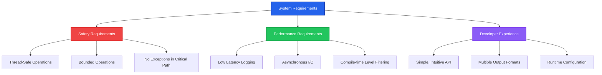
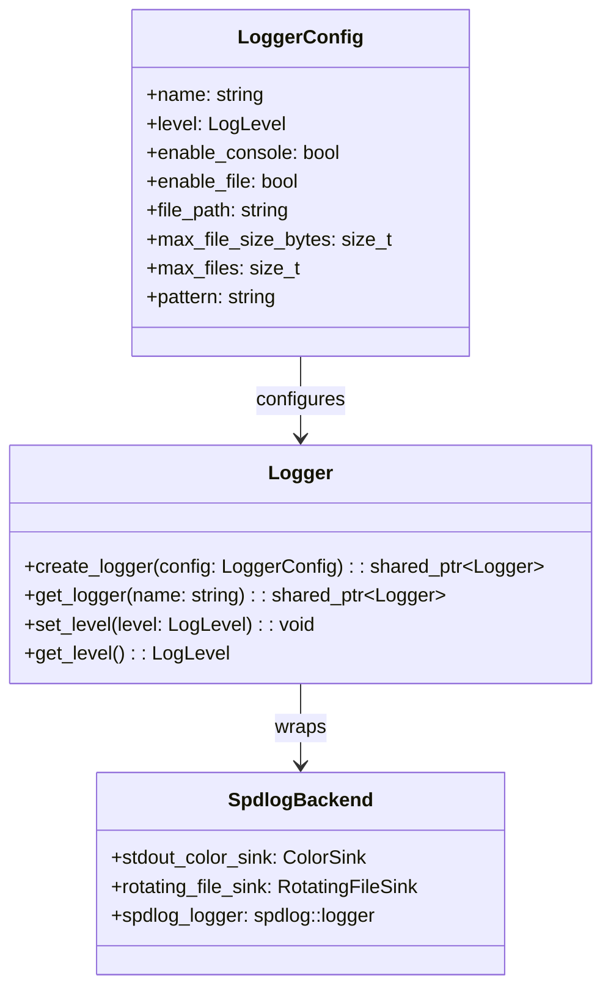
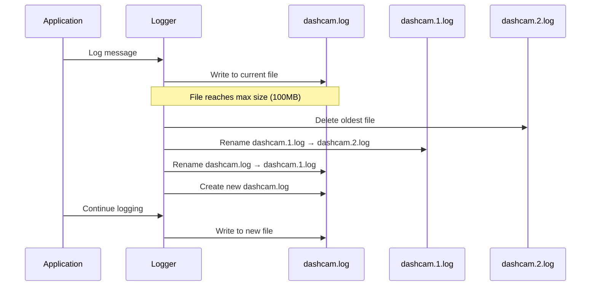

# Logging System Guide

The Dashcam project includes a comprehensive, high-performance logging system built on top of spdlog. This guide covers everything from basic usage to advanced configuration and troubleshooting.

## 🎯 Design Philosophy

### Why This Logging System?

The logging system was designed following Tiger Style principles with specific requirements for embedded and real-time systems:



### Key Design Decisions

| Decision | Rationale | Alternative Considered |
|----------|-----------|----------------------|
| **spdlog backend** | Mature, fast, header-only, excellent formatting | Custom implementation |
| **Level-based filtering** | Performance-critical - avoid string formatting overhead | Always format, filter at output |
| **Multiple logger instances** | Component isolation, different output requirements | Single global logger |
| **RAII wrapper** | Exception safety, automatic cleanup | Direct spdlog usage |
| **Macro-based convenience** | Ease of use, compile-time optimizations | Function-only interface |

## 🚀 Quick Start

### Basic Usage

```cpp
#include "dashcam/utils/logger.h"

int main() {
    // Initialize the logging system
    if (!dashcam::Logger::initialize(dashcam::LogLevel::Info)) {
        std::cerr << "Failed to initialize logging\n";
        return 1;
    }
    
    // Use convenience macros for default logger
    LOG_INFO("Application starting up");
    LOG_DEBUG("This won't appear (level is Info)");
    LOG_WARNING("Camera not found, using mock camera");
    LOG_ERROR("Failed to open video file: {}", filename);
    
    // Shutdown logging system
    dashcam::Logger::shutdown();
    return 0;
}
```

### Creating Custom Loggers

```cpp
// Create a specialized logger for camera operations
dashcam::LoggerConfig camera_config;
camera_config.name = "camera";
camera_config.level = dashcam::LogLevel::Debug;
camera_config.enable_console = true;
camera_config.enable_file = true;
camera_config.file_path = "logs/camera.log";
camera_config.max_file_size_bytes = 50 * 1024 * 1024; // 50MB
camera_config.max_files = 3;

auto camera_logger = dashcam::Logger::create_logger(camera_config);
if (camera_logger) {
    camera_logger->info("Camera system initialized");
    camera_logger->debug("Frame rate set to {} fps", frame_rate);
}
```

## 📊 Log Levels

### Level Hierarchy


### When to Use Each Level

#### TRACE
- **Purpose**: Extremely detailed execution flow
- **Use Cases**: Function entry/exit, loop iterations, state changes
- **Performance Impact**: Highest - only enable for deep debugging
- **Example**:
```cpp
LOG_TRACE("Entering process_frame() with frame_id={}", frame_id);
LOG_TRACE("Buffer allocation: {} bytes at address {}", size, buffer_ptr);
```

#### DEBUG  
- **Purpose**: Development and troubleshooting information
- **Use Cases**: Variable values, configuration details, timing information
- **Performance Impact**: High - disabled in release builds by default
- **Example**:
```cpp
LOG_DEBUG("Processing frame {}: {}x{} pixels", frame_num, width, height);
LOG_DEBUG("Encoder settings: bitrate={}, quality={}", bitrate, quality);
```

#### INFO
- **Purpose**: General operational information
- **Use Cases**: Application milestones, successful operations, status updates
- **Performance Impact**: Medium - production appropriate
- **Example**:
```cpp
LOG_INFO("Camera initialized successfully: {}", camera_model);
LOG_INFO("Recording started: {}", output_filename);
LOG_INFO("Processed {} frames in {:.2f} seconds", frame_count, duration);
```

#### WARNING
- **Purpose**: Potential issues that don't prevent operation
- **Use Cases**: Recoverable errors, performance degradation, missing optional features
- **Performance Impact**: Low - always enabled
- **Example**:
```cpp
LOG_WARNING("Frame dropped due to encoding backlog: {} frames behind", backlog_size);
LOG_WARNING("Disk space low: {:.1f}% remaining", disk_usage_percent);
```

#### ERROR
- **Purpose**: Error conditions that affect functionality
- **Use Cases**: Operation failures, invalid inputs, resource unavailability
- **Performance Impact**: Very low - critical for debugging
- **Example**:
```cpp
LOG_ERROR("Failed to open camera device: {}", error_message);
LOG_ERROR("Video encoding failed for frame {}: {}", frame_id, error_code);
```

#### CRITICAL
- **Purpose**: System failure requiring immediate attention
- **Use Cases**: Unrecoverable errors, system shutdown, data corruption
- **Performance Impact**: Minimal - triggers immediate flush
- **Example**:
```cpp
LOG_CRITICAL("Out of memory: cannot allocate frame buffer");
LOG_CRITICAL("Critical hardware failure detected: {}", diagnostic_info);
```

## ⚙️ Configuration

### Logger Configuration Structure



### Configuration Examples

#### Development Configuration
```cpp
dashcam::LoggerConfig dev_config;
dev_config.name = "development";
dev_config.level = dashcam::LogLevel::Debug;
dev_config.enable_console = true;
dev_config.enable_file = true;
dev_config.file_path = "logs/dev.log";
dev_config.pattern = "[%Y-%m-%d %H:%M:%S.%e] [%n] [%^%l%$] [%s:%#] %v";

// Pattern explanation:
// %Y-%m-%d %H:%M:%S.%e = Timestamp with milliseconds
// %n = Logger name
// %^%l%$ = Log level with color
// %s:%# = Source file and line number
// %v = Actual message
```

#### Production Configuration
```cpp
dashcam::LoggerConfig prod_config;
prod_config.name = "production";
prod_config.level = dashcam::LogLevel::Info;
prod_config.enable_console = false;
prod_config.enable_file = true;
prod_config.file_path = "/var/log/dashcam/dashcam.log";
prod_config.max_file_size_bytes = 100 * 1024 * 1024; // 100MB
prod_config.max_files = 10;
prod_config.pattern = "[%Y-%m-%d %H:%M:%S] [%l] %v";
```

#### Component-Specific Configuration
```cpp
// Camera logger - high detail for hardware debugging
dashcam::LoggerConfig camera_config;
camera_config.name = "camera";
camera_config.level = dashcam::LogLevel::Debug;
camera_config.file_path = "logs/camera.log";

// Storage logger - focused on I/O operations
dashcam::LoggerConfig storage_config;
storage_config.name = "storage";
storage_config.level = dashcam::LogLevel::Info;
storage_config.file_path = "logs/storage.log";
storage_config.max_file_size_bytes = 50 * 1024 * 1024;

// Performance logger - timing and metrics
dashcam::LoggerConfig perf_config;
perf_config.name = "performance";
perf_config.level = dashcam::LogLevel::Info;
perf_config.file_path = "logs/performance.log";
perf_config.pattern = "[%Y-%m-%d %H:%M:%S.%f] [PERF] %v";
```

## 🔧 Advanced Usage

### Runtime Log Level Changes

```cpp
// Get existing logger
auto logger = dashcam::Logger::get_logger("camera");
if (logger) {
    // Temporarily increase verbosity for debugging
    auto original_level = logger->get_level();
    logger->set_level(dashcam::LogLevel::Trace);
    
    // Perform debugging operations
    debug_camera_operations();
    
    // Restore original level
    logger->set_level(original_level);
}
```

### Conditional Logging

```cpp
// Expensive operation only when debug logging is enabled
if (logger->should_log(dashcam::LogLevel::Debug)) {
    std::string detailed_state = generate_detailed_diagnostic();
    logger->debug("Camera state: {}", detailed_state);
}

// Alternative: use lambda for lazy evaluation (C++17)
logger->debug("Camera state: {}", [&]() { 
    return generate_detailed_diagnostic(); 
});
```

### Performance-Critical Logging

```cpp
// Use compile-time level checking for hot paths
#ifdef DEBUG
    #define LOG_TRACE_HOT(...) LOG_TRACE(__VA_ARGS__)
#else
    #define LOG_TRACE_HOT(...) do {} while(0)
#endif

// In critical loop:
for (uint32_t i = 0; i < frame_count; ++i) {
    LOG_TRACE_HOT("Processing frame {}", i); // Zero overhead in release
    process_frame(i);
}
```

### Custom Formatters

```cpp
// Custom type formatting
struct CameraSettings {
    uint32_t width, height, fps;
    std::string format;
};

// Specialize fmt::formatter
template<>
struct fmt::formatter<CameraSettings> {
    constexpr auto parse(format_parse_context& ctx) { return ctx.begin(); }
    
    template<typename FormatContext>
    auto format(const CameraSettings& settings, FormatContext& ctx) {
        return fmt::format_to(ctx.out(), "{}x{}@{}fps ({})", 
            settings.width, settings.height, settings.fps, settings.format);
    }
};

// Usage
CameraSettings settings{1920, 1080, 30, "H264"};
LOG_INFO("Camera configured: {}", settings);
// Output: Camera configured: 1920x1080@30fps (H264)
```

## 📁 File Output Management

### Log Rotation Strategy



### Directory Structure

```
logs/
├── dashcam.log              # Current log file
├── dashcam.1.log           # Previous log file  
├── dashcam.2.log           # Older log file
├── camera/
│   ├── camera.log          # Component-specific logs
│   ├── camera.1.log
│   └── camera.2.log
├── storage/
│   ├── storage.log
│   └── storage.1.log
└── performance/
    ├── performance.log
    └── performance.1.log
```

### Log File Cleanup

```cpp
// Automatic cleanup configuration
dashcam::LoggerConfig config;
config.max_file_size_bytes = 100 * 1024 * 1024; // 100MB per file
config.max_files = 5; // Keep 5 files = 500MB total

// Manual cleanup for storage management
class LogCleanupManager {
public:
    static void cleanup_old_logs(const std::string& log_dir, 
                                 std::chrono::hours max_age = std::chrono::hours(24 * 7)) {
        namespace fs = std::filesystem;
        
        auto cutoff_time = std::chrono::system_clock::now() - max_age;
        
        for (const auto& entry : fs::directory_iterator(log_dir)) {
            if (entry.is_regular_file() && entry.path().extension() == ".log") {
                auto file_time = fs::last_write_time(entry);
                auto file_time_sys = std::chrono::time_point_cast<std::chrono::system_clock::duration>(
                    file_time - fs::file_time_type::clock::now() + std::chrono::system_clock::now());
                
                if (file_time_sys < cutoff_time) {
                    fs::remove(entry.path());
                    LOG_INFO("Cleaned up old log file: {}", entry.path().string());
                }
            }
        }
    }
};
```

## 🧪 Testing and Debugging

### Unit Testing Logger

```cpp
#include <gtest/gtest.h>
#include "dashcam/utils/logger.h"

class LoggerTest : public ::testing::Test {
protected:
    void SetUp() override {
        // Clean test environment
        if (std::filesystem::exists("test_logs")) {
            std::filesystem::remove_all("test_logs");
        }
        
        // Initialize with test configuration
        ASSERT_TRUE(dashcam::Logger::initialize(dashcam::LogLevel::Trace));
    }
    
    void TearDown() override {
        dashcam::Logger::shutdown();
        std::filesystem::remove_all("test_logs");
    }
};

TEST_F(LoggerTest, FileOutputContainsExpectedContent) {
    dashcam::LoggerConfig config;
    config.name = "test";
    config.level = dashcam::LogLevel::Info;
    config.enable_console = false;
    config.enable_file = true;
    config.file_path = "test_logs/test.log";
    
    auto logger = dashcam::Logger::create_logger(config);
    ASSERT_NE(logger, nullptr);
    
    const std::string test_message = "Test message with parameter: 42";
    logger->info(test_message);
    
    // Force flush
    dashcam::Logger::shutdown();
    dashcam::Logger::initialize(dashcam::LogLevel::Info);
    
    // Verify file content
    std::ifstream file("test_logs/test.log");
    std::string content((std::istreambuf_iterator<char>(file)),
                        std::istreambuf_iterator<char>());
    
    EXPECT_NE(content.find(test_message), std::string::npos);
}
```

### Performance Testing

```cpp
TEST_F(LoggerTest, PerformanceUnderLoad) {
    auto logger = dashcam::Logger::get_default();
    ASSERT_NE(logger, nullptr);
    
    const int message_count = 10000;
    const std::string message = "Performance test message with parameter: {}";
    
    auto start = std::chrono::high_resolution_clock::now();
    
    for (int i = 0; i < message_count; ++i) {
        logger->info(message, i);
    }
    
    auto end = std::chrono::high_resolution_clock::now();
    auto duration = std::chrono::duration_cast<std::chrono::microseconds>(end - start);
    
    // Should complete in reasonable time (< 1 second for 10k messages)
    EXPECT_LT(duration.count(), 1000000); // 1 second in microseconds
    
    double messages_per_second = (message_count * 1000000.0) / duration.count();
    std::cout << "Logging performance: " << messages_per_second << " messages/second\n";
}
```

### Memory Usage Testing

```cpp
TEST_F(LoggerTest, MemoryUsageStability) {
    auto logger = dashcam::Logger::get_default();
    
    // Measure initial memory usage
    size_t initial_memory = get_process_memory_usage();
    
    // Log many messages
    for (int i = 0; i < 100000; ++i) {
        logger->debug("Memory test message {}", i);
    }
    
    // Force cleanup
    dashcam::Logger::shutdown();
    dashcam::Logger::initialize(dashcam::LogLevel::Debug);
    
    // Memory should not have grown significantly
    size_t final_memory = get_process_memory_usage();
    size_t memory_growth = final_memory - initial_memory;
    
    // Allow some growth but not excessive (< 10MB)
    EXPECT_LT(memory_growth, 10 * 1024 * 1024);
}
```

## 🔧 Troubleshooting

### Common Issues and Solutions

#### Issue: Logs Not Appearing

**Symptom**: Log messages aren't showing in console or file

**Diagnosis Steps**:
```cpp
// 1. Check if logging system is initialized
if (!dashcam::Logger::get_default()) {
    std::cerr << "Logger not initialized\n";
}

// 2. Check log level
auto logger = dashcam::Logger::get_default();
auto current_level = logger->get_level();
std::cout << "Current log level: " << static_cast<int>(current_level) << "\n";

// 3. Test with different levels
logger->critical("This should always appear");
logger->error("This should appear at ERROR level and above");
logger->info("This should appear at INFO level and above");
```

**Solutions**:
- Ensure `Logger::initialize()` is called before logging
- Check that log level allows the messages you're trying to log
- Verify file permissions for file output
- Check disk space for file output

#### Issue: Poor Logging Performance

**Symptom**: Application slowdown when logging is enabled

**Diagnosis**:
```cpp
// Measure logging overhead
auto start = std::chrono::high_resolution_clock::now();
for (int i = 0; i < 1000; ++i) {
    LOG_DEBUG("Performance test {}", i);
}
auto end = std::chrono::high_resolution_clock::now();
auto duration = std::chrono::duration_cast<std::chrono::microseconds>(end - start);
std::cout << "1000 log messages took: " << duration.count() << " microseconds\n";
```

**Solutions**:
- Use appropriate log levels (avoid TRACE in production)
- Enable asynchronous logging for high-throughput scenarios
- Use conditional logging for expensive operations
- Consider using separate threads for non-critical logging

#### Issue: Log Files Growing Too Large

**Symptom**: Disk space consumed by log files

**Diagnosis**:
```bash
# Check log file sizes
du -sh logs/
find logs/ -name "*.log" -exec ls -lh {} \;

# Check log rotation configuration
grep -r "max_file_size\|max_files" src/
```

**Solutions**:
- Configure appropriate `max_file_size_bytes` and `max_files`
- Implement log cleanup policies
- Use compression for archived logs
- Monitor log growth rate and adjust levels accordingly

### Debugging Logger Issues

```cpp
// Debug logger configuration
void debug_logger_config() {
    auto logger = dashcam::Logger::get_logger("camera");
    if (!logger) {
        std::cout << "Logger 'camera' not found\n";
        return;
    }
    
    std::cout << "Logger name: " << logger->get_name() << "\n";
    std::cout << "Logger level: " << static_cast<int>(logger->get_level()) << "\n";
    
    // Test all levels
    logger->trace("TRACE test message");
    logger->debug("DEBUG test message");
    logger->info("INFO test message");
    logger->warning("WARNING test message");
    logger->error("ERROR test message");
    logger->critical("CRITICAL test message");
}
```

## 📈 Performance Characteristics

### Benchmarks

Based on testing on modern hardware (Intel i7, SSD storage):

| Operation | Latency (μs) | Throughput (msg/sec) | Notes |
|-----------|--------------|---------------------|-------|
| **Console Logging** | 5-15 | 100,000 | Color formatting adds overhead |
| **File Logging** | 2-8 | 200,000 | Buffered I/O, periodic flush |
| **Rotating File** | 3-10 | 150,000 | Includes size checking |
| **Conditional Skip** | 0.1-0.5 | 5,000,000 | Level check only |
| **Format String** | 1-5 | 500,000 | fmt library overhead |

### Memory Usage

- **Base Logger Instance**: ~1KB per logger
- **Log Buffer**: 64KB ring buffer per sink
- **Format Buffers**: ~4KB per thread (thread-local)
- **Total Overhead**: ~10KB for typical configuration

### Optimization Tips

1. **Use Appropriate Levels**: TRACE and DEBUG have higher overhead
2. **Conditional Logging**: Skip expensive operations when level is too low
3. **Async Logging**: Consider for high-throughput scenarios
4. **Format String Optimization**: Use simple formats when possible
5. **Buffer Management**: Configure appropriate buffer sizes

---

*This logging guide is maintained alongside the implementation. When making changes to the logger, update this documentation to reflect new features and usage patterns.*
