# Testing Strategy and Implementation

This guide covers the comprehensive testing framework for the Dashcam project, including unit tests, integration tests, system tests, and performance testing. Our testing approach follows Tiger Style principles emphasizing safety, reliability, and thorough validation.

## 🎯 Testing Philosophy

### Tiger Style Testing Principles


### Testing Pyramid Implementation

```mermaid
graph TD
    subgraph "Testing Pyramid"
        E2E["🔺 E2E Tests<br/>Few, Expensive<br/>Full System"]
        Integration["🔶 Integration Tests<br/>Moderate, Medium Cost<br/>Component Interaction"]
        Unit["🔻 Unit Tests<br/>Many, Fast, Cheap<br/>Individual Functions"]
    end
    
    subgraph "Our Implementation"
        SystemPytest["Python System Tests<br/>Real hardware simulation<br/>Process lifecycle testing"]
        ComponentCpp["C++ Integration Tests<br/>GoogleTest framework<br/>Component interaction"]
        UnitCpp["C++ Unit Tests<br/>GoogleTest + Mock objects<br/>Function-level validation"]
    end
    
    E2E --> SystemPytest
    Integration --> ComponentCpp
    Unit --> UnitCpp
    
    style E2E fill:#ef4444,stroke:#dc2626,stroke-width:2px,color:#fff
    style Integration fill:#f59e0b,stroke:#d97706,stroke-width:2px,color:#fff
    style Unit fill:#22c55e,stroke:#16a34a,stroke-width:2px,color:#fff
```



## 🧪 Unit Testing with GoogleTest

### Test Structure

Our unit tests follow the AAA (Arrange, Act, Assert) pattern with comprehensive error condition testing:

```cpp
// tests/unit/test_logger.cpp - Example unit test structure
#include <gtest/gtest.h>
#include <gmock/gmock.h>
#include "dashcam/utils/logger.h"

class LoggerTest : public ::testing::Test {
protected:
    void SetUp() override {
        // Arrange: Clean test environment
        test_log_dir_ = "test_logs_" + std::to_string(::testing::UnitTest::GetInstance()->current_test_info()->random_seed());
        
        if (std::filesystem::exists(test_log_dir_)) {
            std::filesystem::remove_all(test_log_dir_);
        }
        
        // Initialize logger with test configuration
        ASSERT_TRUE(dashcam::Logger::initialize(dashcam::LogLevel::Trace));
    }
    
    void TearDown() override {
        // Cleanup: Always clean up test resources
        dashcam::Logger::shutdown();
        
        if (std::filesystem::exists(test_log_dir_)) {
            std::filesystem::remove_all(test_log_dir_);
        }
    }
    
    std::string test_log_dir_;
};

// Positive test cases - expected behavior
TEST_F(LoggerTest, CreateLoggerWithValidConfiguration) {
    // Arrange
    dashcam::LoggerConfig config;
    config.name = "test_logger";
    config.level = dashcam::LogLevel::Info;
    config.enable_console = true;
    config.enable_file = false;
    
    // Act
    auto logger = dashcam::Logger::create_logger(config);
    
    // Assert
    ASSERT_NE(logger, nullptr);
    EXPECT_EQ(logger->get_name(), "test_logger");
    EXPECT_EQ(logger->get_level(), dashcam::LogLevel::Info);
}

// Negative test cases - error conditions
TEST_F(LoggerTest, CreateLoggerWithInvalidFilePathFails) {
    // Arrange
    dashcam::LoggerConfig config;
    config.name = "invalid_logger";
    config.enable_file = true;
    config.file_path = "/invalid/path/that/does/not/exist/test.log";
    
    // Act
    auto logger = dashcam::Logger::create_logger(config);
    
    // Assert - Should handle gracefully
    EXPECT_EQ(logger, nullptr);
}

// Boundary condition testing
TEST_F(LoggerTest, LoggerHandlesLargeMesages) {
    // Arrange
    std::string large_message(10000, 'A'); // 10KB message
    auto logger = dashcam::Logger::get_default();
    
    // Act & Assert - Should not crash or throw
    EXPECT_NO_THROW(logger->info(large_message));
}
```

### Mock Objects for Testing

```cpp
// tests/mocks/mock_camera.h - Example mock interface
class MockCamera : public dashcam::Camera {
public:
    MOCK_METHOD(bool, initialize, (), (override));
    MOCK_METHOD(bool, start_capture, (), (override));
    MOCK_METHOD(bool, stop_capture, (), (override));
    MOCK_METHOD(std::optional<dashcam::Frame>, get_frame, (), (override));
    MOCK_METHOD(dashcam::CameraStatus, get_status, (), (const, override));
};

// Usage in tests
TEST_F(CameraManagerTest, HandlesCameraInitializationFailure) {
    // Arrange
    auto mock_camera = std::make_shared<MockCamera>();
    EXPECT_CALL(*mock_camera, initialize())
        .WillOnce(::testing::Return(false));
    
    dashcam::CameraManager manager(mock_camera);
    
    // Act
    bool result = manager.initialize();
    
    // Assert
    EXPECT_FALSE(result);
}
```

### Parameterized Tests

```cpp
// Test multiple configurations systematically
class LoggerLevelTest : public LoggerTest, 
                       public ::testing::WithParamInterface<dashcam::LogLevel> {};

TEST_P(LoggerLevelTest, LoggerRespectsLevelFiltering) {
    // Arrange
    auto test_level = GetParam();
    dashcam::LoggerConfig config;
    config.name = "level_test";
    config.level = test_level;
    config.enable_console = false;
    config.enable_file = true;
    config.file_path = test_log_dir_ + "/level_test.log";
    
    auto logger = dashcam::Logger::create_logger(config);
    ASSERT_NE(logger, nullptr);
    
    // Act - Log at all levels
    logger->trace("trace message");
    logger->debug("debug message");
    logger->info("info message");
    logger->warning("warning message");
    logger->error("error message");
    logger->critical("critical message");
    
    // Force flush
    dashcam::Logger::shutdown();
    dashcam::Logger::initialize(dashcam::LogLevel::Trace);
    
    // Assert - Check file contents
    std::ifstream file(config.file_path);
    std::string content((std::istreambuf_iterator<char>(file)),
                        std::istreambuf_iterator<char>());
    
    // Messages at or above the test level should appear
    if (test_level <= dashcam::LogLevel::Trace) {
        EXPECT_NE(content.find("trace message"), std::string::npos);
    } else {
        EXPECT_EQ(content.find("trace message"), std::string::npos);
    }
    
    if (test_level <= dashcam::LogLevel::Debug) {
        EXPECT_NE(content.find("debug message"), std::string::npos);
    } else {
        EXPECT_EQ(content.find("debug message"), std::string::npos);
    }
    
    // Critical should always appear
    EXPECT_NE(content.find("critical message"), std::string::npos);
}

INSTANTIATE_TEST_SUITE_P(AllLogLevels, LoggerLevelTest,
    ::testing::Values(
        dashcam::LogLevel::Trace,
        dashcam::LogLevel::Debug,
        dashcam::LogLevel::Info,
        dashcam::LogLevel::Warning,
        dashcam::LogLevel::Error,
        dashcam::LogLevel::Critical
    ));
```

## 🔗 Integration Testing

### Component Integration Tests

```cpp
// tests/integration/test_camera_storage_integration.cpp
class CameraStorageIntegrationTest : public ::testing::Test {
protected:
    void SetUp() override {
        // Initialize real components with test configuration
        storage_config_.base_path = test_storage_path_;
        storage_config_.max_file_size = 10 * 1024 * 1024; // 10MB for testing
        
        camera_config_.width = 640;
        camera_config_.height = 480;
        camera_config_.fps = 30;
        camera_config_.format = "H264";
        
        storage_manager_ = std::make_unique<dashcam::StorageManager>(storage_config_);
        camera_manager_ = std::make_unique<dashcam::CameraManager>(camera_config_);
        
        ASSERT_TRUE(storage_manager_->initialize());
        ASSERT_TRUE(camera_manager_->initialize());
    }
    
    void TearDown() override {
        camera_manager_->shutdown();
        storage_manager_->shutdown();
        
        if (std::filesystem::exists(test_storage_path_)) {
            std::filesystem::remove_all(test_storage_path_);
        }
    }
    
    std::string test_storage_path_ = "test_storage";
    dashcam::StorageConfig storage_config_;
    dashcam::CameraConfig camera_config_;
    std::unique_ptr<dashcam::StorageManager> storage_manager_;
    std::unique_ptr<dashcam::CameraManager> camera_manager_;
};

TEST_F(CameraStorageIntegrationTest, RecordAndStoreVideoSegment) {
    // Arrange
    const auto recording_duration = std::chrono::seconds(5);
    const auto expected_frames = camera_config_.fps * 5; // 150 frames
    
    // Act
    ASSERT_TRUE(camera_manager_->start_recording());
    
    auto start_time = std::chrono::steady_clock::now();
    size_t frames_stored = 0;
    
    while (std::chrono::steady_clock::now() - start_time < recording_duration) {
        auto frame = camera_manager_->get_frame();
        if (frame.has_value()) {
            ASSERT_TRUE(storage_manager_->store_frame(frame.value()));
            frames_stored++;
        }
        std::this_thread::sleep_for(std::chrono::milliseconds(1));
    }
    
    ASSERT_TRUE(camera_manager_->stop_recording());
    ASSERT_TRUE(storage_manager_->finalize_current_segment());
    
    // Assert
    EXPECT_GE(frames_stored, expected_frames * 0.9); // Allow 10% tolerance
    EXPECT_LE(frames_stored, expected_frames * 1.1);
    
    // Verify file exists and has reasonable size
    auto files = storage_manager_->get_stored_files();
    EXPECT_FALSE(files.empty());
    
    for (const auto& file : files) {
        EXPECT_TRUE(std::filesystem::exists(file));
        auto file_size = std::filesystem::file_size(file);
        EXPECT_GT(file_size, 100000); // At least 100KB
        EXPECT_LT(file_size, storage_config_.max_file_size);
    }
}
```

### Thread Safety Testing

```cpp
// tests/integration/test_thread_safety.cpp
TEST(ThreadSafetyTest, LoggerHandlesConcurrentAccess) {
    // Arrange
    const int num_threads = 10;
    const int messages_per_thread = 1000;
    std::vector<std::thread> threads;
    std::atomic<int> total_messages{0};
    
    auto logger = dashcam::Logger::get_default();
    ASSERT_NE(logger, nullptr);
    
    // Act - Multiple threads logging simultaneously
    for (int t = 0; t < num_threads; ++t) {
        threads.emplace_back([&, t]() {
            for (int i = 0; i < messages_per_thread; ++i) {
                logger->info("Thread {} message {}", t, i);
                total_messages.fetch_add(1);
            }
        });
    }
    
    // Wait for all threads to complete
    for (auto& thread : threads) {
        thread.join();
    }
    
    // Assert
    EXPECT_EQ(total_messages.load(), num_threads * messages_per_thread);
    
    // Verify no data corruption by checking log output
    // (Implementation would need to examine log files for corrupted entries)
}
```

## 🖥️ System Testing with Python

### Full System Integration Tests

```python
# tests/system/test_dashcam_system.py
import pytest
import subprocess
import time
import psutil
import os
import signal
from pathlib import Path

class TestDashcamSystem:
    """
    System-level tests that verify the complete dashcam application
    running as a real process with actual hardware simulation.
    """
    
    @pytest.fixture
    def dashcam_process(self):
        """Start dashcam process for testing"""
        # Arrange
        build_dir = Path("build")
        executable = build_dir / "dashcam"
        
        if not executable.exists():
            pytest.skip("Dashcam executable not found. Run build first.")
        
        # Start process with test configuration
        env = os.environ.copy()
        env["DASHCAM_LOG_LEVEL"] = "DEBUG"
        env["DASHCAM_STORAGE_PATH"] = "test_system_storage"
        
        process = subprocess.Popen(
            [str(executable)],
            env=env,
            stdout=subprocess.PIPE,
            stderr=subprocess.PIPE,
            text=True
        )
        
        # Wait for startup
        time.sleep(2)
        
        yield process
        
        # Cleanup
        if process.poll() is None:
            process.terminate()
            try:
                process.wait(timeout=5)
            except subprocess.TimeoutExpired:
                process.kill()
                process.wait()
        
        # Clean up test files
        import shutil
        if Path("test_system_storage").exists():
            shutil.rmtree("test_system_storage")
    
    def test_application_starts_and_runs(self, dashcam_process):
        """Test that the application starts successfully and runs"""
        # Act
        time.sleep(3)  # Let it run for a few seconds
        
        # Assert
        assert dashcam_process.poll() is None, "Process should still be running"
        
        # Check process is using reasonable resources
        try:
            proc = psutil.Process(dashcam_process.pid)
            memory_mb = proc.memory_info().rss / 1024 / 1024
            cpu_percent = proc.cpu_percent(interval=1)
            
            assert memory_mb < 500, f"Memory usage too high: {memory_mb}MB"
            assert cpu_percent < 80, f"CPU usage too high: {cpu_percent}%"
        except psutil.NoSuchProcess:
            pytest.fail("Process terminated unexpectedly")
    
    def test_graceful_shutdown_on_signal(self, dashcam_process):
        """Test that the application shuts down gracefully on SIGTERM"""
        # Arrange
        assert dashcam_process.poll() is None, "Process should be running"
        
        # Act
        dashcam_process.send_signal(signal.SIGTERM)
        
        # Assert
        try:
            exit_code = dashcam_process.wait(timeout=10)
            assert exit_code == 0, f"Expected exit code 0, got {exit_code}"
        except subprocess.TimeoutExpired:
            pytest.fail("Process did not shut down gracefully within 10 seconds")
    
    def test_creates_expected_output_files(self, dashcam_process):
        """Test that the application creates expected log and storage files"""
        # Arrange
        storage_path = Path("test_system_storage")
        log_path = Path("logs")
        
        # Act
        time.sleep(5)  # Let it run and create files
        
        # Assert
        assert storage_path.exists(), "Storage directory should be created"
        assert log_path.exists(), "Logs directory should be created"
        
        # Check for log files
        log_files = list(log_path.glob("*.log"))
        assert len(log_files) > 0, "Should create at least one log file"
        
        # Check log file has content
        main_log = log_path / "dashcam.log"
        if main_log.exists():
            assert main_log.stat().st_size > 0, "Log file should have content"
    
    def test_handles_configuration_errors(self):
        """Test application behavior with invalid configuration"""
        # Arrange
        build_dir = Path("build")
        executable = build_dir / "dashcam"
        
        if not executable.exists():
            pytest.skip("Dashcam executable not found")
        
        # Create invalid configuration
        env = os.environ.copy()
        env["DASHCAM_STORAGE_PATH"] = "/invalid/path/that/does/not/exist"
        
        # Act
        process = subprocess.Popen(
            [str(executable)],
            env=env,
            stdout=subprocess.PIPE,
            stderr=subprocess.PIPE,
            text=True
        )
        
        try:
            exit_code = process.wait(timeout=10)
            stdout, stderr = process.communicate()
            
            # Assert
            assert exit_code != 0, "Should exit with error code for invalid config"
            assert "error" in stderr.lower() or "failed" in stderr.lower(), \
                "Should output error message"
        
        finally:
            if process.poll() is None:
                process.kill()
```

### Performance and Load Testing

```python
# tests/system/test_performance.py
import pytest
import subprocess
import time
import psutil
import threading
from pathlib import Path

class TestPerformance:
    """Performance tests to ensure the system meets requirements"""
    
    def test_startup_time(self):
        """Test that application starts within acceptable time"""
        # Arrange
        executable = Path("build/dashcam")
        if not executable.exists():
            pytest.skip("Executable not found")
        
        start_time = time.time()
        
        # Act
        process = subprocess.Popen([str(executable)])
        
        # Wait for process to be ready (check log file creation)
        startup_timeout = 10  # seconds
        ready = False
        
        while time.time() - start_time < startup_timeout:
            if Path("logs/dashcam.log").exists():
                ready = True
                break
            time.sleep(0.1)
        
        startup_time = time.time() - start_time
        
        # Cleanup
        process.terminate()
        process.wait()
        
        # Assert
        assert ready, f"Application did not start within {startup_timeout} seconds"
        assert startup_time < 5.0, f"Startup time too slow: {startup_time:.2f}s"
    
    def test_memory_usage_stability(self):
        """Test that memory usage remains stable over time"""
        # Arrange
        executable = Path("build/dashcam")
        if not executable.exists():
            pytest.skip("Executable not found")
        
        process = subprocess.Popen([str(executable)])
        time.sleep(2)  # Initial startup
        
        try:
            proc = psutil.Process(process.pid)
            initial_memory = proc.memory_info().rss
            memory_readings = [initial_memory]
            
            # Act - Monitor for 30 seconds
            for _ in range(30):
                time.sleep(1)
                memory_readings.append(proc.memory_info().rss)
            
            # Assert
            max_memory = max(memory_readings)
            memory_growth = max_memory - initial_memory
            memory_growth_mb = memory_growth / 1024 / 1024
            
            assert memory_growth_mb < 50, \
                f"Memory grew by {memory_growth_mb:.1f}MB, limit is 50MB"
            
            # Check for memory leaks (gradual growth)
            late_average = sum(memory_readings[-10:]) / 10
            early_average = sum(memory_readings[:10]) / 10
            growth_rate = (late_average - early_average) / early_average
            
            assert growth_rate < 0.1, \
                f"Memory growth rate {growth_rate:.2%} suggests leak"
        
        finally:
            process.terminate()
            process.wait()
    
    def test_cpu_usage_reasonable(self):
        """Test that CPU usage is reasonable under normal load"""
        # Similar implementation to memory test but for CPU
        pass
```

## 📊 Test Coverage and Reporting

### Coverage Configuration

```cmake
# CMakeLists.txt - Coverage configuration
if(ENABLE_COVERAGE)
    set(CMAKE_CXX_FLAGS "${CMAKE_CXX_FLAGS} -g --coverage")
    set(CMAKE_EXE_LINKER_FLAGS "${CMAKE_EXE_LINKER_FLAGS} --coverage")
    
    find_program(LCOV_PATH lcov REQUIRED)
    find_program(GENHTML_PATH genhtml REQUIRED)
    
    add_custom_target(coverage
        COMMAND ${CMAKE_COMMAND} -E remove_directory coverage
        COMMAND ${CMAKE_COMMAND} -E make_directory coverage
        COMMAND ${LCOV_PATH} --directory . --zerocounters
        COMMAND ctest --output-on-failure
        COMMAND ${LCOV_PATH} --directory . --capture --output-file coverage/coverage.info
        COMMAND ${LCOV_PATH} --remove coverage/coverage.info 
            '/usr/*' 
            '*/tests/*' 
            '*/third_party/*'
            --output-file coverage/coverage_filtered.info
        COMMAND ${GENHTML_PATH} coverage/coverage_filtered.info 
            --output-directory coverage/html
        COMMENT "Generating test coverage report"
    )
endif()
```

### Coverage Analysis


### Automated Test Reporting

```python
# scripts/generate_test_report.py
#!/usr/bin/env python3
"""Generate comprehensive test report"""

import json
import subprocess
import xml.etree.ElementTree as ET
from pathlib import Path
from datetime import datetime

def run_unit_tests():
    """Run C++ unit tests and collect results"""
    result = subprocess.run(
        ["ctest", "--output-junit", "unit_test_results.xml"],
        cwd="build",
        capture_output=True,
        text=True
    )
    
    # Parse JUnit XML
    tree = ET.parse("build/unit_test_results.xml")
    root = tree.getroot()
    
    stats = {
        "total": int(root.get("tests", 0)),
        "passed": int(root.get("tests", 0)) - int(root.get("failures", 0)),
        "failed": int(root.get("failures", 0)),
        "duration": float(root.get("time", 0))
    }
    
    return stats

def run_system_tests():
    """Run Python system tests and collect results"""
    result = subprocess.run(
        ["python", "-m", "pytest", "tests/system", "--junitxml=system_test_results.xml"],
        capture_output=True,
        text=True
    )
    
    # Parse pytest results
    tree = ET.parse("system_test_results.xml")
    root = tree.getroot()
    
    stats = {
        "total": int(root.get("tests", 0)),
        "passed": len(root.findall(".//testcase")) - len(root.findall(".//failure")),
        "failed": len(root.findall(".//failure")),
        "duration": float(root.get("time", 0))
    }
    
    return stats

def generate_coverage_report():
    """Generate and parse coverage report"""
    subprocess.run(["make", "coverage"], cwd="build")
    
    # Parse coverage info (simplified)
    coverage_file = Path("build/coverage/coverage_filtered.info")
    if coverage_file.exists():
        # Extract coverage percentage (implementation depends on lcov format)
        return {"line_coverage": 85.5, "branch_coverage": 78.2}
    
    return {"line_coverage": 0, "branch_coverage": 0}

def generate_html_report(unit_stats, system_stats, coverage_stats):
    """Generate comprehensive HTML test report"""
    html_template = """
<!DOCTYPE html>
<html>
<head>
    <title>Dashcam Test Report</title>
    <style>
        body {{ font-family: Arial, sans-serif; margin: 20px; }}
        .header {{ background: #2563eb; color: white; padding: 20px; }}
        .section {{ margin: 20px 0; padding: 15px; border: 1px solid #ddd; }}
        .pass {{ color: #22c55e; }}
        .fail {{ color: #ef4444; }}
        .stats {{ display: flex; gap: 20px; }}
        .stat-box {{ padding: 15px; border: 1px solid #ddd; min-width: 120px; }}
    </style>
</head>
<body>
    <div class="header">
        <h1>Dashcam Project Test Report</h1>
        <p>Generated: {timestamp}</p>
    </div>
    
    <div class="section">
        <h2>Test Summary</h2>
        <div class="stats">
            <div class="stat-box">
                <h3>Unit Tests</h3>
                <p>Total: {unit_total}</p>
                <p class="pass">Passed: {unit_passed}</p>
                <p class="fail">Failed: {unit_failed}</p>
            </div>
            <div class="stat-box">
                <h3>System Tests</h3>
                <p>Total: {system_total}</p>
                <p class="pass">Passed: {system_passed}</p>
                <p class="fail">Failed: {system_failed}</p>
            </div>
            <div class="stat-box">
                <h3>Coverage</h3>
                <p>Line: {line_coverage:.1f}%</p>
                <p>Branch: {branch_coverage:.1f}%</p>
            </div>
        </div>
    </div>
</body>
</html>
    """.format(
        timestamp=datetime.now().strftime("%Y-%m-%d %H:%M:%S"),
        unit_total=unit_stats["total"],
        unit_passed=unit_stats["passed"],
        unit_failed=unit_stats["failed"],
        system_total=system_stats["total"],
        system_passed=system_stats["passed"],
        system_failed=system_stats["failed"],
        line_coverage=coverage_stats["line_coverage"],
        branch_coverage=coverage_stats["branch_coverage"]
    )
    
    Path("test_report.html").write_text(html_template)

if __name__ == "__main__":
    unit_stats = run_unit_tests()
    system_stats = run_system_tests()
    coverage_stats = generate_coverage_report()
    
    generate_html_report(unit_stats, system_stats, coverage_stats)
    print("Test report generated: test_report.html")
```

## 🔧 Test Automation and CI/CD

### GitHub Actions Workflow

```yaml
# .github/workflows/tests.yml
name: Tests
on: [push, pull_request]

jobs:
  unit-tests:
    runs-on: ubuntu-latest
    steps:
      - uses: actions/checkout@v3
      
      - name: Install dependencies
        run: |
          sudo apt-get update
          sudo apt-get install -y cmake conan lcov
      
      - name: Setup Conan
        run: |
          conan profile detect --force
          mkdir build && cd build
          conan install .. --build=missing
      
      - name: Build with coverage
        run: |
          cd build
          cmake .. -DCMAKE_BUILD_TYPE=Debug -DENABLE_COVERAGE=ON
          make -j$(nproc)
      
      - name: Run unit tests
        run: |
          cd build
          ctest --output-on-failure
      
      - name: Generate coverage
        run: |
          cd build
          make coverage
      
      - name: Upload coverage
        uses: codecov/codecov-action@v3
        with:
          file: build/coverage/coverage_filtered.info
  
  system-tests:
    runs-on: ubuntu-latest
    needs: unit-tests
    steps:
      - uses: actions/checkout@v3
      
      - name: Setup Python
        uses: actions/setup-python@v4
        with:
          python-version: '3.9'
      
      - name: Install Python dependencies
        run: |
          pip install pytest psutil
      
      - name: Build application
        run: |
          # Same build steps as unit tests
          
      - name: Run system tests
        run: |
          python -m pytest tests/system -v
```

## 🐛 Debugging Test Failures

### Test Debugging Strategies

```cpp
// Use custom test listeners for debugging
class DebugTestListener : public ::testing::TestEventListener {
public:
    void OnTestStart(const ::testing::TestInfo& test_info) override {
        std::cout << "Starting test: " << test_info.test_suite_name() 
                  << "." << test_info.name() << std::endl;
        
        // Log system state
        LOG_INFO("Test starting: memory usage = {} MB", 
                 get_memory_usage_mb());
    }
    
    void OnTestFailure(const ::testing::TestFailureInfo& failure_info) override {
        std::cout << "Test failed: " << failure_info.message() << std::endl;
        
        // Capture additional debug information
        capture_debug_state();
    }
    
private:
    void capture_debug_state() {
        // Save logs, memory dumps, etc.
        system("cp -r logs test_failure_logs_$(date +%s)");
    }
};

// Register listener in main
int main(int argc, char** argv) {
    ::testing::InitGoogleTest(&argc, argv);
    
    auto& listeners = ::testing::UnitTest::GetInstance()->listeners();
    listeners.Append(new DebugTestListener);
    
    return RUN_ALL_TESTS();
}
```

### Test Data Management

```cpp
// Helper for managing test data
class TestDataManager {
public:
    static std::string get_test_data_path(const std::string& filename) {
        return std::string(TEST_DATA_DIR) + "/" + filename;
    }
    
    static std::vector<uint8_t> load_test_image(const std::string& filename) {
        auto path = get_test_data_path(filename);
        std::ifstream file(path, std::ios::binary);
        
        if (!file) {
            throw std::runtime_error("Cannot load test data: " + path);
        }
        
        return std::vector<uint8_t>((std::istreambuf_iterator<char>(file)),
                                    std::istreambuf_iterator<char>());
    }
    
    static void create_test_video_file(const std::string& path, 
                                       uint32_t width, uint32_t height,
                                       uint32_t frame_count) {
        // Create synthetic test video data
        // Implementation would generate actual video frames
    }
};
```

---

*This testing guide provides comprehensive coverage of our testing strategy. Update this documentation when adding new test types or changing testing procedures.*
