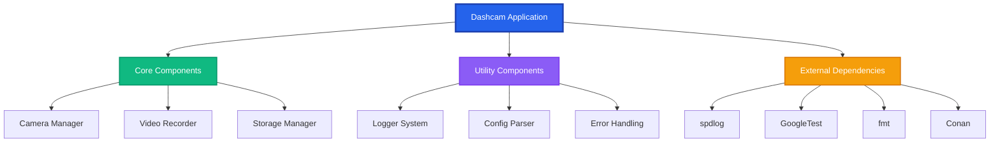
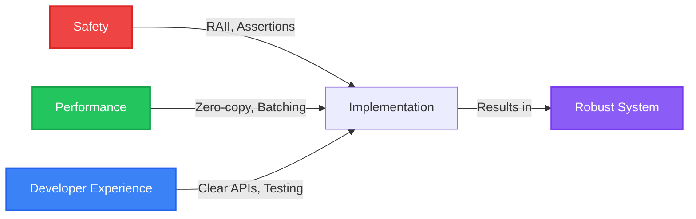
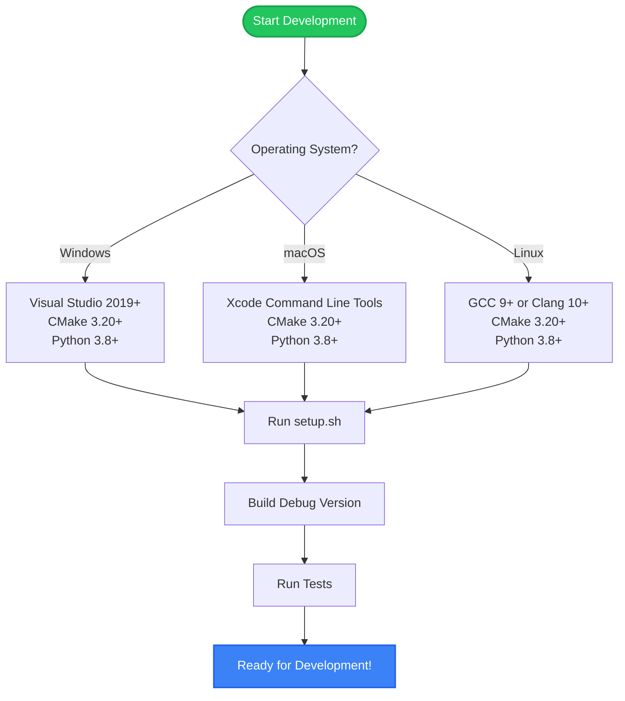
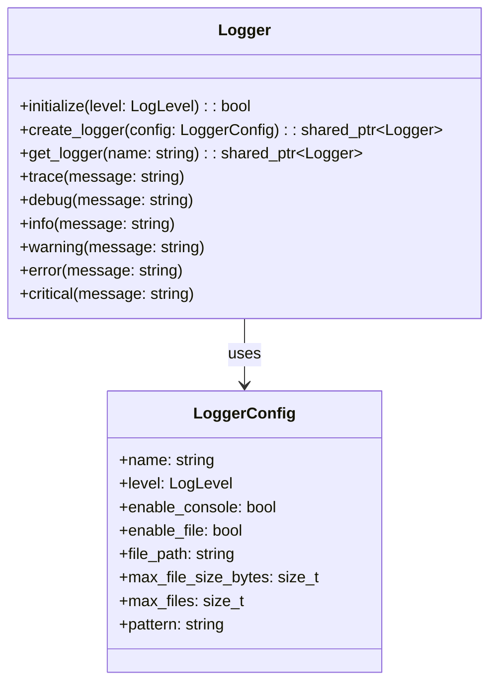
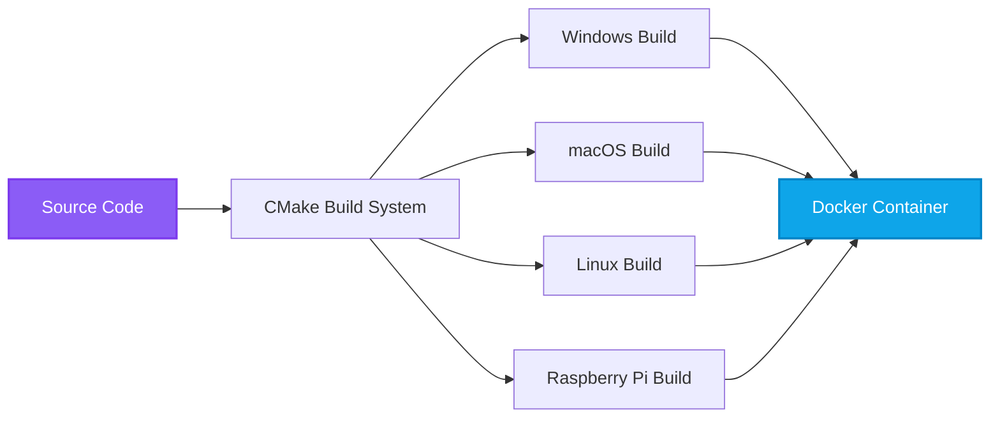
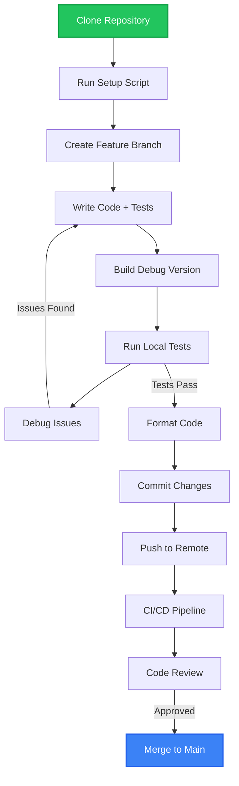

# Dashcam Project Documentation

Welcome to the comprehensive documentation for the Tiger Style C++ Dashcam project. This documentation is designed to provide clear guidance, design rationale, and practical examples for developers, maintainers, and users.

## 🎯 Project Overview

The Dashcam project is a modern C++ application built following **Tiger Style** programming principles, emphasizing safety, performance, and developer experience. This project demonstrates professional-grade software engineering practices suitable for embedded systems and real-time applications.



## 🏗️ Architecture Philosophy

### Design Principles

The project architecture is built on Tiger Style principles adapted for C++:

1. **Safety First**: Memory safety through RAII, smart pointers, and comprehensive assertions
2. **Performance**: Cache-friendly data structures, minimal allocations, bounded operations
3. **Developer Experience**: Clear APIs, excellent tooling, comprehensive testing



### Key Design Decisions

| Decision | Rationale | Trade-offs |
|----------|-----------|------------|
| **C++17 Standard** | Modern features without bleeding edge complexity | Some newer features unavailable |
| **CMake Build System** | Cross-platform, industry standard, good tooling | Learning curve for beginners |
| **Conan Package Manager** | Reproducible builds, version management | Additional dependency |
| **spdlog for Logging** | High performance, thread-safe, feature-rich | Larger binary size |
| **GoogleTest Framework** | Industry standard, excellent tooling integration | Heavyweight for simple tests |
| **Docker Containerization** | Consistent environments, easy deployment | Additional complexity |

## 📁 Documentation Structure

This documentation is organized to mirror the project structure and development workflow:

### 🏠 Getting Started
- **[Architecture Overview](architecture/)** - High-level system design and component relationships
- **[Project Setup](development/setup.html)** - Environment setup and first build
- **[GitHub Actions Quick Start](guides/github-actions-quickstart.html)** - Get started with CI/CD (beginners)

### 📖 Developer Guides
- **[CMake Build System](development/cmake_guide.html)** - Complete CMake architecture and protobuf/gRPC integration
- **[CMake Architecture](development/cmake_architecture.html)** - High-level build system design and structure
- **[Build Process Guide](development/build_process.html)** - Step-by-step build walkthrough and troubleshooting
- **[Cleanup Guide](development/cleanup_guide.html)** - Comprehensive cleanup scripts for maintaining clean development environment
- **[Logging System](guides/logging.html)** - Comprehensive logging usage and configuration
- **[Testing Strategy](guides/testing.html)** - Unit and system testing approaches
- **[Python Development with uv](guides/python-uv.html)** - Fast Python package management
- **[GitHub Actions Documentation](deployment/github-actions.html)** - Complete CI/CD system documentation
- **[Debugging Guide](guides/debugging.html)** - Debugging tools and techniques
- **[Tiger Style Guide](guides/tiger_style.html)** - C++ coding standards and principles

### 🐳 Deployment
- **[Docker Setup](deployment/docker.html)** - Container development and deployment
- **[Production Deployment](deployment/production.html)** - Production configuration and monitoring
- **[Raspberry Pi Deployment](deployment/raspberry_pi.html)** - Embedded deployment guide

### 🔧 Development Tools
- **[Build Scripts](development/scripts.html)** - Automation scripts including build, test, and cleanup utilities
- **[Cleanup Guide](development/cleanup_guide.html)** - Environment cleanup and maintenance scripts
- **[VS Code Integration](development/vscode.html)** - IDE setup and debugging configuration
- **[Contributing Guide](development/contributing.html)** - Development workflow and standards

### 📚 API Reference
- **[Logger API](api/logger.html)** - Complete logging system API
- **[Core Components](api/core.html)** - Camera, recorder, and storage APIs
- **[Utilities](api/utils.html)** - Helper functions and utilities

## 🚀 Quick Start

### Prerequisites Check

Before starting, ensure you have the required tools:



### First Build

```bash
# 1. Setup environment
./scripts/setup.sh          # Linux/macOS
# or
.\scripts\setup.ps1          # Windows

# 2. Build debug version
./scripts/build.sh debug     # Linux/macOS
# or  
.\scripts\build.ps1 Debug    # Windows

# 3. Run tests
./scripts/test.sh            # Linux/macOS
# or
.\scripts\test.ps1           # Windows

# 4. Run application
./build/src/dashcam_main
```

## 🎯 Key Features

### Tiger Style Implementation

The project demonstrates Tiger Style principles in C++:

- **Bounded Operations**: All loops have fixed upper bounds
- **Explicit Error Handling**: No exceptions in critical paths
- **Assertion-Driven Development**: Comprehensive precondition/postcondition checking
- **70-Line Function Limit**: Enforced for maintainability
- **Static Memory Management**: Minimal dynamic allocation after initialization

### Robust Logging System



### Comprehensive Testing

The project includes multiple testing layers:

1. **Unit Tests** (GoogleTest) - Component isolation and functionality
2. **Integration Tests** - Component interaction testing  
3. **System Tests** (pytest) - End-to-end behavior validation
4. **Performance Tests** - Timing and resource usage validation

### Multi-Platform Support



## 🔧 Development Workflow

### Recommended Development Process



## 📖 How to Use This Documentation

### For New Developers
1. Start with **[Project Setup](development/setup.html)** to get your environment ready
2. Read **[Architecture Overview](architecture/)** to understand the system design
3. Follow **[Building Guide](development/building.html)** for your first successful build
4. Explore **[Logging System](guides/logging.html)** to understand debugging tools

### For Contributors
1. Review **[Tiger Style Guide](guides/tiger_style.html)** for coding standards
2. Understand **[Testing Strategy](guides/testing.html)** for quality requirements
3. Use **[Contributing Guide](development/contributing.html)** for workflow
4. Reference **[API Documentation](api/)** for implementation details

### For Deployment Engineers
1. Study **[Docker Setup](deployment/docker.html)** for containerization
2. Follow **[Production Deployment](deployment/production.html)** for live systems
3. Use **[Raspberry Pi Guide](deployment/raspberry_pi.html)** for embedded deployment

## 🌟 Documentation Philosophy

This documentation follows these principles:

- **Justify Every Decision**: Design choices include rationale and trade-offs
- **Visual Learning**: Mermaid diagrams illustrate complex relationships
- **Practical Examples**: Real code samples demonstrate concepts
- **Progressive Disclosure**: Information is layered from basic to advanced
- **Searchable Content**: Well-structured for easy navigation and reference

## 🤝 Contributing to Documentation

Documentation is as important as code. When contributing:

1. **Update docs with code changes** - Documentation should never lag behind implementation
2. **Include design rationale** - Explain not just what, but why
3. **Add diagrams for complex concepts** - Use Mermaid for visual explanation
4. **Test documentation locally** - Use the documentation server to verify formatting
5. **Consider the audience** - Write for developers at different experience levels

---

*This documentation is served by a custom Python server with Mermaid diagram support. Start the server with `python docs/serve_docs.py` and navigate to `http://localhost:8080`*
